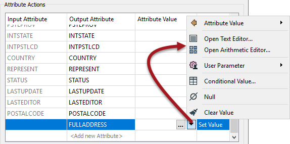

<!--This section is (mostly) a copy of part of the basic manual, used here just as a reminder-->

# Constructing Attributes #
Besides constant attribute values, FME also allows you to build values using string manipulation and arithmetic calculations. This is achieved using the menu opened by clicking on the arrow in the Attribute Value field and using one of the editor options:

This capability is very useful because an attribute is no longer a fixed value: it can be constructed from a mix of existing attributes and parameters. The two methods are the **Text Editor** and **Arithmetic Editor**.

Editor functions are mostly based around standard programming language syntax. The text editor is based around the language *Tcl*, while the arithmetic editor around *C*.

---

<table style="border-spacing: 0px">
<tr>
<td style="vertical-align:middle;background-color:darkorange;border: 2px solid darkorange">
<i class="fa fa-quote-left fa-lg fa-pull-left fa-fw" style="color:white;padding-right: 12px;vertical-align:text-top"></i>
FME Lizard says…
</td>
</tr>

<tr>
<td style="border: 1px solid darkorange">

Remember that besides existing to construct attributes, the text and arithmetic editors can be applied on most FME parameters. You wouldn't, for example, have to use the AttributeManager arithmetic editor to create an attribute to then use in the 3DForcer transformer; you could instead use the arithmetic editor directly in the 3DForcer itself.
</td>
</tr>
</table>

---

<!--Person X Says Section-->

<table style="border-spacing: 0px">
<tr>
<td style="vertical-align:middle;background-color:darkorange;border: 2px solid darkorange">
<i class="fa fa-quote-left fa-lg fa-pull-left fa-fw" style="color:white;padding-right: 12px;vertical-align:text-top"></i>
FME Lizard asks...
</td>
</tr>

<tr>
<td style="border: 1px solid darkorange">

<quiz name="">
  <question multiple>
    

      Q) Do you know which transformers can be used to create attributes? Select all that apply:
    

    <answer>AttributeCopier</answer> 
    <answer correct>AttributeCreator</answer> 
    <answer correct>AttributeManager</answer> 
    <answer>AttributeRenamer</answer> 
     <explanation>A) The AttributeCreator is obvious and - hopefully - so is the AttributeManager. Other transformers may have allowed attribute creation at some point, but those capabilities should no longer be needed.</explanation>
  </question>
</quiz>

</td>
</tr>
</table>
