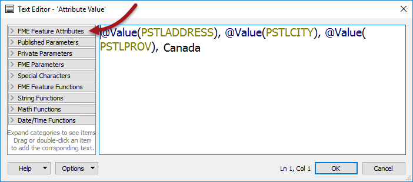
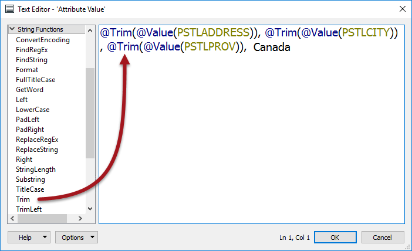
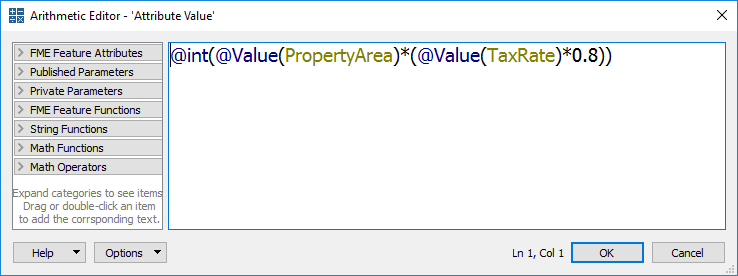

<!--This section is (mostly) a copy of part of the basic manual, used here just as a reminder-->

## Text Editor ##
The text editor - as you would expect - allows you to construct a text value. It includes all the usual string-handling functionality you would need, such as concatenation, trimming, padding, and case changing.

The text editor looks like this:

Here the user is constructing a simple address string by concatenating various existing attributes. Notice the menu on the left-hand side. Existing attributes are listed here and were added to the string by double-clicking them.

Also, notice the other menu options. The most important (for a text editor) is the String Functions:

These are the functions that can be used to manipulate the strings being used. For example, here the user is making sure the attributes being used are trimmed when used:

 

These functions allow you to calculate results for various date operations; for example you can determine the interval between two dates in a number of units, you can add or subtract time from a date, or you can change a date from one structure to another.

 

---

## Arithmetic Editor ##

The arithmetic editor is much the same as the text editor, except that whatever is entered into the dialog will be evaluated as an arithmetic expression and a numeric result returned:

Here the user is calculating a resident's tax using a simple equation containing property area and a tax code. As with the text editor, existing attributes and arithmetic functions were obtained from the menu on the left-hand side.

