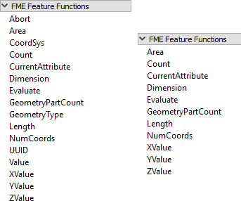

## FME Feature Functions ##

One other item in the menu of both text and arithmetic editors is FME Feature Functions:

 

---

These are functions that reach into the very heart of FME's core functionality. They are the building blocks that transformers are built upon; basic functionality that can return values to the editor. 

For example, the *@Area()* function returns the area of the current feature (assuming it is a polygon). *@NumCoords()* returns the number of vertices in the current feature.

Some functions return strings, and others return numeric values; therefore the available functions vary depending on whether the text or arithmetic editor is being used. In the screenshot above, the text editor functions are on the left and the arithmetic editor functions on the right.

FME Feature Functions are useful because they allow you to build processing directly into attribute creation, instead of using a separate transformer.

---

<table style="border-spacing: 0px">
<tr>
<td style="vertical-align:middle;background-color:darkorange;border: 2px solid darkorange">
<i class="fa fa-quote-left fa-lg fa-pull-left fa-fw" style="color:white;padding-right: 12px;vertical-align:text-top"></i>
FME Lizard says…
</td>
</tr>

<tr>
<td style="border: 1px solid darkorange">

You might also be wondering why there are math functions inside the text editor and how you can use them.
  Well, sometimes you need to calculate a numeric value as part of a string. If so, you can use the FME function @Evaluate() inside a text editor to carry out a mathematical calculation. This function understands all numerical operations, which is why they are included in the text editor dialog.

</td>
</tr>
</table>

---

## Replacing Other Transformers ##
Integrated text and arithmetic editors provide a great benefit for workspace creation. They allow attribute-creating functions to be carried out directly in a single transformer.

For example, the AttributeManager text editor can be used as a direct replacement for the StringConcatenator and ExpressionEvaluator transformers.

The AttributeManager could also replace the StringPadder and AttributeTrimmer transformers, albeit with a little less user-friendliness. If FME Feature Functions are used inside the editor, this transformer could also technically replace transformers such as the AreaCalculator, LengthCalculator, VertexCounter, DateTimeStamper, and many more.

Replacing transformers is usually a good thing. Workspaces are more compact and well-defined when as many peripheral operations as possible are integrated directly into a single transformer. However, because it's possible for an AttributeManager to be carrying out one of many, many activities, it is also critical to use Best Practice and ensure it has the proper annotation. 

If an AttributeManager is not annotated correctly, it isn't possible to determine from looking at the Workbench canvas what action it is carrying out!

---

<table style="border-spacing: 0px">
<tr>
<td style="vertical-align:middle;background-color:darkorange;border: 2px solid darkorange">
<i class="fa fa-quote-left fa-lg fa-pull-left fa-fw" style="color:white;padding-right: 12px;vertical-align:text-top"></i>
FME Lizard says…
</td>
</tr>
<tr>
<td style="border: 1px solid darkorange">

Note that incorporating functions into a single transformer is <strong>not</strong> intended as a way to improve performance. 
  For example, replacing twenty (20) transformers with twenty functions inside one AttributeManager transformer - all carrying out the same task - is unlikely to make the workspace faster overall; plus the AttributeManager will naturally become slower with each new function that is added to it.

</td>
</tr>
</table>