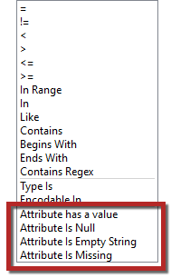

## Handling Nothing ##

Besides representing all forms of nothing in its interface, FME also allows nothing to be a condition in various tests, lets users set nothing values, and allows bulk updates from one form of nothing to another. 

### Recognizing Null Values ###

Various formats have various ways to represent nothing. However, if they support the concept of null, then FME will read any null attributes with a &lt;null&gt; value.

For a workspace to check for incoming nulls, the Tester transformer has specific operators to test for null, empty, and missing values:

 

Because the Tester interface is incorporated into many facets of FME (such as the TestFilter transformer or Conditional attributes/parameters), you can test for nulls wherever you find that interface.

---

<!--Tip Section--> 

<table style="border-spacing: 0px">
<tr>
<td style="vertical-align:middle;background-color:darkorange;border: 2px solid darkorange">
<i class="fa fa-info-circle fa-lg fa-pull-left fa-fw" style="color:white;padding-right: 12px;vertical-align:text-top"></i>
TIP
</td>
</tr>

<tr>
<td style="border: 1px solid darkorange">

The "Attribute Has a Value" test returns true when an attribute is not null, is not empty, and is not missing - saving you the inconvenience of having to use those three tests separately.

</td>
</tr>
</table>

---

### Other Null-Handling Transformers ###

Many other transformers also allow testing for nulls. For example, the Matcher transformer has options as to whether null values constitute a match:

This parameter lets the workspace author decide whether null, empty, and missing values should be treated as different values. 

If set to No, then two features can match even if one has an attribute that is &lt;null&gt; and the other has an attribute that is &lt;missing&gt;. 

If set to Yes, then two features can only match when their attributes are the same type of nothing; i.e. when &lt;null&gt; one on feature is matched by &lt;null&gt; on the other. 

Another example is the AttributeFilter transformer, which has separate output ports for &lt;Empty&gt;, &lt;Missing&gt;, and &lt;Null&gt;:

---

### Writing Null Values ###

It's often important to be able to test for and filter null values as part of a data validation process, or when a null value would cause problems in a calculation. 

However, it's also important to be able to filter out null values for writing data. That's because what happens when an attribute set to null is sent to a writer depends very much upon the data format.

If the format supports &lt;null&gt; then the destination dataset will contain &lt;null&gt; attributes.

If the format doesn’t support &lt;null&gt;, then FME will automatically convert the data to the closest representation that is supported.

For example, MapInfo TAB does not have a concept of &lt;null&gt;; instead text attributes are not written (so FME will read them back as &lt;missing&gt;) and numeric attributes are written as -9999 (which is a MapInfo equivalent to null).

---

<!--Tip Section--> 

<table style="border-spacing: 0px">
<tr>
<td style="vertical-align:middle;background-color:darkorange;border: 2px solid darkorange">
<i class="fa fa-info-circle fa-lg fa-pull-left fa-fw" style="color:white;padding-right: 12px;vertical-align:text-top"></i>
TIP
</td>
</tr>

<tr>
<td style="border: 1px solid darkorange">

Be aware that FME only converts "null" values when the format does not support the current representation. For example, if a feature has an empty attribute value, and the format allows empty values, then FME will not convert the data to a true &lt;null&gt;. 

</td>
</tr>
</table>

---

### Joining with Null Attribute Keys and Values ###

There are various transformers in FME that join data together in some way; the FeatureMerger, FeatureJoiner, and DatabaseJoiner are all examples of these.

When joining data, one consideration must be handling null values, particularly null key values in an attribute join. 

When FME compares keys, and one key is null, it must consider what action is correct. Should that feature be rejected, or should that feature be joined to other features that also have a null key?

Similarly, when FME merges attributes and there is a clash, most transformers have a parameter to specify which takes precedence. But should that action be the same when the attribute with priority has a null value? Should a null overwrite an actual value?

These are all aspects of data joins to consider. Some transformers - for example the FeatureMerger - have a specific parameter to handle nulls. In general you should always inspect the documentation for each transformer if you suspect that your data contains null values that need to be handled.