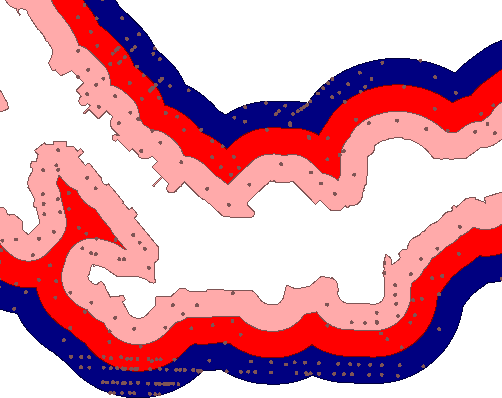

<!--Exercise Section-->

<table style="border-spacing: 0px;border-collapse: collapse;font-family:serif">
<tr>
<td style="vertical-align:middle;background-color:darkorange;border: 2px solid darkorange">
<i class="fa fa-cogs fa-lg fa-pull-left fa-fw" style="color:white;padding-right: 12px;vertical-align:text-top"></i>
Exercise 2
</td>
<td style="border: 2px solid darkorange;background-color:darkorange;color:white">
Flood Risk Project
</td>
</tr>

<tr>
<td style="border: 1px solid darkorange; font-weight: bold">Data</td>
<td style="border: 1px solid darkorange">Parks (MapInfo TAB)</td>
</tr>

<tr>
<td style="border: 1px solid darkorange; font-weight: bold">Overall Goal</td>
<td style="border: 1px solid darkorange">Assess flood risk for addresses based on elevation and distance from shore</td>
</tr>

<tr>
<td style="border: 1px solid darkorange; font-weight: bold">Demonstrates</td>
<td style="border: 1px solid darkorange">Conditional attribute values</td>
</tr>

<tr>
<td style="border: 1px solid darkorange; font-weight: bold">Start Workspace</td>
<td style="border: 1px solid darkorange">C:\FMEData2018\Workspaces\DesktopAdvanced\Attributes-Ex2-Begin.fmw</td>
</tr>

<tr>
<td style="border: 1px solid darkorange; font-weight: bold">End Workspace</td>
<td style="border: 1px solid darkorange">C:\FMEData2018\Workspaces\DesktopAdvanced\Attributes-Ex2-Complete.fmw</td>
</tr>

</table>

A colleague is working on a workspace to calculate the tsunami flood risk for all addresses in the city. The risk is adjudged to be a combination of closeness to the shoreline and elevation above sea level, and is calculated using this table:

<table>
<tr><td></td><td></td><td colspan="3">Elevation (meters above sea level)</td></tr>
<tr><td></td><td></td><td align="center">0-10m</td><td align="center">10-25m</td><td align="center">25-60m</td></tr>
<tr><td rowspan="3">Distance from Shoreline (meters)</td><td align="center">100m</td><td align="center">1</td><td align="center">2</td><td align="center">3</td></tr>
<tr><td align="center">200m</td><td align="center">2</td><td align="center">3</td><td align="center">4</td></tr>
<tr><td align="center">300m</td><td align="center">3</td><td align="center">4</td><td align="center">5</td></tr>
</table>

Your colleague has created the workspace up until the point at which each address has an elevation and distance from the shoreline. Now the calculations need to start, and he has asked for your assistance in finishing the project.

 **1) Start Workbench**
 Open the workspace C:\FMEData2018\Workspaces\DesktopAdvanced\Attributes-Ex2-Begin.fmw. This is the workspace as your colleague has created it so far.

To find out what data we are dealing with, run the workspace and then inspect the results at various parts. You can do this either using Inspector transformers or Feature Caching.

You’ll probably want to inspect the source feature types (or the Reprojector, since the CDED data is a different coordinate system). You’ll also want to inspect the AttributeRenamer output.

Don’t forget you can set a Group-By in an Inspector's parameters, which may be of use in visualizing which addresses are in which zone.

You’ll see how the addresses are assigned a zone denoting their distance from the shoreline, and also possess an elevation.

---

<!--Person X Says Section-->

<table style="border-spacing: 0px">
<tr>
<td style="vertical-align:middle;background-color:darkorange;border: 2px solid darkorange">
<i class="fa fa-quote-left fa-lg fa-pull-left fa-fw" style="color:white;padding-right: 12px;vertical-align:text-top"></i>
Ms. Analyst says...
</td>
</tr>

<tr>
<td style="border: 1px solid darkorange">

Before we get onto a full set of instructions for the exercise, try to consider how you might go about this task. You’ll need to think about:

<ul><li>Can the data be mapped directly to flood risk, or does it need filtering first?</li></ul>

The zone is fairly easy to map because it is a fixed value (100, 200, and 300). However, elevation is trickier because they are not fixed values; elevation could be any single value from 0 to 60.

<ul><li>Which transformers would you use?</li></ul>

To filter the data the Tester and TestFilter transformers are the most obvious candidates, with maybe the AttributeRangeFilter; to map data, either the AttributeValueMapper or AttributeRangeMapper.  Alternatively, why not just use the AttributeManager with conditional attributes?

<ul><li>Should you combine methods?</li></ul>

Perhaps a combination method would work best, where you filter the data partially and then map it? If so, which data do you filter by and using which transformers?

<ul><li>Which will produce the most aesthetic workspace?</li></ul>

Best Practice should always play a part in any workspace. If there are several solutions, then which produces the most aesthetic (good-looking) workspace? Are fewer transformers always better, or will that impact on the need to maintain the workspace?

</td>
</tr>
</table>

---

<!--Person X Says Section-->

<table style="border-spacing: 0px">
<tr>
<td style="vertical-align:middle;background-color:darkorange;border: 2px solid darkorange">
<i class="fa fa-quote-left fa-lg fa-pull-left fa-fw" style="color:white;padding-right: 12px;vertical-align:text-top"></i>
Miss Vector says...
</td>
</tr>

<tr>
<td style="border: 1px solid darkorange">

On consideration, I see three likely ways to carry out this project. I call them:

<ul><li>Simple Filtering (Simple, but bulky)</li>
<li>Complex Filtering (Moderate in both complexity and size)</li>
<li>Conditional Values (Complex, but compact)</li></ul>

Simple Filtering filters the data and then maps it to the required values; as such it is a two-step process. It requires more transformers but is simpler to understand and set up.

  Complex Filtering filters the data in a single step, so no further mapping is required. It’s a single-step process, but – because the data is filtered – needs more transformers than perhaps necessary. It is moderately complex.

  Conditional Values set the values directly depending on a set of inbuilt conditions. All the work can be done in a single transformer, so it is compact, but the setup and maintenance are considerably more complex.

  On the following pages, we’ll detail how to set up each method. Pick which one you want to try and follow the instructions. Alternatively, do each in turn – then you’ll be able to compare the different methods and decide which you think is the best.

  <strong>BEWARE!</strong> Be sure to check your use of AND and OR in filter transformers. It's easy to get one wrong but difficult to track that down as the cause! 

</td>
</tr>
</table>