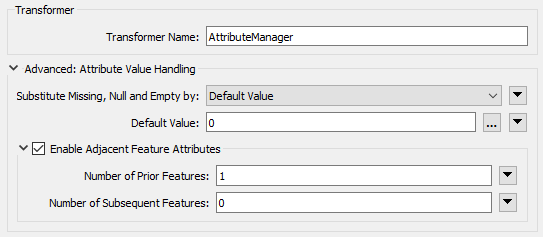
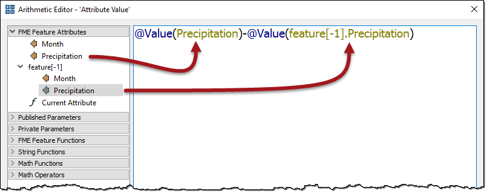
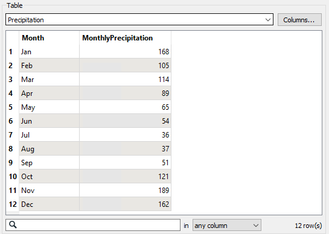

<!--Exercise Section-->

<table style="border-spacing: 0px;border-collapse: collapse;font-family:serif">
<tr>
<td style="vertical-align:middle;background-color:darkorange;border: 2px solid darkorange">
<i class="fa fa-cogs fa-lg fa-pull-left fa-fw" style="color:white;padding-right: 12px;vertical-align:text-top"></i>
Exercise 3
</td>
<td style="border: 2px solid darkorange;background-color:darkorange;color:white">
Precipitation Calculations
</td>
</tr>

<tr>
<td style="border: 1px solid darkorange; font-weight: bold">Data</td>
<td style="border: 1px solid darkorange">Precipitation Data (Microsoft Excel)</td>
</tr>

<tr>
<td style="border: 1px solid darkorange; font-weight: bold">Overall Goal</td>
<td style="border: 1px solid darkorange">Calculate monthly precipitation</td>
</tr>

<tr>
<td style="border: 1px solid darkorange; font-weight: bold">Demonstrates</td>
<td style="border: 1px solid darkorange">Adjacent feature attributes</td>
</tr>

<tr>
<td style="border: 1px solid darkorange; font-weight: bold">Start Workspace</td>
<td style="border: 1px solid darkorange">None</td>
</tr>

<tr>
<td style="border: 1px solid darkorange; font-weight: bold">End Workspace</td>
<td style="border: 1px solid darkorange">C:\FMEData2019\Workspaces\DesktopAdvanced\Attributes-Ex3-Complete.fmw</td>
</tr>

</table>

You're working on a project mapping monthly precipitation (rainfall) in the city. You have been given a dataset like so:

<table>
<tr><th>Month</th><th>Precipitation</th></tr>
<tr><td>Jan</td><td>168</td></tr>
<tr><td>Feb</td><td>273</td></tr>
<tr><td>Mar</td><td>387</td></tr>
<tr><td>Apr</td><td>476</td></tr>
<tr><td>May</td><td>541</td></tr>
<tr><td>Jun</td><td>595</td></tr>
<tr><td>Jul</td><td>631</td></tr>
<tr><td>Aug</td><td>668</td></tr>
<tr><td>Sep</td><td>719</td></tr>
<tr><td>Oct</td><td>840</td></tr>
<tr><td>Nov</td><td>1029</td></tr>
<tr><td>Dec</td><td>1191</td></tr>
</table>

Unfortunately, the numbers are a cumulative amount, and you wanted to map individual figures for each month. 

Rather than reaching into your desk drawer for a calculator, you decide to use FME to do the calculations!

 **1) Create Workspace**
 Create a workspace to translate the data as follows:

<table style="border: 0px">

<tr>
<td style="font-weight: bold">Reader Format</td>
<td style="">Microsoft Excel</td>
</tr>

<tr>
<td style="font-weight: bold">Reader Dataset</td>
<td style="">C:\FMEData2019\Data\ElevationModel\Precipitation.xlsx</td>
</tr>

<tr>
<td style="font-weight: bold">Writer Format</td>
<td style="">Microsoft Excel</td>
</tr>

<tr>
<td style="font-weight: bold">Writer Dataset</td>
<td style="">C:\FMEData2019\Output\Training\MonthlyPrecipitation.xlsx</td>
</tr>

</table>

When creating the workspace, check the parameters for the reader to ensure FME recognizes the headers at the top of each column.

 **2) Add AttributeManager**
 To calculate precipitation for any given month, you need to subtract the previous month's cumulative total from the current month's cumulative total.

With FME you can use the Adjacent Feature Attribute functionality to fetch the previous month's number.

So, place an AttributeManager transformer between the reader and writer feature types:

 **3) Set AttributeManager Parameters 1**
 Inspect the AttributeManager's parameters, either in the parameters dialog or the Parameter Editor window. 

Expand the set of advanced attributes and check the box marked Enable Adjacent Feature Attributes. In the fields provided enter 1 for the Number of Prior Features to keep.

Next set the parameter *Substitute Missing, Null and Empty by:* to Default Value and enter 0 into the Default Value field:

---

<table style="border-spacing: 0px">
<tr>
<td style="vertical-align:middle;background-color:darkorange;border: 2px solid darkorange">
<i class="fa fa-quote-left fa-lg fa-pull-left fa-fw" style="color:white;padding-right: 12px;vertical-align:text-top"></i>
FME Lizard says…
</td>
</tr>

<tr>
<td style="border: 1px solid darkorange">

The substitution parameter is important because the first feature to be processed can’t have a prior feature,
and the last feature to be processed can't have a subsequent one. Therefore you always have to be careful about what you have set here. 
 In this exercise we’re calculating a numeric value; therefore it makes sense to use 0 (zero) as the
default replacement.

</td>
</tr>
</table>
 
---

 **4) Set AttributeManager Parameters 2**
 Now let's calculate the new precipitation value.

In the Attribute Value field for the precipitation attribute, click the drop-down arrow and open the Arithmetic Editor.

In the arithmetic editor dialog use the menu on the left to select:

- The FME Feature Attribute Precipitation
- The Math Operator – (minus)
- The FME Feature Attribute Precipitation for feature[-1]

All of which should leave you with an expression looking like this:

<pre>
@Value(Precipitation)-@Value(feature[-1].Precipitation)
</pre>

Now you can see why it was so important to set the substitution field because it’s uncertain what result would occur from the above when feature[-1].Precipitation is missing!

Click OK to close the Arithmetic Editor dialog, and then accept the parameter changes.

 **5) Save and Run Workspace**
 Save the workspace and then run it. Inspect the output.

The numbers start out looking correct but quickly become wrong. Not even in Vancouver (I mean, Interopolis) does it rain 623mm in a single month!

The problem is this: unlike other occasions in FME, here we can’t simply overwrite the attribute we are working with. That’s because it skews the next calculation. i.e. the calculation for March needs to operate on February's original number, but instead, it receives the value we've just overwritten it with!

The only way to solve this is by creating a new attribute...

 **6) Adjust Workspace**
 Edit the writer schema by renaming the destination attribute Precipitation to MonthlyPrecipitation:

Now return to the AttributeManager and change it to create an entirely new attribute called MonthlyPrecipitation. You can copy and paste the line to save time; just change the Output Attribute name:

 

It's a pain to have to do, but blame me for leading you in the wrong direction at first! You can't even just rename Precipitation to MonthlyPrecipitation since, whatever you call it, it still fetches an incorrect value. You'll have to reset its Action field to "Do Nothing" and then create a new attribute.

 **7) Re-Run Workspace.**
 Save the workspace.

Before you re-run the workspace, check the writer parameter called "Overwrite Existing File" in the Navigator window.

Set it to Yes – if it isn’t already – so the output overwrites the destination dataset and doesn’t just append this data to the same spreadsheet.

Also, make sure the file you are writing to is not already open in Excel (or any other editor).

Re-run the workspace.

Inspect the output. This time the numbers should be correct:

---

<table style="border-spacing: 0px">
<tr>
<td style="vertical-align:middle;background-color:darkorange;border: 2px solid darkorange">
<i class="fa fa-quote-left fa-lg fa-pull-left fa-fw" style="color:white;padding-right: 12px;vertical-align:text-top"></i>
FME Lizard says…
</td>
</tr>

<tr>
<td style="border: 1px solid darkorange">

If the values in the output are literally "273-168", "387-273", etc., then you've used the string editor and not the arithmetic editor! If the values are all zero, then you need to make sure the AttributeManager action is set to Do Nothing for the Precipitation field, rather than Set Value. 

</td>
</tr>
</table>

---

<!--Exercise Congratulations Section--> 

<table style="border-spacing: 0px">
<tr>
<td style="vertical-align:middle;background-color:darkorange;border: 2px solid darkorange">
<i class="fa fa-thumbs-o-up fa-lg fa-pull-left fa-fw" style="color:white;padding-right: 12px;vertical-align:text-top"></i>
CONGRATULATIONS
</td>
</tr>

<tr>
<td style="border: 1px solid darkorange">

By completing this exercise you have learned how to:
<ul><li>Expose adjacent feature attributes</li>
<li>Use adjacent feature attributes</li>
<li>Handle missing values in attribute manipulation</li></ul>

</td>
</tr>
</table>