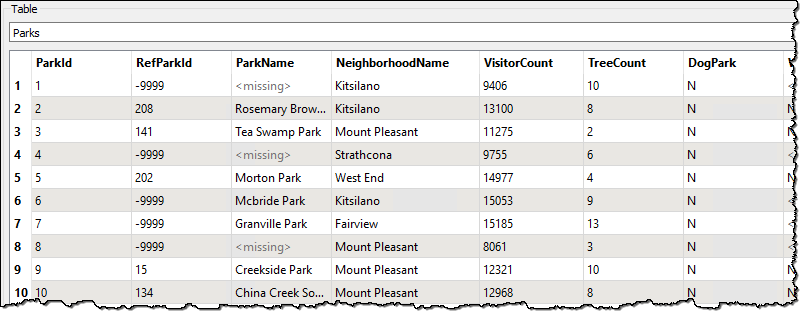
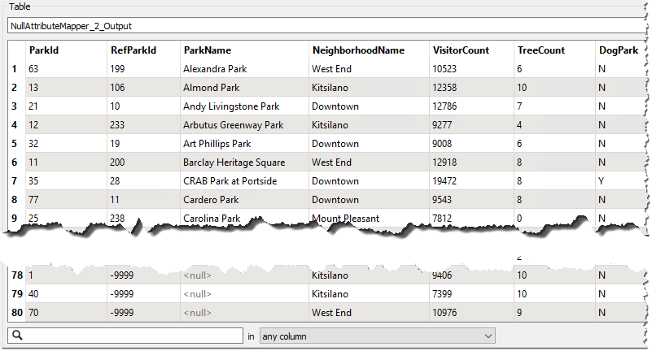
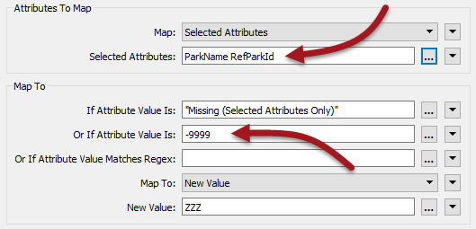

<!--Exercise Section-->

<table style="border-spacing: 0px;border-collapse: collapse;font-family:serif">
<tr>
<td style="vertical-align:middle;background-color:darkorange;border: 2px solid darkorange">
<i class="fa fa-cogs fa-lg fa-pull-left fa-fw" style="color:white;padding-right: 12px;vertical-align:text-top"></i>
Exercise 4
</td>
<td style="border: 2px solid darkorange;background-color:darkorange;color:white">
Parks Dataset Sorting
</td>
</tr>

<tr>
<td style="border: 1px solid darkorange; font-weight: bold">Data</td>
<td style="border: 1px solid darkorange">Parks (MapInfo TAB)</td>
</tr>

<tr>
<td style="border: 1px solid darkorange; font-weight: bold">Overall Goal</td>
<td style="border: 1px solid darkorange">Sort parks into alphabetical order</td>
</tr>

<tr>
<td style="border: 1px solid darkorange; font-weight: bold">Demonstrates</td>
<td style="border: 1px solid darkorange">Null attribute handling</td>
</tr>

<tr>
<td style="border: 1px solid darkorange; font-weight: bold">Start Workspace</td>
<td style="border: 1px solid darkorange">C:\FMEData2019\Workspaces\DesktopAdvanced\Attributes-Ex4-Begin.fmw</td>
</tr>

<tr>
<td style="border: 1px solid darkorange; font-weight: bold">End Workspace</td>
<td style="border: 1px solid darkorange">C:\FMEData2019\Workspaces\DesktopAdvanced\Attributes-Ex4-Complete.fmw</td>
</tr>

</table>

In this workspace, a colleague is trying to write out a list of parks to a Geodatabase dataset. It’s important that the parks are in alphabetical order – according to their name – and that features with no park names are written as null and appear last in the dataset.

However, the workspace they have does not seem to be doing what they need. The parks are sorted alphabetically, but un-named parks always appear first.

 **1) Start Workbench**
 Open the workspace C:\FMEData2019\Workspaces\DesktopAdvanced\Attributes-Ex4-Begin.fmw

Using feature caching, run the workspace and inspect the source dataset as a table. You’ll see that the data is in order of ID, not name, and that there are &lt;missing&gt; values scattered throughout:

To sort the &lt;missing&gt; data we'll need to set their ParkName attribute to something that appears at the bottom of a sorted list, then set them back to null afterward.

 **2) Add NullAttributeMapper**
 Add a NullAttributeMapper transformer prior to the Sorter transformer. Inspect the parameters.

Ensure “Map” is set to Selected Attributes, and choose the attribute ParkName:

Underneath that is a section of what to map to.

We know the values in here are currently listed as &lt;missing&gt; so set the “If Attribute Value Is” parameter to Missing (Selected Attributes Only)

We want to map these to a value that appears at the bottom of an alphabetically sorted list, so change “Map To” to New Value and enter ZZZ as the new value.

Accept the parameter changes.

 **3) Add NullAttributeMapper**
 Now add a second NullAttributeMapper; this time it should be connected *after* the Sorter.

Open the parameters and, once again, ensure “Map” is set to Selected Attributes and select the ParkName attribute.  This time turn the ZZZ values back to nulls:

Technically we could just turn them back into &lt;missing&gt;; the Geodatabase writer will write them out as nulls. However, assuming we didn’t know that, null is the safer option and bound to give us what we want.

 **4) Save and Run Workspace**
 Save the workspace and then run it. Inspect the output. This time the data should be sorted by ParkName, but with all null values at the end of the dataset:

 **5) Fix RefParkId**
 Your colleague now asks you to fix the RefParkId field. You'll have noticed that a lot of the values are -9999. That's the MapInfo equivalent of "nothing", but for Geodatabase it would be better to set these to proper nulls.

---

<!--Person X Says Section-->

<table style="border-spacing: 0px">
<tr>
<td style="vertical-align:middle;background-color:darkorange;border: 2px solid darkorange">
<i class="fa fa-quote-left fa-lg fa-pull-left fa-fw" style="color:white;padding-right: 12px;vertical-align:text-top"></i>
FME Lizard says...
</td>
</tr>

<tr>
<td style="border: 1px solid darkorange">

That's very simple to do. Take a moment to think about how before you look at the instructions!

</td>
</tr>
</table>

---

To do this open the parameters dialog for the first NullAttributeMapper. Add RefParkId to the list of attributes for processing. Then add -9999 to the *Or If Attribute Value Is* field:

Now open the second NullAttributeMapper and add RefParkId to the list of attributes for processing.

Now, these values will get mapped to ZZZ with the missing ParkName values. Then they will be turned into true nulls by the second NullAttributeMapper.

---

<!--Advanced Exercise Section-->

<table style="border-spacing: 0px">
<tr>
<td style="vertical-align:middle;background-color:darkorange;border: 2px solid darkorange">
<i class="fa fa-cogs fa-lg fa-pull-left fa-fw" style="color:white;padding-right: 12px;vertical-align:text-top"></i>
Advanced Exercise
</td>
</tr>

<tr>
<td style="border: 1px solid darkorange">

If you still have time, you should filter out the null ParkNames and RefParkIDs and write them to a separate Feature Type (table) in the Geodatabase. 

</td>
</tr>
</table>

---

<!--Exercise Congratulations Section--> 

<table style="border-spacing: 0px">
<tr>
<td style="vertical-align:middle;background-color:darkorange;border: 2px solid darkorange">
<i class="fa fa-thumbs-o-up fa-lg fa-pull-left fa-fw" style="color:white;padding-right: 12px;vertical-align:text-top"></i>
CONGRATULATIONS
</td>
</tr>

<tr>
<td style="border: 1px solid darkorange">

By completing this exercise you have learned how to:
<ul><li>Identify null and missing attribute values</li>
<li>Set null and missing attribute values</li></ul>

</td>
</tr>
</table>