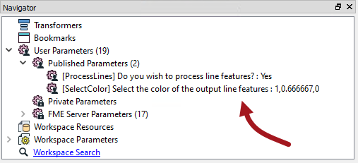
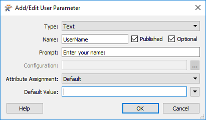
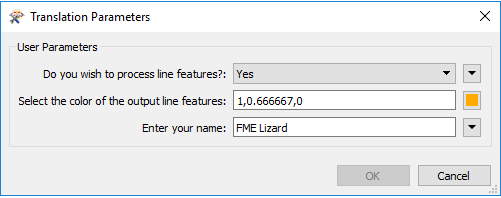
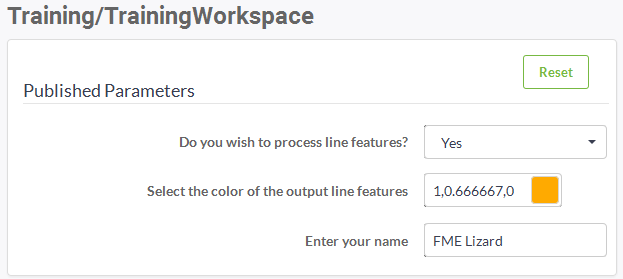
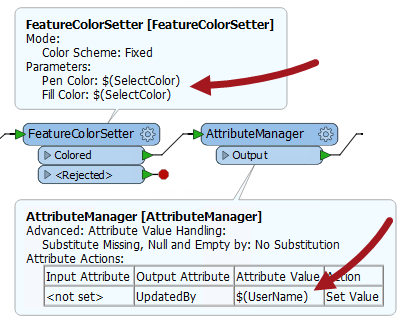
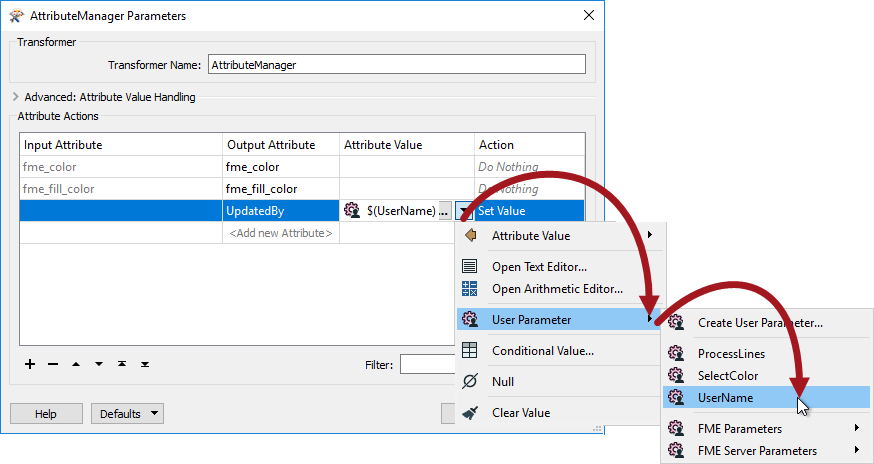

## User Parameters ##

User Parameters are those that are created *by* an FME author, but *for* an FME user to use. In other words, they are a way for the end-user of the workspace to provide their input to a workspace.

### Creating a User Parameter ###
User parameters appear in a special section of the Navigator window, labelled User Parameters. Here, for example, two user parameters have been defined:

Each of these user parameters will allow the end-user of a workspace to enter information into the translation; whether to process line features and what color to write them in. 

A user parameter is easy to create by right-clicking on the User Parameters label and choosing Add Parameter:

A dialog appears in which the author can define the parameter. In this case they are creating a parameter in which the user can enter their name:

---

### Entering Information into a User Parameter ###
Once a user-parameter is defined, when the workspace is run the user is prompted to give their input. 

In FME Workbench (or the FME Quick Translator) the user is prompted through a simple dialog:

In FME Server, the user is prompted through a web page:

---

<!--Person X Says Section-->

<table style="border-spacing: 0px">
<tr>
<td style="vertical-align:middle;background-color:darkorange;border: 2px solid darkorange">
<i class="fa fa-quote-left fa-lg fa-pull-left fa-fw" style="color:white;padding-right: 12px;vertical-align:text-top"></i>
Ms. Analyst says...
</td>
</tr>

<tr>
<td style="border: 1px solid darkorange">

In the FME Quick Translator, the user is <strong>always</strong> prompted to fill in user parameters when running a workspace. However, in FME Workbench, prompting only happens when the prompt option is turned on in the menubar:
  
  Think of it as a nano-paradigm shift between the two applications.

</td>
</tr>
</table>

---

###Using a User Parameter###

Getting input from a user is pointless if it is not used, so it’s also necessary to actually do something with that input.

User parameters can be exploited in a number of places. Firstly they can be tied to an FME parameter (more information on that in the next section), but they can also be used to provide values to transformers and attributes in a workspace.

For example, here the author is making use of the color and username parameters (in the FeatureColorSetter and AttributeManager transformers):

The author set up these transformers to use the parameter input by selecting it in the transformer like so:

Now when the workspace is run, the end user can select the color of features to write, plus enter their name into a text field and have it entered into the UpdatedBy attribute in the output.

---

<!--Person X Says Section-->

<table style="border-spacing: 0px">
<tr>
<td style="vertical-align:middle;background-color:darkorange;border: 2px solid darkorange">
<i class="fa fa-quote-left fa-lg fa-pull-left fa-fw" style="color:white;padding-right: 12px;vertical-align:text-top"></i>
Miss Vector says...
</td>
</tr>

<tr>
<td style="border: 1px solid darkorange">

Do you remember me? I'm Miss Vector. I ask the hard questions around here. But to start with tell me this, what are our two roles of FME user? 
  1. Creator/Inspector
 2. Author/User
 3. Reader/Writer
 4. Maker/Consumer
  Here's another question, only slightly less easy. Look at the ParameterFetcher transformer. What does it do?
  1. Fetches the name of a user parameter
 2. Fetches the value of a user parameter
 3. Fetches the type of a user parameter
 4. Fetches the user a cup of tea

</td>
</tr>
</table>

