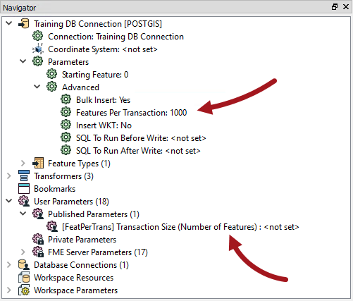
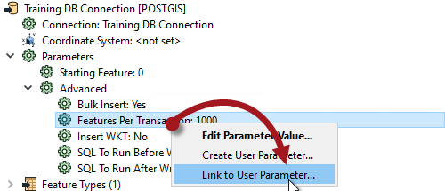
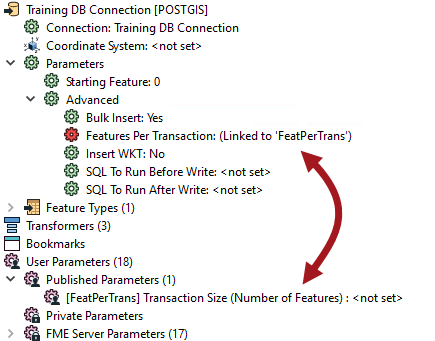
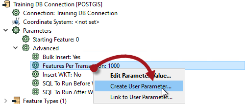
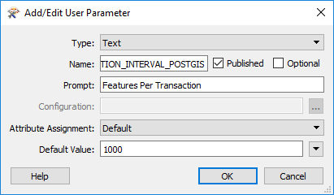
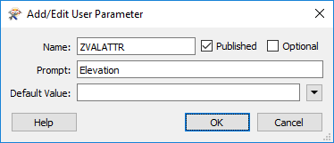
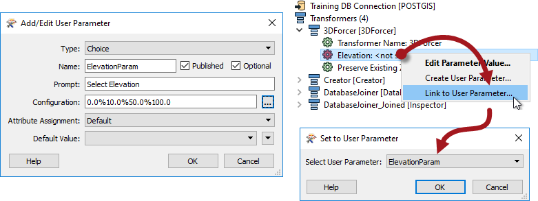

## Linking Parameters ##

As we know, there are **FME parameters** that control FME directly, and **user parameters** that allow input from a user.

Sometimes a workspace author needs the user's input to apply directly to an FME parameter, and this is done by linking the user parameter to the FME parameter.

For example, an FME author has a workspace that writes to a PostGIS database. There is a parameter called "Features Per Transaction" that specifies the number of features to write before committing data to the database.

The author wishes for the end-user to control what that number of features is, but doesn't want them to have to search for that parameter.

So, besides the FME parameter, they create a user parameter:

Their user parameter allows the user to enter a value, but as yet the workspace does not do anything with that value. To do so the user parameter must be linked to the FME parameter.

The author does this by right-clicking the FME parameter and choosing Link to User Parameter:

Then they select their user parameter to link to.

---

<!--Person X Says Section-->

<table style="border-spacing: 0px">
<tr>
<td style="vertical-align:middle;background-color:darkorange;border: 2px solid darkorange">
<i class="fa fa-quote-left fa-lg fa-pull-left fa-fw" style="color:white;padding-right: 12px;vertical-align:text-top"></i>
Ms. Analyst says...
</td>
</tr>

<tr>
<td style="border: 1px solid darkorange">

Alternatively they can do the reverse; right-click the User parameter and choose Apply To [FME Parameter]. But there are usually more FME parameters than user parameters, so the 'Link' method is usually easier and quicker.

</td>
</tr>
</table>

---

Because the FME parameter is now linked to the user parameter, whatever value the user sets for that user parameter will be applied directly to the FME Parameter (Features Per Transaction). Write UTF Byte Order Mark parameter:

---

<!--Person X Says Section-->

<table style="border-spacing: 0px">
<tr>
<td style="vertical-align:middle;background-color:darkorange;border: 2px solid darkorange">
<i class="fa fa-quote-left fa-lg fa-pull-left fa-fw" style="color:white;padding-right: 12px;vertical-align:text-top"></i>
Ms. Analyst says...
</td>
</tr>

<tr>
<td style="border: 1px solid darkorange">

If the author changes their mind, there is always an option to unlink the user parameter and return the FME parameter to direct author control.

</td>
</tr>
</table>

---

### Creating Direct Links ###

In the previous example, a user parameter was created separately and then linked to the FME parameter. However, there is a shortcut to this, where it is possible to both create and link a parameter simultaneously.

In the Navigator window, simply right-click an existing FME parameter and choose the option to "Create User Parameter":

This opens the Add User Parameter dialog as before, but this time the definition to create a parameter is filled in automatically:

Click OK and the user parameter is created and automatically linked to the FME parameter.

---

<!--Person X Says Section-->

<table style="border-spacing: 0px">
<tr>
<td style="vertical-align:middle;background-color:darkorange;border: 2px solid darkorange">
<i class="fa fa-quote-left fa-lg fa-pull-left fa-fw" style="color:white;padding-right: 12px;vertical-align:text-top"></i>
Ms. Analyst says...
</td>
</tr>

<tr>
<td style="border: 1px solid darkorange">

You can do the same one-step action inside a transformer dialog too, like so:
  
  Here the workspace author is creating a user parameter linked to the Elevation FME parameter in a 3DForcer transformer. 

</td>
</tr>
</table>

---

### Advantages and Disadvantages of Direct Links ###

You might be wondering why you would ever link a user parameter separately, or why we showed that process first. It's because there are advantages and disadvantages to both methods.

#### Direct Link Advantages ####
Creating a linked FME parameter directly has the obvious advantage that it is a single-step process. The creation and linking of the user parameter is done in a single action.

Additionally, a user parameter created from an FME parameter is automatically given the correct data type.

For example, in the 3DForcer, elevation requires a floating point number; any user parameter created from this FME parameter will automatically be of type float, without the option to change it.

#### Direct Link Disadvantages ####
The inability to set data type can, however, be a limitation. 

Say, for example, the author wanted to provide a list of permitted elevations for the 3DForcer; 0.0, 10.0, 50.0, etc. This could not be achieved by creating the user parameter directly because it would create a Float parameter when a Choice is the required option.

So the author should create a choice user parameter separately and then link it to the FME parameter:

Of course, the author needs to take care that the values provided by the user parameter were of a type that matched those expected by the FME parameter. FME isn't able to parse all input from a user parameter (especially Choice parameters) to ensure it matches the FME parameter it is linked to. 

The other disadvantage is one of persistence of the user parameter. 

It's like this: if a user parameter is created directly from an FME parameter on a transformer, then it is forever tied to that transformer. If the transformer is deleted, then the FME parameter will be deleted too.

However, if a user parameter is created separately, and linked manually to a transformer’s FME parameter, then it will remain in the workspace, even if the transformer is deleted.

This could be seen as either an advantage or disadvantage, depending on whether you would like this behavior or not!