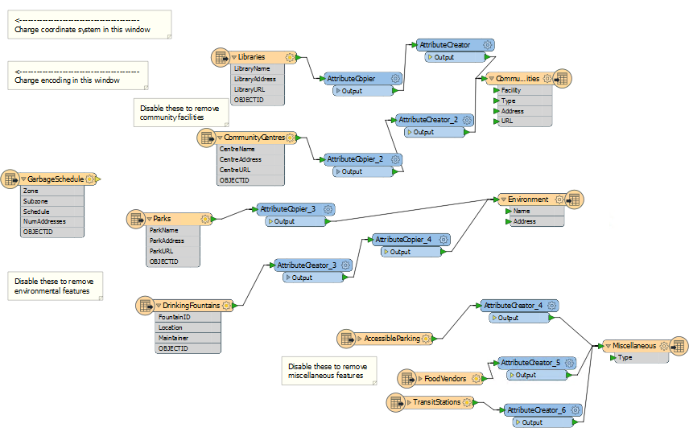
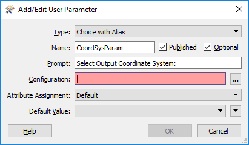
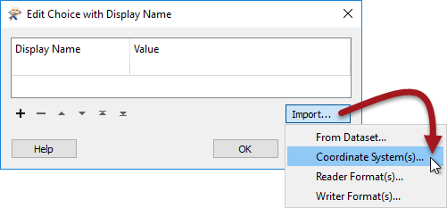
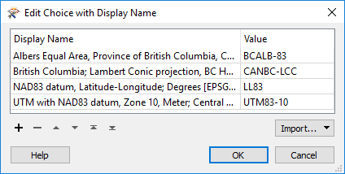
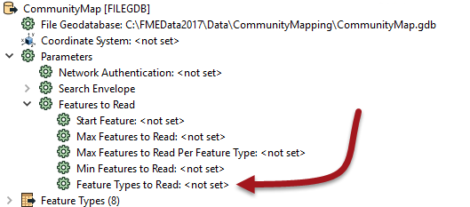
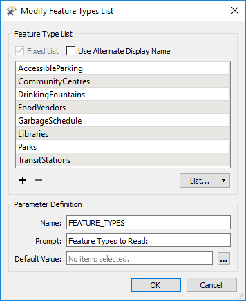
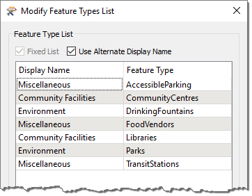
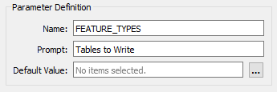
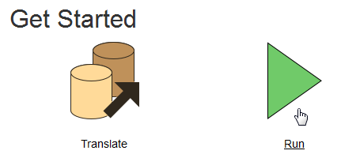
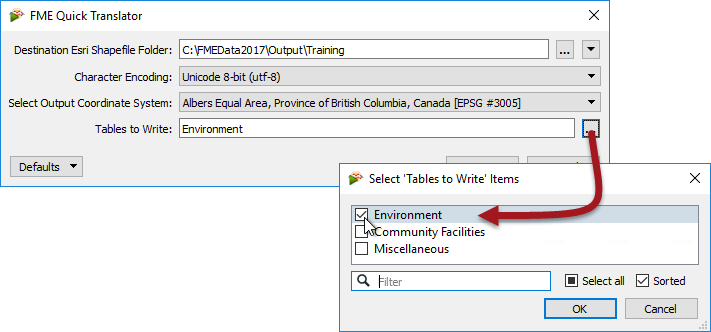

<!--Exercise Section-->

<table style="border-spacing: 0px;border-collapse: collapse;font-family:serif">
<tr>
<td style="vertical-align:middle;background-color:darkorange;border: 2px solid darkorange">
<i class="fa fa-cogs fa-lg fa-pull-left fa-fw" style="color:white;padding-right: 12px;vertical-align:text-top"></i>
Exercise 2
</td>
<td style="border: 2px solid darkorange;background-color:darkorange;color:white">
Code Review a Colleague's Workspace
</td>
</tr>

<tr>
<td style="border: 1px solid darkorange; font-weight: bold">Data</td>
<td style="border: 1px solid darkorange">Community Map (File Geodatabase)</td>
</tr>

<tr>
<td style="border: 1px solid darkorange; font-weight: bold">Overall Goal</td>
<td style="border: 1px solid darkorange">Simplify a workspace using user parameters</td>
</tr>

<tr>
<td style="border: 1px solid darkorange; font-weight: bold">Demonstrates</td>
<td style="border: 1px solid darkorange">Creation and use of complex User Parameters</td>
</tr>

<tr>
<td style="border: 1px solid darkorange; font-weight: bold">Start Workspace</td>
<td style="border: 1px solid darkorange">C:\FMEData2017\Workspaces\DesktopAdvanced\Parameters-Ex2-Begin.fmw</td>
</tr>

<tr>
<td style="border: 1px solid darkorange; font-weight: bold">End Workspace</td>
<td style="border: 1px solid darkorange">C:\FMEData2017\Workspaces\DesktopAdvanced\Parameters-Ex2-Complete.fmw</td>
</tr>

</table>

The Public Safety department at the city has just bought into FME and started using it for data translations.

However, having not (yet) taken the FME Desktop training course, they are not confident users and would like some assistance. 

You have been tasked to carry out a **"[code review](https://en.wikipedia.org/wiki/Code_review "Code Reviews")"** on one of their workspaces. At least one of the issues you find is likely to involve creating user parameters to take the place of hard-coded values.

 **1) Start Workbench**
 Start Workbench and open the workspace C:\FMEData2017\Workspaces\DesktopAdvanced\Parameters-Ex2-Begin.fmw

This is the workspace created by your colleagues:

Notice that it converts from an Esri Geodatabase to Esri Shapefile format. Currently the tables to process are chosen by disabling unwanted ones in the workspace. Similarly, they are setting the destination coordinate system and data encoding using Navigator parameters. This is all very user-intensive.

Also notice that the only annotations in the workspace are there to help the end user make such edits. Really there should be no need for that; published parameters should prompt the user instead, and that is what we will implement here.

 **2) Clean Up Auto-Created User Parameters**
 Open up the User Parameters section of the Navigator window. Notice how there are already user parameters for the source and destination datasets:

Your public safety colleague tells you that the source data will never change, so that parameter is of no use. So delete the user parameter labelled “SourceDataset_FILEGDB.”

However, she tells you that the destination location can be set by the user, so keep the parameter for DestDataset_ESRISHAPE.

 **3) Create Encoding Parameter**
 The Public Safety team want to make it easier to set the encoding of the output dataset. Currently users are pointed towards the point on the Navigator where that Writer parameter exists by a workspace annotation!

This shows you how difficult it is for them to locate the correct parameter in the Navigator window. Let's solve that with a user parameter.

Locate the Shape writer in the Navigator window and expand the list of FME parameters. Identify the Character Encoding parameter, right-click on it and choose Create User Parameter:

Simply click OK on the dialog that opens and a user parameter is created and linked to the FME one. Now there is a user parameter to make it easy to set that FME parameter.

 **4) Create Coordinate System Parameter**
 Another requirement, you are told, is an ability to set the output coordinate system. Again this is currently done by using an annotation to point the user towards the Navigator Window.

However, if you simply publish the Writer’s coordinate system parameter – try it and see – then there will be a problem. The parameter will allow the end-user to select ANY coordinate system supported by FME.

This is not necessarily very useful. Since the data is located in Vancouver, BC, it makes little sense for the user to be able to reproject it to (for example) NZMG (a New Zealand coordinate system).

It would be preferable if the parameter only allowed the end-user to select a coordinate system from a smaller list. 

So create a new user parameter (Right-click User Parameters &gt; Add Parameter), and set the Type to be **Choice with Alias**. Set the Name to be CoordSysParam, and set the prompt to be Select Output Coordinate System:

Now click the [...] button to the right of the Configuration setting. This opens a dialog in which to configure the parameter. Normally we would enter values manually in a Choice with Alias parameter, but for coordinate systems (and Reader/Writer formats) we have the option to have FME define them for us.

Click on the button labelled Import and choose Coordinate System(s):

This opens a list of coordinate systems that we can import as values in our user parameter.

Locate and put a checkmark in the box for the following coordinate systems:

- UTM83-10
- BCALB-83
- LL83
- CANBC-LCC

Then click OK to close this dialog. You will be returned to the configuration dialog and find that names and values have been automatically entered for these coordinate systems:

The left hand side shows what the user is prompted to select, the right hand side what the value fed to FME will be.

Click OK and then OK again to close the remaining dialogs and create the user parameter.

 **5) Link Coordinate System Parameter**
 Now we have the user's selection but we still have to apply it to the real parameter. So locate the writer’s coordinate system parameter, right-click on it, and choose Link to User Parameter:

When prompted, select the newly created *CoordSysParam* and click OK to accept the selection. Now when the workspace is run the user is prompted to select a coordinate system, and that system's shortname value is passed to FME.

 **6) Create Tables Parameter**
 The final task for us here is to create a way to decide which tables are going to be read. If you remember, at the moment the way your colleagues do this is by disabling various reader feature types. However, there has to be a better method.

This is an interesting task because we want to control the source tables (Libraries, Parks, etc.), but based on the selection of destination tables (CommunityFacilities, Environment, and Miscellaneous).

For example, we want the user to select output feature types like "Environment", which needs both "Parks" and "DrinkingFountains" reader feature types.

But this we can do very easily. Firstly locate the Feature Types to Read parameter in the CommunityMap Reader "Features to Read" parameters (in the Navigator window):

Right-click on it and choose Create User Parameter. A dialog will open that is already populated with a list of feature types:

Check the box that is labelled Use Alternate Display Name. This provides the ability to give alternative names for each feature type. What we need to do is use this dialog to group together common reader feature types under a single display name.

Delete the entry for GarbageSchedule, as this data isn’t connected and is not needed.

Then, match the contents of the workspace by editing the Display Names. They should match as follows (the order is not important):

<table>
<tr>
<th>Display Name</th>
<th>Feature Type</th>
</tr>

<tr>
<td>Community Facilities</td>
<td>Libraries</td>
</tr>

<tr>
<td>Community Facilities</td>
<td>CommunityCentres</td>
</tr>

<tr>
<td>Environment</td>
<td>Parks</td>
</tr>

<tr>
<td>Environment</td>
<td>DrinkingFountains</td>
</tr>

<tr>
<td>Miscellaneous</td>
<td>FoodVendors</td>
</tr>

<tr>
<td>Miscellaneous</td>
<td>TransitStations</td>
</tr>

<tr>
<td>Miscellaneous</td>
<td>AccessibleParking</td>
</tr>

</table>

Underneath that change the prompt to read “Tables to Write” and then click OK to close the dialog.

What we have done here is set up a list of output layers to select from, with a list of input layers that each refers to.

 **7) Save and Run Workspace**
 Save the workspace. Then start up the FME Quick Translator application, located on the Start menu under the FME Desktop Utilities folder. By using this tool we'll ensure that the user is prompted for parameter values.

In there, select Run from the Getting Started menu:

Browse to the newly saved workspace, select it, and click Open. You will be presented with a list of published parameters, just as the end-user would see it:

Pick Unicode 8-bit (utf-8) as the encoding. Select a coordinate system, noting how the user is restricted to those chosen by us. Select one or two of the tables to write and click OK to run the workspace.

The translation will be carried out. Inspect the data to ensure the results are correct. The CommunityFacilities – for example – should be made up of both libraries and community centres.

---

<table style="border-spacing: 0px">
<tr>
<td style="vertical-align:middle;background-color:darkorange;border: 2px solid darkorange">
<i class="fa fa-cogs fa-lg fa-pull-left fa-fw" style="color:white;padding-right: 12px;vertical-align:text-top"></i>
Advanced Exercise
</td>
</tr>

<tr>
<td style="border: 1px solid darkorange">

Speaking of Best Practice, don't forget to tidy up the workspace and give it a better style and structure!

</td>
</tr>
</table>

---

<!--Exercise Congratulations Section--> 

<table style="border-spacing: 0px">
<tr>
<td style="vertical-align:middle;background-color:darkorange;border: 2px solid darkorange">
<i class="fa fa-thumbs-o-up fa-lg fa-pull-left fa-fw" style="color:white;padding-right: 12px;vertical-align:text-top"></i>
CONGRATULATIONS
</td>
</tr>

<tr>
<td style="border: 1px solid darkorange">

By completing this exercise you have learned how to:
<ul><li>Remove pre-linked parameters</li>
<li>Create a simple pre-linked parameter</li>
<li>Create a Choice with Alias user parameter</li>
<li>Use a Choice with Alias parameter to define coordinate systems</li>
<li>Manually link a user parameter to an FME parameter</li>
<li>Publish the Feature Types to Read parameter</li>
<li>Set up and use alternative names in the Feature Types to Read parameter</li></ul>

</td>
</tr>
</table>
