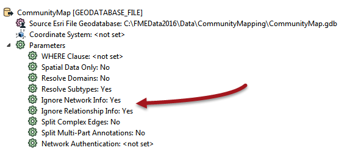

# Database Optimization #

Besides the previous performance tips and tricks, there are some that apply only to databases and some that apply only to specific formats of database. Most are also either for reading or writing (not both).

## Database Reading ##

Reading and filtering data (querying) from a database is nearly always faster when you can use the native functionality of the database.

For Readers this means using the various parameters that occur in the Navigator window of Workbench, like this SQL Server Reader:

Here there is a WHERE clause and a search envelope. When you set these then FME's query to the database includes these parameters. This is much faster than reading the full database table and filtering it by attribute (Tester) or geometry (SpatialFilter).

Additionally, Reader feature types often contain a set of parameters containing WHERE clauses and SELECT statements, which mean you can set a query to apply to just one particular table in your workspace:

### Database Transformers ###

Besides Readers, transformers can also be used to query database data. The best to use is the SQLExecutor (or SQLCreator) as these pass their queries to the database using native SQL. If you don’t want to write SQL then you can use the FeatureReader transformer; but be aware this transformer is more generic and won’t give quite the same performance.

The SQLExecutor is particularly worth being aware of, as it issues a query for each incoming feature. This can be useful where you need to make multiple queries.

For example, here a query is issued to the database for every library feature that enters the SQLExecutor:

Generally the output from the SQLExecutor is an entirely new feature. If you want to simply retrieve attributes to attach to the incoming feature, then the Joiner transformer is more appropriate.

---

<table style="border-spacing: 0px">
<tr>
<td style="vertical-align:middle;background-color:darkorange;border: 2px solid darkorange">
<i class="fa fa-quote-left fa-lg fa-pull-left fa-fw" style="color:white;padding-right: 12px;vertical-align:text-top"></i>
Jake Speedie says…
</td>
</tr>

<tr>
<td style="border: 1px solid darkorange">

FME is fast, but if you can filter or process data in its native environment, it’s likely to be faster still. For example, a materialized view (a database object containing the results of a query) is going to perform better than reading the data and filtering it in FME. Similarly, a SQL Join is going to perform better than reading two tables into FME and using the FeatureMerger transformer. Sometimes it really is a case of working smart, not hard!

</td>
</tr>
</table>

---

### Queries and Indexing ###

Of course, all queries will run faster if carried out on indexed fields – whether these are spatial or plain attribute indexes – and where the queries are well-formed.

To assess how good performance is, remember the log interpretation method of checking timings:

For example, take this section of log timings:

<pre>
2016-07-10 14:43:06|  8.5| 0.0|
2016-07-10 14:43:13|  8.8| 0.3|
2016-07-10 14:46:29| 18.0| 9.1|
2016-07-10 14:49:29| 25.8| 7.9|
</pre>

The workspace took over six minutes to complete this part, but FME is only reporting 25.8 seconds of processing! If the query is to a database then the conclusion is that the fields are either not indexed or the query is badly formed.

To confirm this you could open a SQL tool – for example the SQL Server Management Studio – and run the query there. If it takes as long to run there as in FME, then you know for sure FME is not the bottleneck in your performance.

---

<table style="border-spacing: 0px">
<tr>
<td style="vertical-align:middle;background-color:darkorange;border: 2px solid darkorange">
<i class="fa fa-quote-left fa-lg fa-pull-left fa-fw" style="color:white;padding-right: 12px;vertical-align:text-top"></i>
Jake Speedie says…
</td>
</tr>

<tr>
<td style="border: 1px solid darkorange">

Structure your SQL commands so that indexed attributes are first, followed by the most limiting of the other matches. For example, if one portion of the clause matches 10 rows, and another matches 1000 rows, put the one matching only 10 first.

</td>
</tr>
</table>

---

Besides indexes, there are other in-built functions that can cause databases to return data slower than expected.

For example, when reading from a Geodatabase geometric network, all of the connectivity information must be verified. Therefore, reading is faster if the network information is ignored.

This can be achieved using the *Ignore Network Info* parameter for the Geodatabase reader, with a similar parameter called *Ignore Relationship Info* to ignore Relationships:

Similarly, Excel formulas can be expensive to read, so turning them off when the schema is generated can speed up reading the data:

Look for parameters like these on many FME formats.