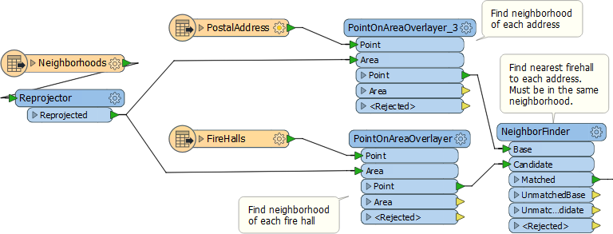
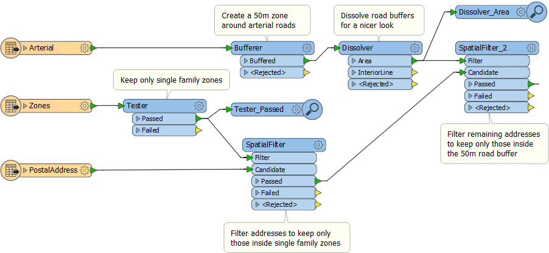

<!--Exercise Section-->

<table style="border-spacing: 0px;border-collapse: collapse;font-family:serif">
<tr>
<td style="vertical-align:middle;background-color:darkorange;border: 2px solid darkorange">
<i class="fa fa-cogs fa-lg fa-pull-left fa-fw" style="color:white;padding-right: 12px;vertical-align:text-top"></i>
Exercise 5
</td>
<td style="border: 2px solid darkorange;background-color:darkorange;color:white">
Performance Review Project
</td>
</tr>

<tr>
<td style="border: 1px solid darkorange; font-weight: bold">Data</td>
<td style="border: 1px solid darkorange">Various</td>
</tr>

<tr>
<td style="border: 1px solid darkorange; font-weight: bold">Overall Goal</td>
<td style="border: 1px solid darkorange">Analyze and improve the workspace performance</td>
</tr>

<tr>
<td style="border: 1px solid darkorange; font-weight: bold">Demonstrates</td>
<td style="border: 1px solid darkorange">Parallel Processing</td>
</tr>

<tr>
<td style="border: 1px solid darkorange; font-weight: bold">Start Workspace</td>
<td style="border: 1px solid darkorange">C:\FMEData2017\Workspaces\DesktopAdvanced\Performance-Ex5a-Begin.fmw C:\FMEData2017\Workspaces\DesktopAdvanced\Performance-Ex5b-Begin.fmw C:\FMEData2017\Workspaces\DesktopAdvanced\Performance-Ex5c-Begin.fmw</td>
</tr>

<tr>
<td style="border: 1px solid darkorange; font-weight: bold">End Workspace</td>
<td style="border: 1px solid darkorange">C:\FMEData2017\Workspaces\DesktopAdvanced\Performance-Ex5a-Complete.fmw C:\FMEData2017\Workspaces\DesktopAdvanced\Performance-Ex5b-Complete.fmw C:\FMEData2017\Workspaces\DesktopAdvanced\Performance-Ex5c-Complete.fmw</td>
</tr>

</table>

Included here are a number of workspaces generated by your colleagues. As the resident FME expert you have been asked to assess the performance of each workspace.

 **1) Workspace A**
 Start Workbench and open workspace C:\FMEData2017\Workspaces\DesktopAdvanced\Performance-Ex5a-Begin.fmw

This workspace carries out spatial overlays and nearest neighbor finding. It determines which neighborhood each postal address and fire hall is located in, and finds the nearest firehall to each address. The nearest firehall must be in the same neighborhood.

Examine the workspace and assess it for its ability to employ parallel processing. You should answer the following questions:

- Do any transformers permit parallel processing?
- Is there an existing group I can parallel process by?
- Is there an artificial group I can create to parallel process by?
- Will parallel processing speed up the workspace performance, or make it worse?

The answers to these questions can be found in the finished workspace: C:\FMEData2017\Workspaces\DesktopAdvanced\Performance-Ex5a-Complete.fmw

 **2) Workspace B**
 Start Workbench and open workspace C:\FMEData2017\Workspaces\DesktopAdvanced\Performance-Ex5b-Begin.fmw

This workspace reads contour data from Esri Shapefile datasets and converts them into raster DEM tiles - one tile for each shapefile.

Again, examine the workspace and assess it for its ability to employ parallel processing. You should answer the following questions:

- Do any transformers permit parallel processing?
- Is there an existing group I can parallel process by?
- Is there an artificial group I can create to parallel process by?
- Will parallel processing speed up the workspace performance, or make it worse?

The answers to these questions can be found in the finished workspace: C:\FMEData2017\Workspaces\DesktopAdvanced\Performance-Ex5b-Complete.fmw

 **3) Workspace C**
 Start Workbench and open workspace C:\FMEData2017\Workspaces\DesktopAdvanced\Performance-Ex5c-Begin.fmw

This workspace may be familiar to you. It comes from the Desktop Basic course and is a project to find all single-family addresses within 50 metres of a major road.

Once more, examine the workspace and assess it for its ability to employ parallel processing. You should again answer the following questions:

- Do any transformers permit parallel processing?
- Is there an existing group I can parallel process by?
- Is there an artificial group I can create to parallel process by?
- Will parallel processing speed up the workspace performance, or make it worse?

The answers to these questions can be found in the finished workspace: C:\FMEData2017\Workspaces\DesktopAdvanced\Performance-Ex5c-Complete.fmw

---

<!--Exercise Congratulations Section--> 

<table style="border-spacing: 0px">
<tr>
<td style="vertical-align:middle;background-color:darkorange;border: 2px solid darkorange">
<i class="fa fa-thumbs-o-up fa-lg fa-pull-left fa-fw" style="color:white;padding-right: 12px;vertical-align:text-top"></i>
CONGRATULATIONS
</td>
</tr>

<tr>
<td style="border: 1px solid darkorange">

By completing this exercise you have learned how to:
<ul><li>Assess when to use parallel processing</li>
<li>Set up transformers to use parallel processing</li>
<li>Create an artificial group for parallel processing</li></ul>

</td>
</tr>
</table>
