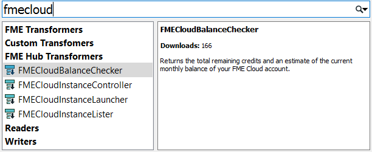

# Performance, FME Server, and FME Cloud #

FME Server adds an extra dimension to FME performance, that of scalability. In terms of performance, the item most easily scalable is the number of FME engines.

Increasing the number of engines supports a higher volume of jobs, and the FME Server Core contains a Software Load Balancer (SLB) to distribute jobs to the FME engines in a balanced way.

---

<table style="border-spacing: 0px">
<tr>
<td style="vertical-align:middle;background-color:darkorange;border: 2px solid darkorange">
<i class="fa fa-quote-left fa-lg fa-pull-left fa-fw" style="color:white;padding-right: 12px;vertical-align:text-top"></i>
Jake Speedie says…
</td>
</tr>

<tr>
<td style="border: 1px solid darkorange">

FME Server is probably best-known for its web-based abilities; but it has huge potential in processing large amounts of data in less time by creating multiple jobs on multiple engines.

</td>
</tr>
</table>

---

## Using Server for Bulk Translations ##

By default, utilizing multiple engines is only possible when you have multiple workspaces to run. When you have only a single workspace and wish to process it more efficiently on FME Server, then you need to divide that workspace into multiple jobs.

To do so, I can create a parent workspace that divides my source data into separate parts and sends each to a different worker job using the FMEServerJobSubmitter transformer.

For example, I can calculate the bounds of tiles to be created and share the load over multiple server engines by running the workspace once for each tile.

---

## FME Cloud ##

FME Cloud is an installation of FME Server hosted by Safe Software on Amazon Web Services technology and used on a pay-as-you-go basis. The benefit is that you don’t have to purchase FME Server, merely make use of it whenever you have a job that can take advantage of its power.

The key to automating this for performance benefits are the FME Cloud custom transformers available on the FME Store:

With the FMECloudInstanceLauncher transformer (or the FMECloudInstanceController), I can run my parent workspace, have it automatically start an FME Cloud instance and run one or more worker jobs on it.

This way I can start a new instance for each job, or run several jobs on one instance, depending on the type of instance and how many engines it has running on it.