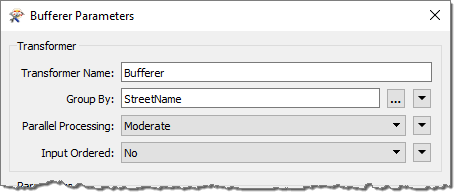
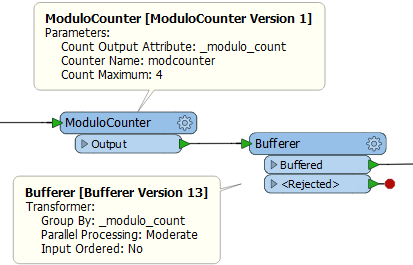

# Parallel Processing

Parallel Processing is a way to improve performance on high-end machines.

## What is Parallel Processing? ##

Each FME translation is usually a single process (fme.exe) on your computer. Parallel processing is when you transform your data into several simultaneous processes. The fact that they run simultaneously means the whole translation will run several times quicker than it used to.

Parallel processing allows FME to make use of multiple cores on a computer. There are four levels of parallel processing in FME, and each maps to the number of cores in this way:

<table>
<tr><th>Parameter</th><th>Processes</th><th>Quad-Core Machine</th></tr>
<tr><td align="center">No parallelism</td><td align="center">1 Process</td><td align="center">1 Process</td></tr>
<tr><td align="center">Minimal</td><td align="center">Cores / 2</td><td align="center">2 Processes</td></tr>
<tr><td align="center">Moderate</td><td align="center">Cores</td><td align="center">4 Processes</td></tr>
<tr><td align="center">Aggressive</td><td align="center">Cores x 1.5</td><td align="center">6 Processes</td></tr>
<tr><td align="center">Extreme</td><td align="center">Cores x 2</td><td align="center">8 Processes</td></tr>
</table>

So, as in the above example, on a quad-core machine, minimal parallelism will result in two simultaneous FME processes. Extreme parallelism would result in eight (assuming there *are* eight tasks that can be processed simultaneously).

There is also a hard cap for each license level:

<table>
<tr><th>FME Edition</th><th>Process Cap</th><th>Quad-Core Machine</th></tr>
<tr><td align="center">Base Edition</td><td align="center">4 processes</td><td align="center">Maximum 4 processes</td></tr>
<tr><td align="center">Professional Edition</td><td align="center">8 processes</td><td align="center">Maximum 8 processes</td></tr>
<tr><td align="center">All Other Editions</td><td align="center">16 processes</td><td align="center">Maximum 8 processes</td></tr>
</table>

So, if you have a Base Edition license you are never going to get more than four processes at one time, regardless of machine type and the parallelism parameter. The quad-core machine in the above example can never have more than eight processes since that is the maximum 'extreme' parallel processing allows.

----

<table style="border-spacing: 0px">
<tr>
<td style="vertical-align:middle;background-color:darkorange;border: 2px solid darkorange">
<i class="fa fa-quote-left fa-lg fa-pull-left fa-fw" style="color:white;padding-right: 12px;vertical-align:text-top"></i>
Jake Speedie says…
</td>
</tr>

<tr>
<td style="border: 1px solid darkorange">

Parallel Processing is very effective when you are offloading a task elsewhere – for example calling a Server with the HTTPFetcher – as each process is a tiny impact on the FME system resources. However, be aware, each parallel process involves starting and stopping an FME engine, and this takes time. So, don’t parallelize your processes when the task already takes less than the time to stop/start FME!

</td>
</tr>
</table>

---

## Transformers and Parallel Processing ##

A number of basic FME transformers have built-in options for parallel processing. Parallel processes work on groups of features, so the transformer must be group-based and have a group-by parameter in order for the user to be able to define the parallel processing groups.

For example, this Bufferer transformer is set up to buffer a set of street features:

Each street (i.e. each feature with the same street name) will be processed as a separate group. To speed up the translation, each group is being handled as a separate process (sadly the user cannot confirm that the source data is already ordered by group, which would improve performance even more).

When a translation is run in parallel mode, then a number of “worker” processes appear in your process manager:

## Parallel Processing Groups ##

Best performance gains are when you have a small number of groups with a large amount of data. When there are many groups with only a few features then any performance gain will not be great and, in fact, the whole process might even be slower. Disk access can be a big bottleneck there.

Because each group gets processed independently, there can be no relationship between features in different groups. If features are related, and their results depend on each other, then they must be in the same group.

However, if **all** data is unrelated and the contents of the group are unimportant, then it’s possible to make artificial groups using a ModuloCounter or RandomNumberGenerator transformer.

For example, here the user has millions of lines to buffer (separately) and uses a ModuloCounter to assign them to one of four groups for parallel processing. Note the Group By parameter in the Bufferer is set to the *&#95;modulo&#95;count* attribute:

---

<table style="border-spacing: 0px">
<tr>
<td style="vertical-align:middle;background-color:darkorange;border: 2px solid darkorange">
<i class="fa fa-quote-left fa-lg fa-pull-left fa-fw" style="color:white;padding-right: 12px;vertical-align:text-top"></i>
Jake Speedie says…
</td>
</tr>

<tr>
<td style="border: 1px solid darkorange">

See <strong><a href="https://blog.safe.com/2016/12/parallel-processing-tips-evangelist159/">this blog article</a></strong> for more information about - and some special techniques for - generating parallel processing groups.

</td>
</tr>
</table>