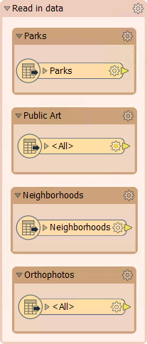
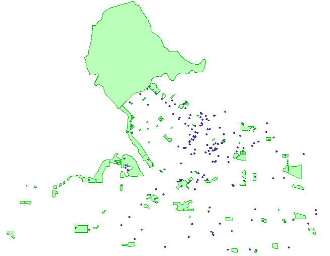
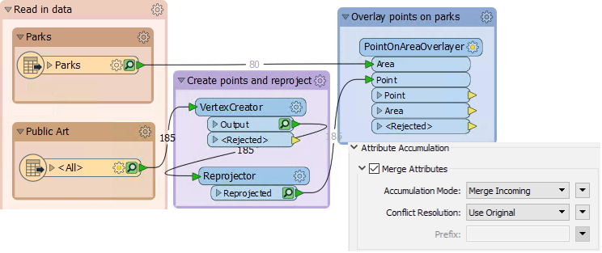

<!--Exercise Section-->

<table style="border-spacing: 0px;border-collapse: collapse;font-family:serif">
<tr>
<td style="vertical-align:middle;background-color:darkorange;border: 2px solid darkorange">
<i class="fa fa-cogs fa-lg fa-pull-left fa-fw" style="color:white;padding-right: 12px;vertical-align:text-top"></i>
Exercise 1
</td>
<!--AKA What Does the Log Say?-->
<td style="border: 2px solid darkorange;background-color:darkorange;color:white">
Public Art in Parks - Feature Caching
</td>
</tr>

<tr>
<td style="border: 1px solid darkorange; font-weight: bold">Data</td>
<td style="border: 1px solid darkorange">City Neighborhoods (Google KML) Public Art (Microsoft Excel) 
Parks (MapInfo Tab) 
City Orthophoto (GeoTIFF)</td>
</tr>

<tr>
<td style="border: 1px solid darkorange; font-weight: bold">Overall Goal</td>
<td style="border: 1px solid darkorange">Plan out a workspace and determine which parks do not contain public art</td>
</tr>

<tr>
<td style="border: 1px solid darkorange; font-weight: bold">Demonstrates</td>
<td style="border: 1px solid darkorange">Workspace layouting and running a translation with feature caches</td>
</tr>

<tr>
<td style="border: 1px solid darkorange; font-weight: bold">Start Workspace</td>
<td style="border: 1px solid darkorange">C:\FMEData2018\Workspaces\DesktopAdvanced\WorkspaceDesign-Ex1-Begin.fmw</td>
</tr>

<tr>
<td style="border: 1px solid darkorange; font-weight: bold">End Workspace</td>
<td style="border: 1px solid darkorange"C:\FMEData2018\Workspaces\DesktopAdvanced\WorkspaceDesign-Ex1-Complete.fmw</td>
</tr>

</table>

The provincial government has given the city a grant to fund new public art in parks. To maximize the funding usage the city would like to add art to parks without existing art. 

You've been tasked with creating a workspace to determine which parks should get the new art. Before any art is commissioned the proposal needs to have public input so your output data will need to be broken down to a neighborhood level. 

This workspace will also be passed on to several different departments so you will need to ensure that it runs efficiently and is well designed. 

---
 **1) Start Workbench**
 Open a blank workspace 

There is a lot to think about before you start creating your workspace, so you have decided to create a quick wireframe using bookmarks to layout what you need to do.

Add a bookmark for each of these different sections. We don't know how large each section will be, so they can all be the same size for now. 

First, we'll need to read in the following datasets, just note their place with a bookmark for now:
- Parks.tab
- NeighbourhoodBoundaries.kml
- PublicArt.xlsx
- Entire folder of GeoTiff orthophotos

Next, we will need to create points and reproject the public art, then overlay the public art on the parks to find out which ones are contained within a park boundary. 

Then we will need to test for parks without art and create a label for our map. 

Next, we will handle the orthophoto data, and clip it to the neighborhood boundaries. There might need to be some raster post-processing after we clip it, so add in a section for that. 

Finally, we will overlay the parks without art on the raster images and write it all out to GeoTiff: 

 **2) Read in the data**
 Lets read in all the data, each are individual readers:

<table style="border: 0px">

<tr>
<td style="font-weight: bold">Reader Format</td>
<td style="">MapInfo Tab (MITAB)</td>
</tr>

<tr>
<td style="font-weight: bold">Reader Dataset</td>
<td style="">C:\FMEData2018\Data\Parks\Parks.tab</td>
</tr>

<tr>
<td style="font-weight: bold">Reader Format</td>
<td style="">Microsoft Excel </td>
</tr>

<tr>
<td style="font-weight: bold">Reader Dataset</td>
<td style="">C:\FMEData2018\Data\Culture\publicArt.xlsx</td>
</tr>

<tr>
<td style="font-weight: bold">Reader Workflow Options</td>
<td style="">Single Merged Feature Type</td>
</tr>

<tr>
<td style="font-weight: bold">Reader Format</td>
<td style="">Google KML </td>
</tr>

<tr>
<td style="font-weight: bold">Reader Dataset</td>
<td style="">C:\FMEData2018\Data\Boundaries\VancouverNeighborhoods.kml</td>
</tr>

<tr>
<td style="font-weight: bold">Reader Format</td>
<td style="">GeoTIFF (Geo-referenced Tagged Image File Format) </td>
</tr>

<tr>
<td style="font-weight: bold">Reader Dataset</td>
<td style="">C:\FMEData2018\Data\Orthophotos\04-05-JK.tif</td>
</tr>

<tr>
<td style="font-weight: bold">Reader Workflow Options</td>
<td style="">Single Merged Feature Type</td>
</tr>

</table>

When you read in the VancouverNeighborhoods.kml, you can read in all the Feature Types, just move them to the side. We are only interested in the Neighborhood Feature type, so move that one into your bookmark. 

 **3) Create points and reproject**
 For this first exercise we will only focus on the parks and public art. We will need to create points from our Excel data. Add a VertexCreator transformer to the canvas and connect it to the Public Art Feature Type. In the parameters set the X Value and Y Value to Longitude and Latitude, respectively: 

Then using the Reprojector transformer, reproject the Public Art to UTM83-10:

 **4) Run workspace with feature caching**
 We want to make sure that our points came out correctly. On the menu bar, go to Run > Run with Feature Caching, then Run the workspace. This will run the workspace caching all the features along the way. When the workspace has finished running there will be green magnifying glasses, which indicate a fresh data cache. You can click on these to inspect the data, but we want to view two caches together. Click on the Reprojector and then hold _Shift_ on your keyboard and click the Parks Feature Type to highlight it as well. Right-click on either the Parks or the Reprojector and click *Inspect cached features...* this will open the selected inspection points up in the FME Data Inspector:

 **5) Add coordinate system and run from the Reprojector**
 
Oh, it looks like the data didn't project correctly, the two datasets don't line up. This is because we forgot to set the coordinate system on the Microsoft Excel reader when we added it. Let's go back to FME Workbench and fix that. 

In the Navigator Window, under the PublicArt &#91;XLSXR&#92; Reader, set the Coordinate System to LL84:

Now the feature caches on the Public Art Feature Type, VertexCreator, and the Reprojector have all turned yellow. This means that the caches are stale because something was changed. We will need to re-run the translation, but a good thing about the feature caches is we only need to run the section that was changed.

Click on the Reprojector, on the popup menu, click *Run To This*, this will only run the section of the workspace that is highlighted, in this case, the PublicArt Feature Table, VertexCreator, and Reprojector:

Inspect the Reprojector cache again, and the data will be lined up correctly:

 **6) Overlay the Public Art onto the Parks**
 Now we will overlay the Public Art points onto the Parks polygons using the PointOnAreaOverlayer transformer. This will give us an attribute called _overlaps that we can then test for. 

Add a PointOnAreaOverlayer transformer to the canvas. Connect the Parks to the Area Input port and the PublicArt to the Points Input port. In the parameters under Attribute Accumulation, enable Merge Attributes. This will ensure our attributes from both features will be on our output features:

 **7) Test for overlaps**
 Add a Tester transformer to the canvas in the parameters create the test _overlaps = 0, this will test for parks that do not contain public art:

Once you've created the test, click on the Tester and click Run From This, then inspect the Passed Output port, ensure that the test went through correctly. Since we haven't run the translation since we added the PointOnAreaOverlayer, you will see a warning telling you that the transformers before this one will need to be run as well, just click ok:

You should have 68 parks with no Public Art. 

Ensure that you made use of your bookmark wireframe and resize the bookmarks as needed. We will continue with this workspace in the next exercise. 

---

<!--Exercise Congratulations Section--> 

<table style="border-spacing: 0px">
<tr>
<td style="vertical-align:middle;background-color:darkorange;border: 2px solid darkorange">
<i class="fa fa-thumbs-o-up fa-lg fa-pull-left fa-fw" style="color:white;padding-right: 12px;vertical-align:text-top"></i>
CONGRATULATIONS
</td>
</tr>

<tr>
<td style="border: 1px solid darkorange">

By completing this exercise you have learned how to:
<ul><li>Plan out a workspace using bookmarks</li>
<li>Use feature caches to inspect a workspace</li></ul>

</td>
</tr>
</table>
