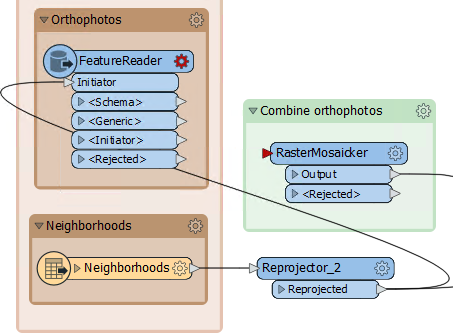
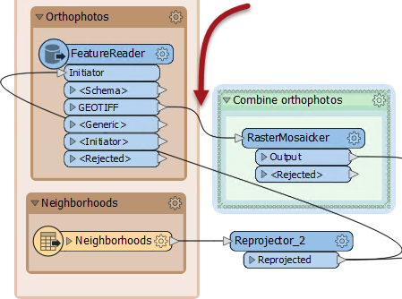
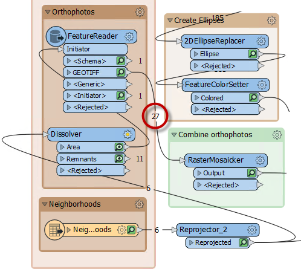

<!--Exercise Section-->

<table style="border-spacing: 0px;border-collapse: collapse;font-family:serif">
<tr>
<td style="vertical-align:middle;background-color:darkorange;border: 2px solid darkorange">
<i class="fa fa-cogs fa-lg fa-pull-left fa-fw" style="color:white;padding-right: 12px;vertical-align:text-top"></i>
Exercise 3
</td>
<!--AKA What Does the Log Say?-->
<td style="border: 2px solid darkorange;background-color:darkorange;color:white">
Public Art in Parks - Feature Caching
</td>
</tr>

<tr>
<td style="border: 1px solid darkorange; font-weight: bold">Data</td>
<td style="border: 1px solid darkorange">City Neighborhoods (Google KML) Public Art (Microsoft Excel) 
Parks (MapInfo Tab) 
City Orthophotos (GeoTIFF)</td>
</tr>

<tr>
<td style="border: 1px solid darkorange; font-weight: bold">Overall Goal</td>
<td style="border: 1px solid darkorange">Examine a workspace that analyzes public art in city parks</td>
</tr>

<tr>
<td style="border: 1px solid darkorange; font-weight: bold">Demonstrates</td>
<td style="border: 1px solid darkorange">Improving Design and Performance</td>
</tr>

<tr>
<td style="border: 1px solid darkorange; font-weight: bold">Start Workspace</td>
<td style="border: 1px solid darkorange">C:\FMEData2019\Workspaces\DesktopAdvanced\WorkspaceDesign-Ex3-Begin.fmw</td>
</tr>

<tr>
<td style="border: 1px solid darkorange; font-weight: bold">End Workspace</td>
<td style="border: 1px solid darkorange">C:\FMEData2019\Workspaces\DesktopAdvanced\WorkspaceDesign-Ex3-Complete.fmw</td>
</tr>

</table>

As you'll recall, the provincial government has given the city a grant to fund new public art in parks. 

A colleague has created a workspace to analyze the amount of art in each city park and we are carrying out a code review to ensure that the workspace is efficient and well-designed. Previously we inspected the workspace to see what it produced, deconstructed the log file, and ran the workspace multiple times to assess the relative performance of each component.

Now let's look at some specific changes we can make to improve performance.

---

 **1) Open and Run Workspace**
 Open your workspace from the previous exercise, or the workspace listed above. Turn on feature caching (we're back in authoring mode now) and re-run the workspace.

First let's first check if the readers are well-designed and don't read any excess data.

- Check the Parks source data. We wish to identify parks without artwork, so we need all of these parks features.
- Check the Neighborhoods data. Again, we need all of these features.
- Check the Public Art data. Again, we need all of these features.
	- It's important to note that artworks fall in one of six neighborhoods, and there are the same six neighborhoods in that dataset. There are no artworks outside one of these neighborhoods and no neighborhoods outside where we have artworks, so there is no excess data being read.
- Check the Orthophotos data. We're reading all the image files for the entire city. Are they any files we don't need?

To check the orthophoto coverage, start the FME Data Inspector (it will be easier than the Visual Preview window). Select File &gt; Open Dataset and set the files to open as follows:

<table style="border: 0px">

<tr>
<td style="font-weight: bold">Reader Format</td>
<td style="">GeoTIFF (Geo-referenced Tagged Image File Format)</td>
</tr>

<tr>
<td style="font-weight: bold">Reader Dataset</td>
<td style="">C:\FMEData2019\Data\Orthophotos\*.tif</td>
</tr>

<tr>
<td style="font-weight: bold">Parameters</td>
<td style="">Feature Type Name(s): From File Name(s)</td>
</tr>

</table>
 
In other words, select all of the TIF files in the Orthophotos folder. The Feature Type Name(s) parameter makes sure the Data Inspector lists files by name. 

Now select File &gt; Add Dataset and set that dialog up as follows:

<table style="border: 0px">

<tr>
<td style="font-weight: bold">Reader Format</td>
<td style="">Google KML</td>
</tr>

<tr>
<td style="font-weight: bold">Reader Dataset</td>
<td style="">C:\FMEData2019\Data\Boundaries\VancouverNeighborhoods.kml</td>
</tr>

</table>

Now you can check whether any GeoTIFF tiles fall outside the extents of the neighborhoods. If so, there are files being read that are not necessary.

 **2) Switch GeoTIFF Reader to FeatureReader**
 It appears that there are GeoTIFF files being unnecessarily read. This causes a performance hit, especially when Feature Caching is turned on. We could just select the files we want to read, but if the neighborhoods dataset changed then this list might not be correct. 

So, instead delete the GeoTIFF format reader from the workspace. Add a FeatureReader transformer in its place. Make the reprojected Neighborhoods data the Initiator (create a separate connection):

Open the FeatureReader parameters. Set the format to GeoTIFF and select all of the TIF files as the source. Set the **Spatial Filter** parameter to *Initiator Intersects Result*:

Close the dialog and the FeatureReader now has a GeoTIFF output port. Connect this to the RasterMosaicker:

If we run the workspace now the FeatureReader outputs 48 features. This is more than we had before (40) and occurs because GeoTIFF tiles that overlap two neighborhoods are being read twice.

So add a Dissolver transformer between Reprojector_2 and FeatureReader. This will consolidate the neighborhoods into a single feature and ensure each GeoTIFF is only read once. Re-run the workspace:

Now we only read 27 features, which is the correct amount. We are reading less data and so the workspace is performing better.

 **3) Check Writer Order**
 The simplest writer improvement we might make is to change the order of the writers. Currently the Excel spreadsheet is being written first. This means that GeoTIFF files - which are large in size - are being cached, instead of the smaller Excel file.

So, adjust the order of the writers, so that the GeoTIFF writer comes first in the Navigator:

Re-run the workspace. Although the workspace wasn't really slow to start with, you should notice it now runs slightly faster, using less memory.

SUMMARY
OVERALL: MIGHT NOT BE HUGELY FASTER, BUT IS BETTER DESIGNED MEANING IT IS MORE SCALABLE!

---

<!--Exercise Congratulations Section--> 

<table style="border-spacing: 0px">
<tr>
<td style="vertical-align:middle;background-color:darkorange;border: 2px solid darkorange">
<i class="fa fa-thumbs-o-up fa-lg fa-pull-left fa-fw" style="color:white;padding-right: 12px;vertical-align:text-top"></i>
CONGRATULATIONS
</td>
</tr>

<tr>
<td style="border: 1px solid darkorange">

By completing this exercise, you have learned how to:
<ul><li>Discover the performance liabilities of feature caching</li>
<li>Analyze a workspace for relative performance of different sections</li></ul>

</td>
</tr>
</table>