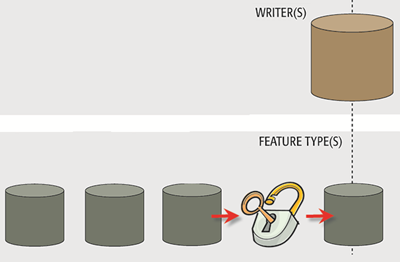

# Dynamic Translations

Dynamic Translations are a way to create "schema-less" workspaces.

## What are Dynamic Translations? ##

Most translations - and everything this training has covered so far - involve a schema defined within the workspace. In other words, the source and destination schema reflect the structure of the source data (what we have) and the structure of the destination data the user requires (what we want).

The layout of a dynamic translation does not reflect either the source or destination schema. It’s a universal layout that is designed to handle data regardless of the schema used.

---

<table style="border-spacing: 0px">
<tr>
<td style="vertical-align:middle;background-color:darkorange;border: 2px solid darkorange">
<i class="fa fa-quote-left fa-lg fa-pull-left fa-fw" style="color:white;padding-right: 12px;vertical-align:text-top"></i>
FME Lizard says…
</td>
</tr>

<tr>
<td style="border: 1px solid darkorange">

For this section, it’s useful to think of a schema as comprised of a trio of objects: feature types, attributes, and geometry type.

</td>
</tr>
</table>

---

### Dynamic Readers ###
On the reader side of things, a dynamic workspace is very similar to using Merge Parameters; feature types are given free entry to a workspace, regardless of whether they are yet defined in there.

Data is also read regardless of attributes or geometry type.

### Dynamic Writers ###

The writer side of a dynamic workspace mimics the reader part; feature types are written to the destination dataset, regardless of whether they are defined in the workspace.

Additionally, all attributes and geometries get written, regardless of whether they too have been predefined in a writer feature type.

---

<table style="border-spacing: 0px">
<tr>
<td style="vertical-align:middle;background-color:darkorange;border: 2px solid darkorange">
<i class="fa fa-quote-left fa-lg fa-pull-left fa-fw" style="color:white;padding-right: 12px;vertical-align:text-top"></i>
FME Lizard asks…
</td>
</tr>

<tr>
<td style="border: 1px solid darkorange">

<quiz name="">
  <question multiple>
    

      Q) It's important to get the concepts correct here, so pick out as many of these statements as you think are true:
    

    <answer><li>A Dynamic workspace will read/write any format of data</answer>
    <answer correct><li>A Dynamic workspace will read/write any feature types in the source data</answer>
    <answer correct><li>A Dynamic workspace will read/write any attributes in the source data</answer>
    <answer correct><li>A Dynamic workspace will read/write any geometry in the source data</answer>
    <explanation>  A) Feature Types, Attributes, and Geometry are the three schema parts handled by dynamic workspaces. Format is not handled. This is the role of the Generic Reader/Writer. A workspace may be generic, or dynamic, or both, or neither!</explanation>
  </question>
</quiz>

</td>
</tr>
</table>
