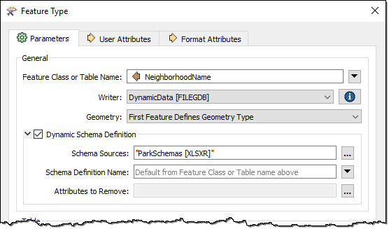
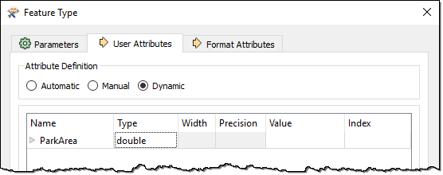
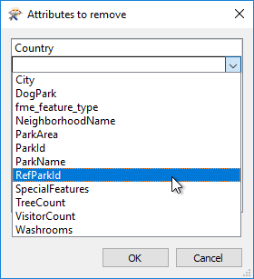
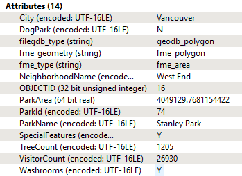

## Dynamic Attributes ##

As we know, there are three main components of a schema:

- Feature Type
- Attributes
- Geometry

This section looks at Attributes, and how a workspace author can change the attributes that are written in a dynamic translation.

---

### Defining Attribute Names ###

This is probably the most complex part of dynamic translations, so let's take the explanation step by step, going back over some old ground where necessary.

As we've seen, in a dynamic translation each incoming feature has an attribute (either *fme&#95;feature&#95;type* or another attribute) that specifies to which feature type the data is to be written.

The Schema Sources parameter defines where those feature types exist and uses them also to define the attributes and geometry types that are written to the output. 

Here, for example, we have a set of parks data being written to Esri Geodatabase. Notice the output feature type (table) name is set to the NeighborhoodName attribute.

The schema is obtained from an Excel spreadsheet, added as a Resource Reader. If, for a particular feature, NeighborhoodName = "Strathcona" then the writer looks for a sheet in the Excel spreadsheet file called Strathcona, and writes the feature using the same attributes as that table.

However... underneath the Schema Source parameter in this dialog is a setting for Schema Definition Name. The Schema Definition Name overrides attribute definitions:

Here, for example, the user still specifies NeighborhoodName to provide the feature type to be written, but overrides the attributes by saying they have to come from a table called Parks.

What's interesting is that the feature type specified by NeighborhoodName no longer needs to exist; i.e. the "Strathcona" sheet does not have to exist to get a "Strathcona" feature type in the output Geodatabase. It is enough that the Parks sheet does exist.

---

<table style="border-spacing: 0px">
<tr>
<td style="vertical-align:middle;background-color:darkorange;border: 2px solid darkorange">
<i class="fa fa-quote-left fa-lg fa-pull-left fa-fw" style="color:white;padding-right: 12px;vertical-align:text-top"></i>
FME Lizard says…
</td>
</tr>

<tr>
<td style="border: 1px solid darkorange">

In the above example, the Schema Definition Name was a fixed value; i.e. all output feature types got the same attribute definitions. However, the Schema Definition Name can also come from an attribute; meaning one attribute defines the feature type name, and another attribute defines a feature type from which the attribute schema is to come!

</td>
</tr>
</table>

---

#### Adding or Deleting Attributes ####

Besides specifying which set of attributes to use, sometimes - even in a dynamic translation - you need to add or delete specific attributes. This is very simple to do.

##### Adding a New Attribute #####

Adding a new attribute to all output on a dynamic feature type is just a case of editing the feature type definition to add that attribute:

In other words, any attribute you add to the feature type definition gets added to all features output through there – regardless of source or resource schemas.

For example, above the user adds an attribute to store the result of an AreaCalculator transformer in the workspace.

##### Deleting an Attribute #####

Deleting an existing attribute is done through the dynamic Schema Definition dialog. At the foot of that dialog is a field for removing attributes:

The edit [...] button opens a dialog in which to select or manually enter attributes that are in the source schema but that you don’t want in the output:

Here the user manually enters Country (an attribute from the external schema) to remove it from the output. They also select RefParkId not to be output.

The result of all of the above changes is as follows:

The feature gets various attributes from the Excel schema (City had to be set manually because the input had no such attribute), and adds ParkArea on its own account. Country and RefParkId have either been removed or just chosen to not exist in the output schema.