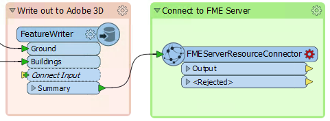
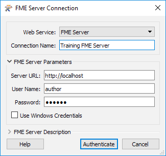
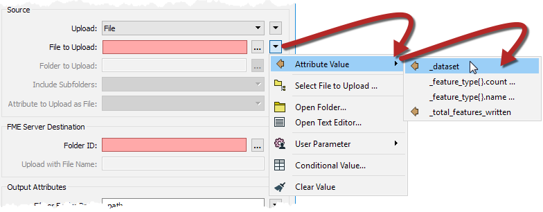
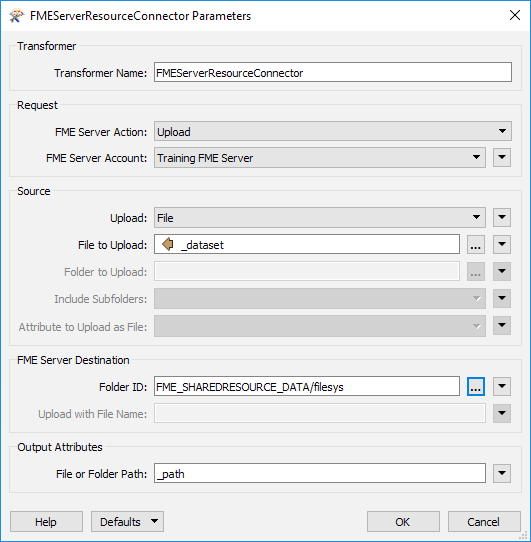
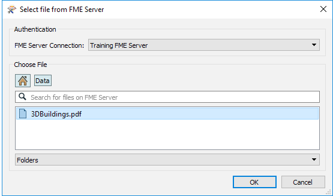

<!--Exercise Section-->

<table style="border-spacing: 0px;border-collapse: collapse;font-family:serif">
<tr>
<td style="vertical-align:middle;background-color:darkorange;border: 2px solid darkorange">
<i class="fa fa-cogs fa-lg fa-pull-left fa-fw" style="color:white;padding-right: 12px;vertical-align:text-top"></i>
Exercise 1
</td>
<td style="border: 2px solid darkorange;background-color:darkorange;color:white">
Web-Based Connections
</td>
</tr>

<tr>
<td style="border: 1px solid darkorange; font-weight: bold">Data</td>
<td style="border: 1px solid darkorange">Point Cloud Data (LiDAR LAS) and Building Outline Data (AutoCAD DWG) </td>
</tr>

<tr>
<td style="border: 1px solid darkorange; font-weight: bold">Overall Goal</td>
<td style="border: 1px solid darkorange">Upload data to an online web service</td>
</tr>

<tr>
<td style="border: 1px solid darkorange; font-weight: bold">Demonstrates</td>
<td style="border: 1px solid darkorange">Creating a web connection and using a connector transformer</td>
</tr>

<tr>
<td style="border: 1px solid darkorange; font-weight: bold">Start Workspace</td>
<td style="border: 1px solid darkorange">C:\FMEData2018\Workspaces\DesktopAdvanced\ReadWrite-Ex1-Begin.fmw</td>
</tr>

<tr>
<td style="border: 1px solid darkorange; font-weight: bold">End Workspace</td>
<td style="border: 1px solid darkorange">C:\FMEData2018\Workspaces\DesktopAdvanced\ReadWrite-Ex1-Complete.fmw</td>
</tr>

</table>

You've created a workspace that takes LiDAR point cloud data and creates a 3D PDF. You'd like to share it with your colleagues but the file is too large to attach to an email. Your workplace has just recently acquired FME Server and you would like to try it out for data storage and sharing. 

 **1) Open Workspace**
 In FME Desktop open the ReadWrite-Ex1-Begin.fmw workspace. 

This workspace takes a LiDAR point cloud and building outlines to create a 3D model that is written to the Adobe 3D PDF format using a FeatureWriter transformer.

 **2) Add FMEServerResourceConnector Transformer**
 In the bookmark labeled Connect to FME Server, add a FMEServerResourceConnector transformer and connect it to the FeatureWriter:Summary output port:

In the parameters ensure that the FME Server Action is set to Upload. For the FME Server Account open the drop-down menu and click Add Web Connection:

In the FME Server Connection Dialog change the Connection Name, if desired. Then set the Server URL to:

<pre>
    http://localhost
</pre>

Then for User Name and Password set it to author, author, respectively, and click Authenticate:

---

<!--Warning Section--> 

<table style="border-spacing: 0px">
<tr>
<td style="vertical-align:middle;background-color:darkorange;border: 2px solid darkorange">
<i class="fa fa-info-circle fa-lg fa-pull-left fa-fw" style="color:white;padding-right: 12px;vertical-align:text-top"></i>
TIP
</td>
</tr>

<tr>
<td style="border: 1px solid darkorange">

If you do not have FME Server installed, you can connect to any web connection for this exercise, just add the appropriate connector transformer and create a connection the same way. 

</td>
</tr>
</table>

---

For the Source ensure that Upload is set to File. Then for File to Upload, click the drop-down icon then Attribute then select _dataset:

Finally for the FME Server Destination click on the ellipsis next to Folder ID:

This will connect to your FME Server Resources folder. Double click on the Data folder to open it. Then click OK: 

Your parameters should look like this when it's all set up:

 **3) Run Translation**
 Now when we run our translation the data will write to our local disk but also upload the output file onto FME Server where any of our colleagues can download it. 

Run the translation.

 **4) Test Upload**
 We need to check to see if our data was uploaded successfully without opening FME Server (that's a different course). 

To do this we can use our FMEServerResourceConnector transformer. Open up the parameters and change the FME Server Action to Download. Then click the ellipsis next to FME Server Source Object ID:

This opens the file browser for FME Server. Double click on the Data folder to open it and our 3DBuildings.pdf is there:

Cancel out of all dialogs to return the FMEServerResourceConnector to the Upload state. 

---

<!--Exercise Congratulations Section--> 

<table style="border-spacing: 0px">
<tr>
<td style="vertical-align:middle;background-color:darkorange;border: 2px solid darkorange">
<i class="fa fa-thumbs-o-up fa-lg fa-pull-left fa-fw" style="color:white;padding-right: 12px;vertical-align:text-top"></i>
CONGRATULATIONS
</td>
</tr>

<tr>
<td style="border: 1px solid darkorange">

By completing this exercise you have learned how to:
<ul><li>Set up a web connection</li>
<li>Upload data to FME Server or another online service</li>
<li>Download data from FME Server or another online service</li></ul>

</td>
</tr>
</table>    
