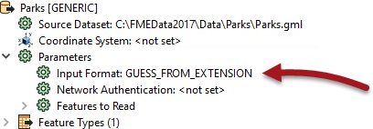
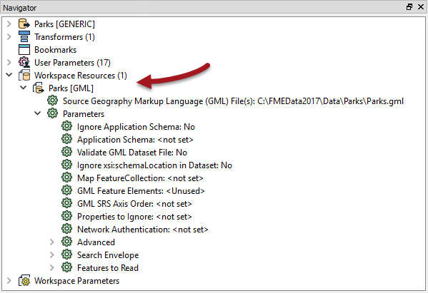

## The Generic Reader ##

A Generic Reader is used in the same way as any other reader; by specifying the format in the Add Reader (or Generate Workspace) dialog:

There the source dataset is a MapInfo TAB dataset, but FME does not know that yet. When the workspace is run FME examines the extension of the file chosen to determine this for itself.

At a later time the end-user might then choose a different file - in a completely different format - to be read, like so:

Again, at run time FME examines the file extension to identify the format of data and then - having discovered it is GML - will read it just as if it were a true GML reader.

That way a single reader can be made to read any format of data.

---

<table style="border-spacing: 0px">
<tr>
<td style="vertical-align:middle;background-color:darkorange;border: 2px solid darkorange">
<i class="fa fa-quote-left fa-lg fa-pull-left fa-fw" style="color:white;padding-right: 12px;vertical-align:text-top"></i>
Sister Intuitive says…
</td>
</tr>

<tr>
<td style="border: 1px solid darkorange">

You're thinking there must be a catch, right? Well it's true. Firstly this technique only works with file-based formats (it won't work on a database or web format). Secondly, the Generic Reader is not immune from the Unexpected Input Remover, so switching datasets - regardless of format - only works with a compatible schema (see below).

</td>
</tr>
</table>

---

### Generic Reader Feature Types ###

The Unexpected Input Remover is the function in FME that filters incoming data against the list of feature types (layers) that are defined in the workspace. If the incoming data is stored on a layer that is not defined in the workspace, then it will be dropped from the translation:

So say, for example, that the Parks.gml dataset in the above screenshot contained a layer called CityParks, when the original MapInfo dataset contained a layer called Parks, then this would be the result:

So, although the Generic Reader allows you to read datasets of different formats, the limitation is that each dataset must have its layers defined as feature types in the workspace, unless you want them to be dropped.

Of course, an easy way to allow all layers to pass is to set a Merge Feature Type in the Feature Type Properties:

With that setup, any layer of data can be passed into the workspace, regardless of format. Of course, even then you need to be careful about assuming what attributes will be available!

---

### Generic Reader Parameters ###

All readers in a workspace have a number of parameters that can be used to control how that reader operates. Each format has its own set of specialized parameters.

However, the Generic Reader has very few parameters, the main one being to set the format of data being read:

By default this is set to determine data format from the file extension, but it can be set manually to a specific format.

---

<table style="border-spacing: 0px">
<tr>
<td style="vertical-align:middle;background-color:darkorange;border: 2px solid darkorange">
<i class="fa fa-quote-left fa-lg fa-pull-left fa-fw" style="color:white;padding-right: 12px;vertical-align:text-top"></i>
Sister Intuitive says…
</td>
</tr>

<tr>
<td style="border: 1px solid darkorange">

The Input Format parameter is useful when the file extension is - like .mdb - one used by multiple formats. For example, you might turn it into a user parameter for use in an FME Server data upload service. Then a single workspace can read any format of data, but the end-user is able to tell you what format that is.

</td>
</tr>
</table>

---

However, let's say you wish to use the Generic Reader, but apply a particular GML reader parameter when a GML dataset is being read. If the Generic Reader has no parameters, then how can this be done?

In brief, the solution is to add a dummy GML reader:

The idea is that all of the parameters in this dummy GML reader get applied to the Generic Reader when reading GML data.

---

<table style="border-spacing: 0px">
<tr>
<td style="vertical-align:middle;background-color:darkorange;border: 2px solid darkorange">
<i class="fa fa-quote-left fa-lg fa-pull-left fa-fw" style="color:white;padding-right: 12px;vertical-align:text-top"></i>
Sister Intuitive says…
</td>
</tr>

<tr>
<td style="border: 1px solid darkorange">

Notice that the above screenshot shows the GML reader under "Workspace Resources". You do this by using Readers &gt; Add Reader as Resource on the menubar. This is the best solution because it applies parameters without actually reading any data. There's more info on Resource Readers later in this chapter.

</td>
</tr>
</table>
