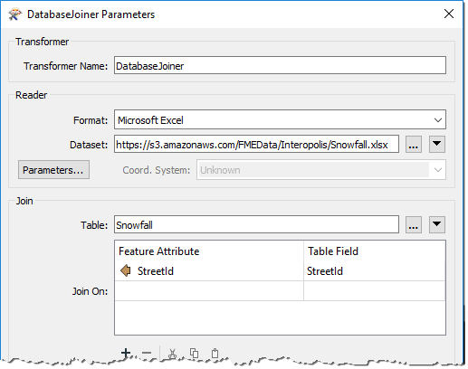
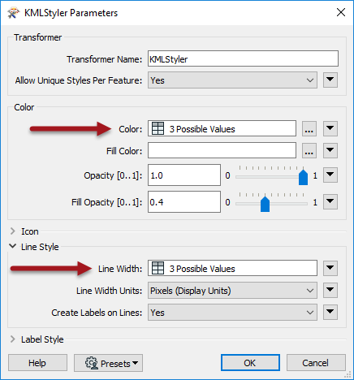
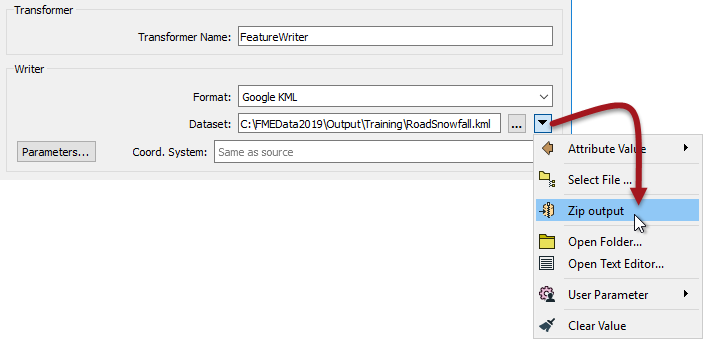
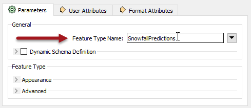
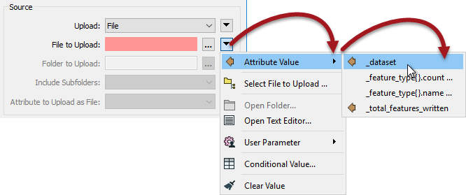
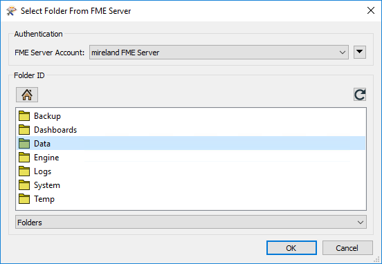
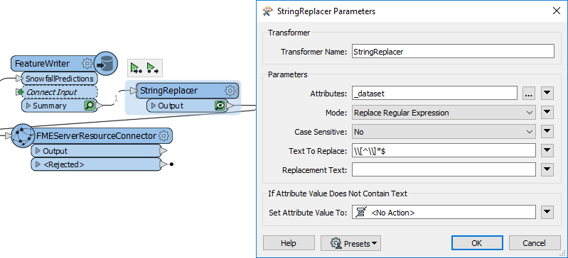

<!--Exercise Section-->

<table style="border-spacing: 0px;border-collapse: collapse;font-family:serif">
<tr>
<td style="vertical-align:middle;background-color:darkorange;border: 2px solid darkorange">
<i class="fa fa-cogs fa-lg fa-pull-left fa-fw" style="color:white;padding-right: 12px;vertical-align:text-top"></i>
Exercise 1
</td>
<td style="border: 2px solid darkorange;background-color:darkorange;color:white">
Web-Based Connections
</td>
</tr>

<tr>
<td style="border: 1px solid darkorange; font-weight: bold">Data</td>
<td style="border: 1px solid darkorange">Point Cloud Data (LiDAR LAS) and Building Outline Data (AutoCAD DWG) </td>
</tr>

<tr>
<td style="border: 1px solid darkorange; font-weight: bold">Overall Goal</td>
<td style="border: 1px solid darkorange">Upload data to an online web service</td>
</tr>

<tr>
<td style="border: 1px solid darkorange; font-weight: bold">Demonstrates</td>
<td style="border: 1px solid darkorange">Creating a web connection and using a connector transformer</td>
</tr>

<tr>
<td style="border: 1px solid darkorange; font-weight: bold">Start Workspace</td>
<td style="border: 1px solid darkorange">None</td>
</tr>

<tr>
<td style="border: 1px solid darkorange; font-weight: bold">End Workspace</td>
<td style="border: 1px solid darkorange">C:\FMEData2019\Workspaces\DesktopAdvanced\ReadWrite-Ex1-Complete.fmw</td>
</tr>

</table>

In this exercise we'll create a workspace that does a join to an online dataset, processes the data, and writes it back out to a different web destination.

 **1) Add Reader**
 Start FME Workbench and in an empty workspace add a reader with these parameters:

<table style="border: 0px">

<tr>
<td style="font-weight: bold">Reader Format</td>
<td style="">Autodesk AutoCAD DWG/DXF</td>
</tr>

<tr>
<td style="font-weight: bold">Reader Dataset</td>
<td style="">C:\FMEData2019\Data\Transportation\CompleteRoads.dwg</td>
</tr>

<tr>
<td style="font-weight: bold">Parameters</td>
<td style="">Group Entities By: Attribute Schema</td>
</tr>

<tr>
<td style="font-weight: bold">Workflow Options</td>
<td style="">Single Merged Feature Type</td>
</tr>

</table>

The Group Entities parameter is an AutoCAD-specific option. It ensures that we have attributes from the AutoCAD source data exposed in Workbench.

The Merged Feature Type option means all the road data is treated as a single map layer, which is fine because we aren't too interested in handling multiple layers separately.

 **2) Locate Snowfall Dataset**
 In a web browser, browse to the City of Interopolis **[Open Data Portal](https://s3.amazonaws.com/FMEData/Interopolis/interopolis.html)** (https://s3.amazonaws.com/FMEData/Interopolis/interopolis.html).

Locate the dataset for Snowfall Predictions, right-click on where it says Excel Spreadsheet, and choose to copy the URL:

The exact command will vary according to web browser of choice.

 **3) Add DatabaseJoiner Transformer**
 Back in FME Workbench, add a DatabaseJoiner transformer and connect it to the roads feature type. Open the DatabaseJoiner parameters.

Set the parameters as follows:

<table style="border: 0px">

<tr>
<td style="font-weight: bold">Reader Format</td>
<td style="">Microsoft Excel</td>
</tr>

<tr>
<td style="font-weight: bold">Reader Dataset</td>
<td style="">https://s3.amazonaws.com/FMEData/Interopolis/Snowfall.xlsx</td>
</tr>

</table>

...where, of course, you can paste the URL you copied from the web browser.

Click the parameters button and check that the data is being read correctly. Proof of this is the preview window showing records with the correct columns. 

Back in the main DatabaseJoiner dialog, select Snowfall as the join table and select StreetId as both the Feature Attribute and Table Field to be joined:

---

<!--Tip Section--> 

<table style="border-spacing: 0px">
<tr>
<td style="vertical-align:middle;background-color:darkorange;border: 2px solid darkorange">
<i class="fa fa-info-circle fa-lg fa-pull-left fa-fw" style="color:white;padding-right: 12px;vertical-align:text-top"></i>
TIP
</td>
</tr>

<tr>
<td style="border: 1px solid darkorange">

If no attributes are available under the Feature Attribute field, then you failed to use the Group Entities By: Attribute Schema parameter when adding the AutoCAD reader. To resolve this the simplest method is to delete and re-add the reader, using the correct options this time.

</td>
</tr>
</table>

---

The final parameters to set in the DatabaseJoiner are *Fields to Add* and *Cardinality*:

Select the following for Fields to Add:

- EstimatedSnowfall
- LastTreated
- Temperature
- WeatherStation

Ensure Cardinality is set to **Match First (1:0...1+)**; then each road feature will be joined to the first matching database record FME finds. It's the option least likely to lead to error messages in the log.

 **4) Add KMLStyler Transformer (Optional)**
 The goal of the project is to write the data to KML format. As a training exercise, we're really only interested in how and where we write the data. However, a realistic requirement would be to set the color and style of the spatial data being written (in spatial terms we sometimes call this *symbology*).

So, as an optional step, place a KMLStyler transformer, connected to the DatabaseJoiner. Open the parameters dialog and set it up to give the roadwork features a specific style.

Here the author has used Conditional Values (discussed in chapter one) to illustrate the roads differently according to the amount of expected snowfall:

However, you can choose to select a fixed color, copy the transformer from the completed workspace, or even ignore this step completely.

 **5) Add FeatureWriter Transformer**
 Now it's time to write the data. It's not as simple to write data directly to a web service, so what we'll do is write it to a zipped, file-based dataset, and then upload that dataset to a web service.

So, add a FeatureWriter transformer and connect it to the KMLStyler transformer (if you added one) or the DatabaseJoiner transformer (if you didn't). 

Open the parameters and set the writer up as follows:

<table style="border: 0px">

<tr>
<td style="font-weight: bold">Writer Format</td>
<td style="">Google KML</td>
</tr>

<tr>
<td style="font-weight: bold">Writer Dataset</td>
<td style="">C:\FMEData2019\Output\Training\RoadSnowfall.kml</td>
</tr>

</table>

Then click on the dropdown arrow to the right of the Dataset parameter, and choose the option to Zip Output

This will make the transformer write data directly to a zipped (compressed/archived) file.

As a final step in this transformer, rename the output feature type to SnowfallPredictions:

Now when the workspace is run, a dataset will be written. The FeatureWriter will create an attribute called *&#95;dataset* to record the name and path of the dataset. The next step is to upload this file to a web service...

---

<!--Tip Section-->

<table style="border-spacing: 0px">
<tr>
<td style="vertical-align:middle;background-color:darkorange;border: 2px solid darkorange">
<i class="fa fa-info-circle fa-lg fa-pull-left fa-fw" style="color:white;padding-right: 12px;vertical-align:text-top"></i>
TIP
</td>
</tr>

<tr>
<td style="border: 1px solid darkorange">

You can copy the data to any web service to which you have access, you just need to use the appropriate connector transformer. For example, use the DropboxConnector to copy data to Dropbox, or the GoogleDriveConnector to copy it to Google Drive.

The rest of this exercise will use FME Server and the FMEServerResourceConnector, using connection settings that assume FME Server is installed on the same system as FME Desktop, which would be the case if you are using one of Safe Software's virtual training computers.

</td>
</tr>
</table>

---

 **6) Add FMEServerResourceConnector Transformer**
 Add a FMEServerResourceConnector transformer and connect it to the FeatureWriter:Summary output port. The workspace should now look like this:

In the parameters dialog ensure that the FME Server Action is set to Upload. For the FME Server Account open the drop-down menu and click Add Web Connection:

In the FME Server Connection Dialog change the Connection Name, if desired. Then set following parameters and click Authenticate:

<pre>
Server URL: http://localhost
Username: author
Password: author
</pre>

---

<!--Warning Section--> 

<table style="border-spacing: 0px">
<tr>
<td style="vertical-align:middle;background-color:darkorange;border: 2px solid darkorange">
<i class="fa fa-exclamation-triangle fa-lg fa-pull-left fa-fw" style="color:white;padding-right: 12px;vertical-align:text-top"></i>
WARNING
</td>
</tr>

<tr>
<td style="border: 1px solid darkorange">

When using a Safe Software virtual machine you may get an authentication error:
  <code>Retrieval Error : Unable to make the request to FME Server. Ensure your machine has internet connectivity</code>
  In this scenario we recommend restarting your virtual machine. Save your workspace and exit FME Workbench. Click the Start Button &gt; Power &gt; Restart. The machine will take a minute or two to restart, and your issue should be resolved. If not, please use the GoToWebinar Questions panel to ask for help or email <a href="mailto:train@safe.com">train@safe.com</a>.

</td>
</tr>
</table>

---

Ensure the Source Upload parameter is set to File. For File to Upload parameter, click the drop-down icon and select Attribute Value &gt; &#95;dataset:

Finally for the FME Server Destination click on the ellipsis next to Folder ID. This will connect to your FME Server Resources folder. Click on the Data folder to select it and click OK:

The parameter is now set to upload to the *FME&#95;SHAREDRESOURCE&#95;DATA/filesys* folder. That was the final part of the FMEServerResourceConnector set up, so click OK to close its parameters dialog.

 **7) Run Translation**
 Save the workspace and then run it. 

Oops! There are a lot of errors message. The key one is:

<pre>
FileNotFoundError: [Errno 2] No such file or directory: 'C:\\FMEData2019\\Output\\Training\\RoadSnowfall.zip\\RoadSnowfall.kml'
</pre>

The problem is that the path only needs to point to the zip file, not the file within it. Let's fix that.

Add a StringReplacer transformer between the FeatureWriter and FMEServerResourceConnector transformers. Set it up with the following parameters:

Attributes: &#95;dataset
Mode: Replace Regular Expression
Text to Replace: `\\[^\\]*$`

Leave the Replacement Text field empty. That regular expression will look for the final \ character in the string, and replace everything after it with the replacement text (which is nothing):

Now when we run our translation the data will write to our local disk but also upload the output file onto FME Server where any of our colleagues can download it.

Run the translation.

 **8) Test Upload**
 Check the results of the translation in the Visual Preview window (or Data Inspector). The output of the FMEServerResourceConnector will be a single feature with an attribute storing a link to the data on Server. 

Copy the contents of the &#95;direct&#95;download&#95;link attribute to the system clipboard. Paste the copied link into the address bar of a web browser and press the <kbd>return</kbd> key.

The uploaded file will be downloaded from FME Server. If prompted for connection parameters, use the username and password you entered into the FME Server connection.

---

<!--Tip Section--> 

<table style="border-spacing: 0px">
<tr>
<td style="vertical-align:middle;background-color:darkorange;border: 2px solid darkorange">
<i class="fa fa-info-circle fa-lg fa-pull-left fa-fw" style="color:white;padding-right: 12px;vertical-align:text-top"></i>
TIP
</td>
</tr>

<tr>
<td style="border: 1px solid darkorange">

An alternative method of testing the result would be to create a second workspace. Place a Creator and FMEServerResourceConnector combination and - this time - set the Server Action Download. Click the ellipsis next to FME Server Source Object ID to open a file browser and then browse to the Data folder to locate the SnowfallPredictions KML dataset.

</td>
</tr>
</table>

---

<!--Exercise Congratulations Section-->

<table style="border-spacing: 0px">
<tr>
<td style="vertical-align:middle;background-color:darkorange;border: 2px solid darkorange">
<i class="fa fa-thumbs-o-up fa-lg fa-pull-left fa-fw" style="color:white;padding-right: 12px;vertical-align:text-top"></i>
CONGRATULATIONS
</td>
</tr>

<tr>
<td style="border: 1px solid darkorange">

By completing this exercise you have learned how to:
<ul><li>Carry out a data join with a web-based dataset</li>
<li>Write data to a compressed output using the FeatureWriter transformer</li>
<li>Set up a web connection</li>
<li>Use a regular expression in a StringReplacer transformer</li>
<li>Upload data to FME Server (or another online service)</li>
<li>Download data from FME Server (or another online service)</li></ul>

</td>
</tr>
</table>
