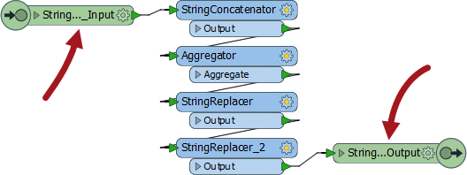
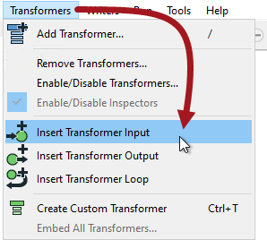
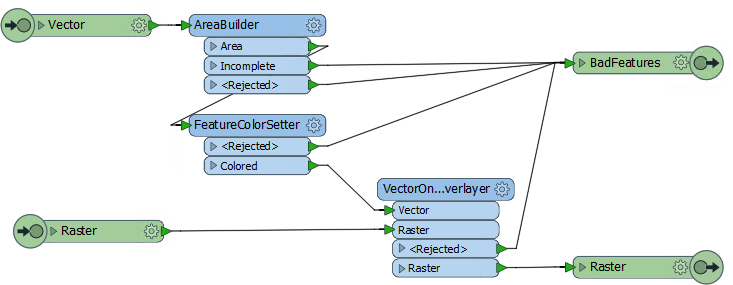

## Custom Transformer Input/Output Ports ##

Again, like a normal FME transformer, a custom transformer has a number of input and output ports:

These input and output ports are defined by input/output objects in the custom transformer definition itself:

### Renaming Ports ###

The first thing to know is that these input/output objects can be renamed, in order that the transformer ports get named appropriately. You can either double-click the object, choose Rename from the context menu, or press F2, in order to rename the object.

For example, here the user is renaming an input port from StringConcatenator_Input to simply Input.

Renaming the input and output ports is useful for making the custom transformer object more legible, and for helping the user to understand what data is supposed to connect to the port.

For example, after editing the transformer might look like this:

---

<!--Person X Says Section-->

<table style="border-spacing: 0px">
<tr>
<td style="vertical-align:middle;background-color:darkorange;border: 2px solid darkorange">
<i class="fa fa-quote-left fa-lg fa-pull-left fa-fw" style="color:white;padding-right: 12px;vertical-align:text-top"></i>
First Officer Transformer says...
</td>
</tr>

<tr>
<td style="border: 1px solid darkorange">

Here the user has simply renamed the ports to Input and Output. However, renaming the input port to "Strings", "Lines", or "Raster" (for example) help guide other users of the transformer as to what data is required as input. 
  Likewise, the output port could be renamed to illustrate the type of data that will emerge; for example "Contours", "Labels", "Concatenated", etc.

</td>
</tr>
</table>

---

### Adding or Removing Ports ###

Besides renaming ports, it is also possible to add new ports to a custom transformer.

To do so simply click the tab to display the custom transformer’s definition and select Transformer Input (or Output) from either the canvas context (right-click) menu or the menubar.

For example, here a user has added ports to handle two streams of input data, and has two output ports (one for the required output, another that handles "bad" features:

This means that each instance of the custom transformer in the main canvas will now have an extra input port, like so:

---

<!--Person X Says Section-->

<table style="border-spacing: 0px">
<tr>
<td style="vertical-align:middle;background-color:darkorange;border: 2px solid darkorange">
<i class="fa fa-quote-left fa-lg fa-pull-left fa-fw" style="color:white;padding-right: 12px;vertical-align:text-top"></i>
Miss Vector says...
</td>
</tr>

<tr>
<td style="border: 1px solid darkorange">

Here are some questions for you.
  Q) Which of these is NOT a reason to use Custom Transformers?
  1. To make my content available in Quick Add
 2. To use advanced functionality like looping
 3. To reuse chunks of content in a simple way
 4. To tidy and declutter the main workspace canvas
  Q) Consider this section of workspace. If I select the three transformers highlighted with arrows, and create a custom transformer, how many input and output ports will it have by default?
  
  1. One Input and One Output port
 2. One Input and Two Output ports
 3. Two Input and Two Output ports
 4. Two Input and Three Output ports

</td>
</tr>
</table>

---