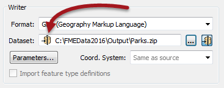

# Zip File Handling

The Basic Desktop course covered how data can be read directly from a zip file. However, it is also possible to write data to a zip file.

Zip files are a convenient way to write output datasets that need to be handled as a single unit.

For example, a single Shape feature type consists of several files; shp, shx, dbf, prj, etc. A Shape dataset can consist of multiple feature types. So, in a scenario where the output data needs to be post-processed – uploaded to a web site, say – it’s more convenient to handle a single zip file than multiple data files.

## Zip File Writing ##

The simplest way to create a zipped output is to simply change the file extension to .zip in the output dataset field:

A shortcut button for setting a zip extention exists on most Writer dialogs:

Once set, a small icon in the dataset field indicates the zipped status:

When the workspace is run the log file reports the zip creation:

<pre>
Finished updating output zip file `C:\FMEData2017\Output\Parks.zip'
</pre>

And the output is, indeed, a zipped dataset:

---

<!--Person X Says Section-->
<!--Sister Intuitive is the representative for this chapter-->

<table style="border-spacing: 0px">
<tr>
<td style="vertical-align:middle;background-color:darkorange;border: 2px solid darkorange">
<i class="fa fa-quote-left fa-lg fa-pull-left fa-fw" style="color:white;padding-right: 12px;vertical-align:text-top"></i>
Sister Intuitive says…
</td>
</tr>

<tr>
<td style="border: 1px solid darkorange">

I’m Sister Intuitive from the order of Perpetual Translations. I’ll provide you with spatial guidance throughout this chapter.
  Some users may want to zip data in order to upload it to a different location as a single entity. A user parameter can be used in a TCL or Python script to find the name of the file just written, and the FeatureWriter transformer (new in FME2016) also provides the name of the dataset as an attribute.

</td>
</tr>
</table>