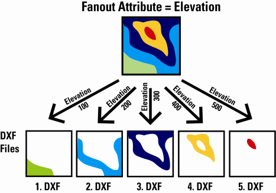
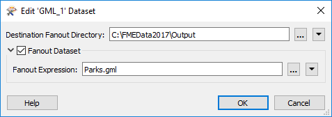
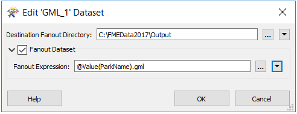

## Dataset Fanout ##

A Dataset Fanout delivers data to the same feature type, but in multiple datasets. Taking the elevation example again, here the output is a different dataset for each elevation value:

This results in a series of DXF datasets, each of which has one elevation’s worth of contours on one layer.

### Setting a Dataset Fanout ###

A Dataset Fanout is defined in the Navigator window in Workbench, just below the Writer’s dataset parameter:

Double-clicking the Fanout Dataset parameter opens a dialog in which to define the folder to write to and the Fanout Expression to use. It defaults to the original file name:

The Fanout Expression can - like the Feature Type fanout - be a simple attribute, like so:

In this case, each feature with a different park name will be written to a different GML output dataset (whereas a feature type fanout would write to different layers in the same dataset).

Additionally, as with a Feature Type fanout, the Text Editor can be used to construct a dataset fanout string, giving (here) a series of GML datasets, each with the park ID and name included:

Two things to notice in that result are:

- The **:** (colon) character is not supported in the filename (a Windows limitation) - but this time it had to be removed before running the workspace
- The file extension (.gml) is necessary as part of the fanout string. FME won't add it automatically.

---

<table style="border-spacing: 0px">
<tr>
<td style="vertical-align:middle;background-color:darkorange;border: 2px solid darkorange">
<i class="fa fa-quote-left fa-lg fa-pull-left fa-fw" style="color:white;padding-right: 12px;vertical-align:text-top"></i>
Miss Vector says…
</td>
</tr>

<tr>
<td style="border: 1px solid darkorange">

Fanouts are an important part of writing data with FME, so tell me, which of these statements are true?
  <a href="http://52.73.3.37/fmedatastreaming/Manual/QAResponse2017.fmw?chapter=14&question=1&answer=1&DestDataset_TEXTLINE=C%3A%5CFMEOutput%5CQAResponse.html">1. You can have both a Feature Type Fanout and a Dataset Fanout in the same workspace</a>
 <a href="http://52.73.3.37/fmedatastreaming/Manual/QAResponse2017.fmw?chapter=14&question=1&answer=2&DestDataset_TEXTLINE=C%3A%5CFMEOutput%5CQAResponse.html">2. You can use a Feature Type Fanout with a database format, but not a Dataset Fanout</a>
 <a href="http://52.73.3.37/fmedatastreaming/Manual/QAResponse2017.fmw?chapter=14&question=1&answer=3&DestDataset_TEXTLINE=C%3A%5CFMEOutput%5CQAResponse.html">3. A fanout expression can be an attribute, or a constructed string, but not a user parameter</a>
 <a href="http://52.73.3.37/fmedatastreaming/Manual/QAResponse2017.fmw?chapter=14&question=1&answer=4&DestDataset_TEXTLINE=C%3A%5CFMEOutput%5CQAResponse.html">4. A fanout cannot be based on a format attribute such as fme_color</a>

</td>
</tr>
</table>
