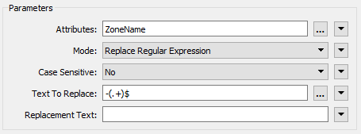
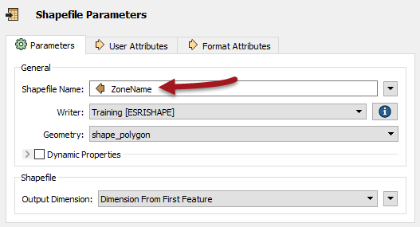

<!--Exercise Section-->

<table style="border-spacing: 0px;border-collapse: collapse;font-family:serif">
<tr>
<td style="vertical-align:middle;background-color:darkorange;border: 2px solid darkorange">
<i class="fa fa-cogs fa-lg fa-pull-left fa-fw" style="color:white;padding-right: 12px;vertical-align:text-top"></i>
Exercise 1
</td>
<td style="border: 2px solid darkorange;background-color:darkorange;color:white">
Development Zone Translation
</td>
</tr>

<tr>
<td style="border: 1px solid darkorange; font-weight: bold">Data</td>
<td style="border: 1px solid darkorange">Zoning Data (MapInfo TAB, Esri Shapefile)</td>
</tr>

<tr>
<td style="border: 1px solid darkorange; font-weight: bold">Overall Goal</td>
<td style="border: 1px solid darkorange">Create a separate Shape dataset for each type of development zone</td>
</tr>

<tr>
<td style="border: 1px solid darkorange; font-weight: bold">Demonstrates</td>
<td style="border: 1px solid darkorange">Feature Type Fanouts and Zipped Datasets</td>
</tr>

<tr>
<td style="border: 1px solid darkorange; font-weight: bold">Start Workspace</td>
<td style="border: 1px solid darkorange">None</td>
</tr>

<tr>
<td style="border: 1px solid darkorange; font-weight: bold">End Workspace</td>
<td style="border: 1px solid darkorange">C:\FMEData2017\Workspaces\DesktopAdvanced\ReadWrite-Ex1-Complete.fmw C:\FMEData2017\Workspaces\DesktopAdvanced\ReadWrite-Ex1-Complete-Advanced.fmw</td>
</tr>

</table>

You’ve been given a dataset of development zones and asked to separate each zone type into a separate Shapefile and send it back with everything zipped together in a single file.

The requester thinks this will be a difficult task; but with FME you should be able to do it in about two minutes.

 **1) Inspect Source Data**
 Inspect the source dataset for this translation in the Data Inspector. The source data is a MapInfo TAB dataset:

<table style="border: 0px">

<tr>
<td style="font-weight: bold">Reader Format</td>
<td style="">MapInfo TAB (MITAB)</td>
</tr>

<tr>
<td style="font-weight: bold">Reader Dataset</td>
<td style="">C:\FMEData2017\Data\Zoning\Zones.tab</td>
</tr>

</table>

Check the geometry type used and notice that there is a field called ZoneName. We need the first characters of this field (up to any "–" character) for our fanout.

 **2) Start Workbench**
 Start Workbench and generate a workspace to translate the MapInfo source data to Esri Shapefile.

By default the workspace will include a GeometryFilter and multiple output feature types. However, we know the data is polygon only (because we inspected it first, right?) so we can remove much of this.

So, delete the GeometryFilter transformer and all of the writer feature types except Zones_polygon. You’ll end up with something that looks like this:

 **3) Add StringReplacer Transformer**
 To remove everything after the “-“ character in the ZoneName field, place a StringReplacer transformer into the workspace, between the Reader and Writer feature types.

Inspect the parameters for the StringReplacer, using either the parameters dialog or Parameter Editor window. Set the following parameters to implement a [Regular Expression](https://en.wikipedia.org/wiki/Regular_expression) string replacement:

- **Attributes:** ZoneName
- **Mode:** Replace Regular Expression
- **Text to Match:** -(.+)$
- **Replacement Text field:** leave empty

This regular expression will search out the dash character – and anything after it – and replace it with nothing (i.e. delete it). Accept the parameter changes.

Add Inspector transformers and run the workspace if you want to check that this step is working.

 **4) Set Fanout**
 Inspect the Feature Type properties for the writer feature type. Click the drop-down arrow next to the Shapefile name parameter and select Attribute Value &gt; ZoneName:

This will cause each feature to be written to a layer (or Shapefile) represented by the updated zone name attribute.

 **5) Save and Run Workspace**
 Save the workspace. Run the workspace with the Prompt option turned on. When prompted manually change the Destination Directory to: *C:\FMEData2017\Output\Zones.zip*

***NB:*** *Manually enter the name directly into the field. Don't click the browse button first. You cannot enter a filename in the browse dialog.*

Locate the output folder in a file browser. You should see the file Zones.zip:

If you open it up there will be inside a Shapefile dataset for every zone type.

---

<table style="border-spacing: 0px">
<tr>
<td style="vertical-align:middle;background-color:darkorange;border: 2px solid darkorange">
<i class="fa fa-quote-left fa-lg fa-pull-left fa-fw" style="color:white;padding-right: 12px;vertical-align:text-top"></i>
Sister Intuitive says…
</td>
</tr>

<tr>
<td style="border: 1px solid darkorange">

A feature type fanout results in multiple Shapefile datasets because each Shapefile is a layer (feature type).
As an advanced task, repeat the exercise but write a separate DWG file (within a single zip file) for each zone type. In that scenario you'll need to use a Dataset Fanout instead. The zipfile can be defined in there, but be sure to also add the ZoneName attribute and ".dwg" as a suffix to the fanout.

</td>
</tr>
</table>

---

<!--Exercise Congratulations Section--> 

<table style="border-spacing: 0px">
<tr>
<td style="vertical-align:middle;background-color:darkorange;border: 2px solid darkorange">
<i class="fa fa-thumbs-o-up fa-lg fa-pull-left fa-fw" style="color:white;padding-right: 12px;vertical-align:text-top"></i>
CONGRATULATIONS
</td>
</tr>

<tr>
<td style="border: 1px solid darkorange">

By completing this exercise you have learned how to:
 
<ul><li>Use a feature type fanout to write separate feature types</li>
<li>Use a .zip extension to create zipped output datasets</li>
<li>(Advanced) Use a dataset fanout to write separate datasets</li></ul>

</td>
</tr>
</table>