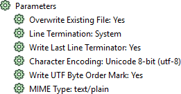

## FME Parameters ##

FME parameters are those built into the FME Workbench interface. They directly control a translation and can be found in various places, such as transformer dialogs or feature type dialogs. However, for the most part, you will find all FME Parameters in the Navigator Window of FME:

 

Here, for example, are the FME Parameters for a text file writer. They include options to overwrite or append to an existing text file and the type of character encoding that should be used.

These are parameters the **workspace author** will use. The user is not expected to set these because they are not assumed to have enough experience of Workbench to know where to find the parameter or how to set it.

For example, the author might decide that the Byte Order Mark should not be written in this output.

 <!-- ** Update screenshot-->

They double-click the parameter to open a dialog in which they can change the parameter value.

---

<!--Person X Says Section-->

<table style="border-spacing: 0px">
<tr>
<td style="vertical-align:middle;background-color:darkorange;border: 2px solid darkorange">
<i class="fa fa-quote-left fa-lg fa-pull-left fa-fw" style="color:white;padding-right: 12px;vertical-align:text-top"></i>
Ms. Analyst says...
</td>
</tr>

<tr>
<td style="border: 1px solid darkorange">

In case you were wondering, the Byte Order Mark (aka BOM) is a special character found in the header of a text file. It denotes whether the text is in a Unicode encoding, which Unicode encoding it is, and what the endianness of the text is. It helps different applications to read the data correctly.
  You want to know what "endianness" means now, don't you? It's not important. Outside of our training's core competency.

</td>
</tr>
</table>
