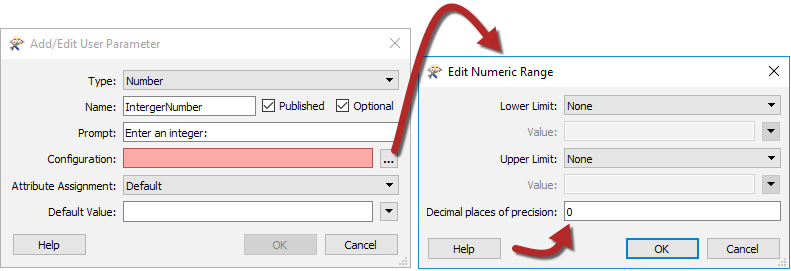
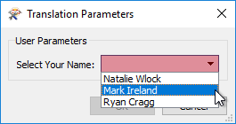
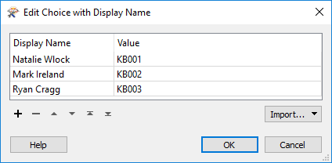

## Types of User Parameters ##

There are many different types of user parameters and many different ways to make use of them. The most common parameter types can be grouped as:

- Text Parameters
- Numeric Parameters
- Choice Parameters

---

### Text Parameters ###

Text parameters are a simple way to accept plain text values into a workspace. A Text parameter allows a single line of text, while Text (Multiline) parameters allow the user to enter text broken over a number of lines.

There is no limitation on the characters that can be entered. However, Text (Multiline) is better for large amounts of text spanning several lines. Additionally, Text (Multiline) is the preferred parameter for entering encoded (not plain ASCII) characters.

---

<table style="border-spacing: 0px">
<tr>
<td style="vertical-align:middle;background-color:darkorange;border: 2px solid darkorange">
<i class="fa fa-quote-left fa-lg fa-pull-left fa-fw" style="color:white;padding-right: 12px;vertical-align:text-top"></i>
FME Lizard says…
</td>
</tr>

<tr>
<td style="border: 1px solid darkorange">

It's worth being aware that not every transformer and format in FME handles encoded text. If you are unsure, then it’s safer to use a Text parameter – that everything will support – rather than a Text (Multiline) parameter that is not universally supported.

</td>
</tr>
</table>

---

### Numeric Parameters ###

Unlike text, there is just one type of numeric parameter: number. However, this type of parameter has settings that allow you to define whether it is a float or integer type number.

Here, for example, the workspace author is creating an integer parameter. The number of decimal places is set to zero:

When the user is prompted for a value, they are not able to enter a floating point (non-integer) number. Because this is a number field, FME also stops the user entering text (alphabetic) characters.

This is a good example of how FME parses input to ensure it matches the parameter type, as shown in the following screenshots:

- Invalid input: 12.3 is not a valid integer
- Invalid input: abcd is not a valid float
- Valid input: negative numbers are fine
- Invalid input: 123.4567 is a valid float, but has 4 decimal places of precision, when the definition was only 3
- Valid input: 123 is a valid integer
- Valid input: 123.456 is a valid float with the correct decimal places of precision

The Upper/Lower Limit settings for a numeric parameter also allow FME to parse the input to ensure it matches what is required:

- Invalid input: needs to be *greater than* 3
- Invalid input: needs to be *less than or equal to* 10
- Valid input: between 3.001 and 10.000

---

### Choice Parameters ###

A choice parameter is when the user is presented with a fixed list of options and selects one of them. Different choice type parameters allow the user to pick from a list, pick multiple entries from a list, or type in text as an alternative to a list:

Here the user will be asked to enter their name. However, since the names of all users are already known – presumably this is for a particular company’s staff – a list of them is created:

That way, the user is prompted to select their name from a list. They don’t have to type it in manually:

A **Choice with Alias** parameter is the same as a Choice parameter in that the end-user gets to pick a value from a list. However, a lookup table maps the chosen entry to a value that gets provided to FME.

For example, this workspace takes incoming features and matches them to a database using an EmployeeID.

EmployeeID is provided by the end-user, but they can’t always remember their own ID number. So, the author creates a Choice with Alias user parameter.

The parameter is configured like so:

Notice that there are two fields in this configuration dialog; the display name and the actual value.

When a user selects their name from the list, then the value provided to the workspace is actually their employee ID. That way employee ID can be used as a match in the DatabaseJoiner, without the end-user having to remember it!

---

<table style="border-spacing: 0px">
<tr>
<td style="vertical-align:middle;background-color:darkorange;border: 2px solid darkorange">
<i class="fa fa-quote-left fa-lg fa-pull-left fa-fw" style="color:white;padding-right: 12px;vertical-align:text-top"></i>
FME Lizard says…
</td>
</tr>

<tr>
<td style="border: 1px solid darkorange">

Choice (Multiple) and Choice with Alias (Multiple) are very similar parameters (to Choice and Choice-with-Alias), but let the end user select multiple values. For example, if a manager wanted to run reports on several employees, this is what they could use. Multiple values are returned space-delimited.

</td>
</tr>
</table>

---

<!--Person X Says Section-->

<table style="border-spacing: 0px">
<tr>
<td style="vertical-align:middle;background-color:darkorange;border: 2px solid darkorange">
<i class="fa fa-quote-left fa-lg fa-pull-left fa-fw" style="color:white;padding-right: 12px;vertical-align:text-top"></i>
FME Lizard asks...
</td>
</tr>

<tr>
<td style="border: 1px solid darkorange">

<quiz name="">
  <question>
    

      Q) Besides the above, there are some more - specialist - parameter types. Which of the following is NOT a valid user parameter type?
    

    <answer><li>Coordinate System Name</answer>
    <answer><li>Password</answer>
    <answer correct><li>String Encoding</answer>
    <answer><li>URL</answer>
    <explanation>  A) String Encoding is not a type of FME user parameter. Technically there is an FME parameter of that type, but it's not made available as a user parameter.</explanation>
  </question>

</quiz>

</td>
</tr>
</table>
