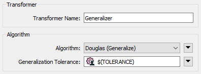
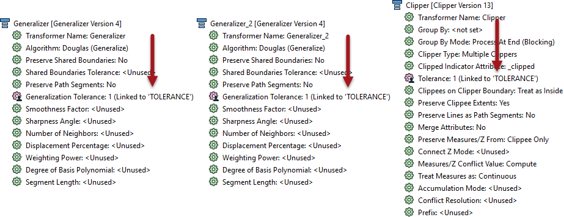
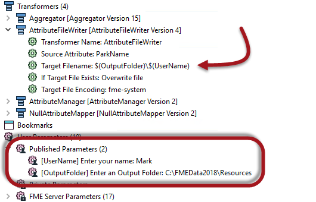

## Shared, Embedded, and Scripted Parameters ##

Shared and Embedded parameters are not specific types of parameters; instead, they refer to two different ways in which parameters might be used.

Scripted parameters are a way to include Python or Tcl code in the way a parameter is defined.

### Shared Parameters ###
There is no limit on the number of times a user parameter can be used or linked to an FME parameter. The value obtained from a user parameter can be used as many times as is required.

When a parameter is used in two or more places, it can be described as a *shared parameter*.

For example, a workspace has a user parameter called TOLERANCE (here being used inside a Generalizer):

However, the workspace author has decided to apply the same parameter in three places in total; two Generalizers and a Clipper:

The advantage is that the same value can be used without the user having to enter it multiple times.

---

<!--Updated Section--> 

<table style="border-spacing: 0px">
<tr>
<td style="vertical-align:middle;background-color:darkorange;border: 2px solid darkorange">
<i class="fa fa-bolt fa-lg fa-pull-left fa-fw" style="color:white;padding-right: 12px;vertical-align:text-top"></i>
2019.1 UPDATE
</td>
</tr>

<tr>
<td style="border: 1px solid darkorange">

You might be wondering, how can I tell where a user parameter is being used? What FME parameters is it linked to?
  To find out, right click the parameter and choose the option to Show References:
  
  This applies whether the user parameter is referenced by one FME parameter or many. If you wish to always show these references, without having to use "Show References", then this is where the new-for-2019.1 <strong>Always Show References</strong> option is used:
  

</td>
</tr>
</table>

---

### Embedded Parameters ###
Sometimes in FME, parameter values need to be constructed from multiple components. When one parameter is constructed so as to include the value of another parameter inside it, this is called *Embedding Parameters*.

For example, here the name of a file is constructed from two user parameters: one is a fixed output path and the other is a user's name:

The technique is called *embedding* because the user parameters - UserName and OutputFolder - are embedded inside the FME parameter (Target Filename).

---

### Scripted Parameters ###

Scripted parameters go one step further than an embedded parameter. Instead of simple concatenation, a scripted parameter allows a full Python or Tcl script to be used to construct a value.

For example, this Tcl script creates a filename from a fixed path and an embedded user parameter. However, in this case, the script is used to test whether the workspace is being run on a Windows or Unix system, so that it can set the output path accordingly:

<pre>
set realname ''

if {[string match 'C:*' $FME_MacroValues(FME_HOME)]} {
	set realname 'C:\Output\'+$FME_MacroValues(UserFileName)
} else {
	set realname '/Output/'++$FME_MacroValues(UserFileName)
}

return realname
</pre>

Note that the script must include a return statement, to return a value to the parameter. A scripted parameter is purely for use by an author. The user is not prompted for a value, as it would be absurd to expect them to enter Python code when a workspace runs!

---

<table style="border-spacing: 0px">
<tr>
<td style="vertical-align:middle;background-color:darkorange;border: 2px solid darkorange">
<i class="fa fa-quote-left fa-lg fa-pull-left fa-fw" style="color:white;padding-right: 12px;vertical-align:text-top"></i>
FME Lizard says…
</td>
</tr>

<tr>
<td style="border: 1px solid darkorange">

Use the ‘print’ command (in Python) or ‘puts’ command (in TCL) to write from the script to the FME log file.

</td>
</tr>
</table>
