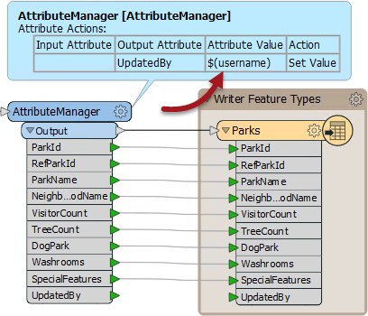
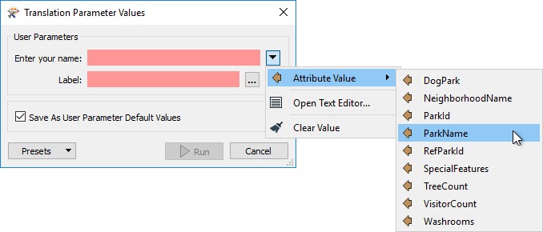
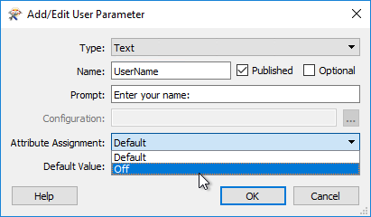
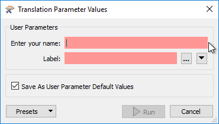
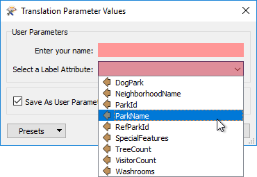
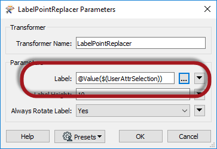

## Parameters and Attributes ##

Sometimes an FME parameter is designed to accept either a fixed value or the value of an attribute. We call these parameters \_OR_ATTR parameters because they allow a value **OR** an attribute.

For workspace authors, it's also possible to define a user parameter to allow this. Specifically, a user parameter can allow either:

- A fixed value only
- A fixed value or an attribute
- An attribute only 

The first two of these capabilities are controlled by a setting in the user parameter called Attribute Assignment.

---

### FME Parameters and Attributes ###

Some FME parameters - but not all - allow an attribute to be used in place of a fixed value. We call this Attribute Assignment:
 

When a user parameter is created or linked to one of these FME parameters, then it too picks up that capability:

So, this allows the end user to enter either a fixed value or to select an attribute that supplies the value.

---

<!--Person X Says Section-->

<table style="border-spacing: 0px">
<tr>
<td style="vertical-align:middle;background-color:darkorange;border: 2px solid darkorange">
<i class="fa fa-quote-left fa-lg fa-pull-left fa-fw" style="color:white;padding-right: 12px;vertical-align:text-top"></i>
Ms Analyst says...
</td>
</tr>

<tr>
<td style="border: 1px solid darkorange">

You might be wondering why some FME parameters allow Attribute Assignment, and some don't.
  The key to this difference is that by selecting an attribute you allow each feature to provide a different value. For example, in the 3DForcer each feature can be set to a different elevation and one feature does not affect the other.
  However, in an operation where the parameter <strong>must</strong> have the same value for each feature, then Attribute Assignment is not allowed. For example, the Tolerance parameter in a Snapper transformer cannot be different for each feature, because what would happen if two features were 1.5 metres apart and one feature had a tolerance of 1.0 and the other had a tolerance of 2.0?!

</td>
</tr>
</table>

---

### Attribute Assignment and User Parameters ###

Attribute Assignment is important when an author creates a user parameter and has to decide whether to allow the end-user to select an attribute or not.

For example, here the workspace has an UpdatedBy field, and an AttributeManager transformer that sets UpdatedBy using a user parameter where the user is prompted to enter their name:

When prompted the user can enter their name. But... they can also select an attribute:

Obviously, this makes no sense. The author does not want the user to have the ability to select an attribute, only to enter a string. The setting that lets the author control this is called Attribute Assignment, and is found on the parameter definition dialog:

By changing this from Default to Off, the user is no longer allowed to select an attribute in the Translation Parameters prompt:

---

<!--Person X Says Section-->

<table style="border-spacing: 0px">
<tr>
<td style="vertical-align:middle;background-color:darkorange;border: 2px solid darkorange">
<i class="fa fa-quote-left fa-lg fa-pull-left fa-fw" style="color:white;padding-right: 12px;vertical-align:text-top"></i>
Ms Analyst says...
</td>
</tr>

<tr>
<td style="border: 1px solid darkorange">

You might now be wondering what "Default" means. You might think that we should just have Yes/No as the options.
  Well - as you saw above - not every FME parameter allows attribute assignment and making it a user parameter will not change this. For example, the Snapper tolerance is never allowed attribute assignment. Having a Yes/No option for a user parameter linked to it is pointless, because Yes is never allowed. That's why we use the term "Default".
  Of course, what this means is that <strong>where</strong> you apply the user parameter is important. Default means, the default of where it is applied. If it is linked to an FME parameter that allows attribute assignment, then default will let the user pick an attribute. If it is linked to an FME parameter that doesn't allow attribute assignment, then default will not let the user pick an attribute. 
  And - because I know you are wondering - if it is shared and linked to both an FME parameter that allows attribute assignment, and one that doesn't, then FME takes the safe option and disallows attribute selection.

</td>
</tr>
</table>

---

### Attribute Name Parameter ###

So Attribute Assignment handles the case where you want the user to enter a fixed value, and you may also give the end user the option to select an attribute.

However, the reverse case must also be handled: you don't want the user to be able to enter a fixed value, you *only* want them to be able to select an attribute. 

For example, here an author is adding a label to the data:

The author wants to allow the user to select an attribute to provide the label, but not be able to enter text. In this scenario they need to create a user parameter with a special type called Attribute Name:

After linking this user parameter to the LabelPointReplacer's FME parameter, when the workspace is run the user is permitted to select an attribute and ONLY an attribute:

**However!**

There is a catch to this operation. The user parameter – as the type suggests – is simply returning an attribute name; it does not return the attribute value.

If the workspace is run in this state then the LabelPointReplacer is supplied with the attribute name (not value) and uses it as the label, like so:

What the author must do is embed the user parameter name inside an FME Function to fetch the value of the attribute that it refers to. 

To do this the author finds the LabelPointReplacer parameter and changes it (either directly in the FME parameter, or via the Text Editor window) to be: **@Value($(UserAttrSelection))**

The @Value() function replaces the name of the attribute with its actual value:

Now when the workspace is run the output will be correct:

