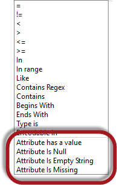
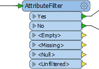

## Handling Nothing ##

Besides representing all forms of nothing in its interface, FME also allows nothing to be a condition in various tests, let's users set nothing values, and allows bulk updates from one form of nothing to another. 

### Recognizing Null Values ###

Various formats have various ways to represent nothing. But, if they support the concept of null, then FME will read any null attributes with a &lt;null&gt; value.

For a workspace to check for incoming nulls, the Tester transformer has specific operators to test for null, empty, and missing values:

Because the Tester interface is incorporated into many facets of FME (such as the TestFilter transformer) you can test for nulls wherever you find that interface.

---

<!--Tip Section--> 

<table style="border-spacing: 0px">
<tr>
<td style="vertical-align:middle;background-color:darkorange;border: 2px solid darkorange">
<i class="fa fa-info-circle fa-lg fa-pull-left fa-fw" style="color:white;padding-right: 12px;vertical-align:text-top"></i>
TIP
</td>
</tr>

<tr>
<td style="border: 1px solid darkorange">

The "Attribute Has a Value" test returns true when an attribute is not null, is not empty, and is not missing - saving you the inconvenience of having to use those three tests separately.

</td>
</tr>
</table>

---

### Other Null-Handling Transformers ###

Many other transformers also allow testing for nulls. For example, the Matcher transformer has options as to whether null values constitute a match:

This parameter lets the workspace author decide whether null, empty, and missing values should be treated as different values. 

If set to No, then two features can match even if one has an attribute that is &lt;null&gt; and the other has an attribute that is &lt;missing&gt;. 

If set to Yes, then two features can only match when their attributes are the same type of nothing; i.e. when &lt;null&gt; one on feature is matched by &lt;null&gt; on the other. 

Another example is the AttributeFilter transformer, which has separate output ports for &lt;Empty&gt;, &lt;Missing&gt;, and &lt;Null&gt;:

