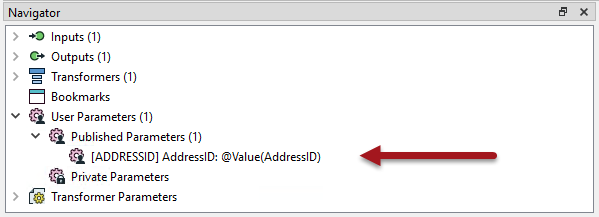

## Automatic Schema Handling ##

Let's look at how we can handle the schema complications that might arise if a custom transformer is reused.

### Automatic Handling of User Parameters ###
To take the handling of user parameters first, when a transformer with a published parameter is incorporated into a custom transformer, the published parameter is automatically moved from the Navigator window of the main canvas to the Navigator window of the custom transformer:

This means that the user is no longer prompted for these when the workspace is run! But... those parameters instead become available on the Custom Transformer itself:

That way the parameters can be set differently for each instance of the custom transformer. If user input is required at run-time, then these new parameters can be published themselves - and shared if you want them all to have the same value.

---

### Automatic Handling of User Attributes ###

Now let's look at how attributes are handled. When a custom transformer is created, one of the parameters in the Create Custom Transformer dialog is labeled Attribute References:

"Handle with Published Parameters" is the automatic way of handling attribute references in the custom transformer. It makes sure that every attribute referenced within the custom transformer is supported outside of the transformer definition.

It does that by creating a new user parameter for each attribute:

The transformer inside the Custom Transformer still references the attribute name, but FME maps the user parameter to that attribute.

When the custom transformer is used in a place without the required attribute, it is still flagged as "incomplete". However, the user parameter allows the workspace author to select an attribute that *is* available:

So (in the above) AddressID is not available, but the author can select a different attribute instead.

---

This illustrates how FME has automatically solved the attribute reference problem using user parameters. To make the custom transformer more generic, the workspace author can change the prompts on these parameters; for example, change the prompt from "AddressID" to "Select an ID Attribute to Process".

---

<!--Person X Says Section-->

<table style="border-spacing: 0px">
<tr>
<td style="vertical-align:middle;background-color:darkorange;border: 2px solid darkorange">
<i class="fa fa-quote-left fa-lg fa-pull-left fa-fw" style="color:white;padding-right: 12px;vertical-align:text-top"></i>
FME Lizard asks...
</td>
</tr>

<tr>
<td style="border: 1px solid darkorange">

<quiz name="">
  <question multiple>
    

      Q) What do you think would happen if you changed the parameter from "Handle with Published Parameters" to its other possible value, "Fix Manually (Advanced)"? Pick as many of these answers as you think are correct:
    

    <answer correct>The workspace won't run by default because no attributes are available in the custom transformer</answer>
    <answer correct>There will be no way to pick attributes to use from the main canvas</answer>
    <answer correct>The author will need to manually fix the custom transformer by exposing attributes in its definition</answer>
    <answer correct>The custom transformer won't work on a different schema unless the exposed attributes are also published</answer>
      <explanation>A) Yes, when the parameter is set to manual, it really means manual! All four of these are true, meaning you'll have your work cut out if you don't let FME take care of attribute references for you.</explanation>
  </question>
</quiz>
</tr>
</table>