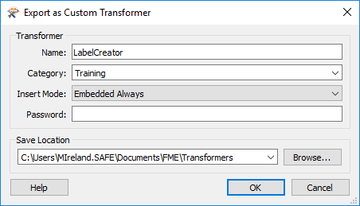
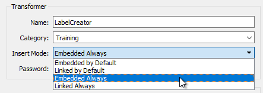

## Creating a Linked Custom Transformer ##

All custom transformers start out as an embedded version. To create a linked version the custom transformer is exported from the workspace.

This is easily done by clicking on the canvas tab for the embedded definition and choosing File > Export as Custom Transformer from the menubar:

---

<table style="border-spacing: 0px">
<tr>
<td style="vertical-align:middle;background-color:darkorange;border: 2px solid darkorange">
<i class="fa fa-quote-left fa-lg fa-pull-left fa-fw" style="color:white;padding-right: 12px;vertical-align:text-top"></i>
First Officer Transformer says…
</td>
</tr>

<tr>
<td style="border: 1px solid darkorange">

It’s best to debug your custom transformers before exporting them because the Run with Breakpoints tool does not work inside exported transformers, only embedded.

</td>
</tr>
</table>

---

At this point a dialog opens in which you can confirm the transformer name and category, plus some other parameters including the save location:

Let's look at some of the different options:

---

### Name and Category ###

It's obvious what these are - the same fields as when the transformer was originally created - but it's interesting to note that you can save it with a different name/category to what was used for the original version.

---

### Insertion Mode ###

The Insertion Mode parameter specifies how the custom transformer can be used. *It is an important parameter when I am the author of a custom transformer, who has created it for other workspace authors to use.*

There are four different modes:

If I export my custom transformer in **Embedded** mode, it means that an author who uses this transformer in his workspace finds it gets embedded (rather than a link to a file). 

If I choose *Embedded By Default*, it means that the author can choose to make the transformer linked instead. If I choose *Embedded Always* it means that the author is stuck with using that custom transformer in embedded mode.

Similarly, if I export my custom transformer in **Linked** mode, it means that an author who uses this transformer in his workspace finds it gets linked to a file (rather than embedded). 

If I choose *Linked By Default*, it means that the author can choose to make the transformer embedded instead. If I choose *Linked Always* it means that the author is stuck with using that custom transformer in linked mode.

#### Which Mode to Use ####

**Embedded Always** is a good choice when the person using the transformer is less experienced with FME; it's easier for them to manage and if they make changes they won't affect other people. Embedded is also a good choice where the custom transformer is intended for use by individuals (i.e. not sharing it as a group).

**Linked Always** is a good choice when the custom transformer is intended to be shared among a group of users. Because it is linked, the users will always receive updates if the transformer definition is changed, and because the definition is shared, it becomes a standard that is applied to all users. 

Only when the end-user is experienced in FME and can understand the consequences, is it advisable to use a “By Default” setting and allow type switching.

---

### Password ###

The password field allows you to password-protect the custom transformer. This makes it impervious to edits from unauthorized persons. Additionally, the file contents are (very mildly) encrypted so that they cannot be copied by opening the source file in a text editor.

This allows authors to make transformers available for purchase without any fear that their work will be copied or edited. Of course, it’s important not to forget or lose the password yourself, in case you wish to make edits!

#### Licensing ####

Although not part of the export dialog, it's worth mentioning licensing along with passwords. Custom transformers can be licensed so that they cannot be used without the proper registration code. This is of benefit when you want to restrict access (perhaps within your own organization) or you want to license a transformer just like any other item of software (perhaps you made it for general sale to users).

A special transformer – the *LicenseChecker* – and a license generator tool are provided for authors to implement such a setup:

Here, for example, the LicenseChecker is being used to protect a custom transformer. If the transformer is licensed, then it will work as expected. If it is not licensed, then it will terminate. Of course, there's not much point in this custom transformer - let along license protecting it - because it only has a single FME transformer inside it, but you get the idea.

For more information on obtaining licenses for a custom transformer, contact the [**Safe Software support team**](http://www.safe.com/support).

---

### Save Location ###

FME has a specific installation folder in which custom transformer files can be saved. If a custom transformer is saved in this folder, then it becomes available in Workbench and can be used the same as any other transformer. If it is saved elsewhere then FME won't be able to find it unless that path is set under Tools > FME Options > Default Paths.

---

<table style="border-spacing: 0px">
<tr>
<td style="vertical-align:middle;background-color:darkorange;border: 2px solid darkorange">
<i class="fa fa-quote-left fa-lg fa-pull-left fa-fw" style="color:white;padding-right: 12px;vertical-align:text-top"></i>
Miss Vector says…
</td>
</tr>

<tr>
<td style="border: 1px solid darkorange">

Here is a question for you to investigate: Can you nest custom transformers? That is, can you put one custom transformer inside another?
  <a href="http://52.73.3.37/fmedatastreaming/Manual/QAResponse2017.fmw?chapter=13&question=5&answer=1&DestDataset_TEXTLINE=C%3A%5CFMEOutput%5CQAResponse.html">1. Yes, with no restrictions</a>
 <a href="http://52.73.3.37/fmedatastreaming/Manual/QAResponse2017.fmw?chapter=13&question=5&answer=2&DestDataset_TEXTLINE=C%3A%5CFMEOutput%5CQAResponse.html">2. Yes, but you can only nest transformers of the same type (Linked or Embedded)</a>
 <a href="http://52.73.3.37/fmedatastreaming/Manual/QAResponse2017.fmw?chapter=13&question=5&answer=3&DestDataset_TEXTLINE=C%3A%5CFMEOutput%5CQAResponse.html">3. Yes, but you cannot nest Linked Custom Transformers</a>
 <a href="http://52.73.3.37/fmedatastreaming/Manual/QAResponse2017.fmw?chapter=13&question=5&answer=4&DestDataset_TEXTLINE=C%3A%5CFMEOutput%5CQAResponse.html">4. Yes, but only a single level of nesting</a>

</td>
</tr>
</table>