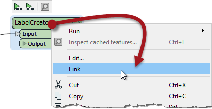
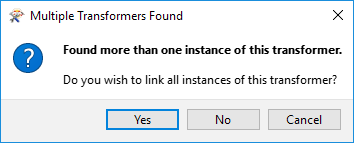

## Switching Custom Transformer Types #

When the Insert Mode of a custom transformer allows type switching, to switch a custom transformer instance from embedded to linked mode is very straightforward. Simply right-click on the instance and choose Link:

 

Of course, switching types requires the custom transformer to be exported already. If not, there is no option to link the transformer because there is no file to link to!

When you switch to linked, then the custom transformer definition tab will be closed, and the custom transformer replaced with one that simply references the external fmx file definition.

If there is more than one instance of the Custom Transformer, you are asked whether you want to switch all of them:

---

The usual answer to this is yes because having the same transformer both embedded and linked could be quite confusing! If you answer no, then be aware that the transformer you clicked on will be linked (but none of the other instances will).

In a similar manner to above, to switch from Linked to Embedded right-click and choose the option Embed. 

---

<table style="border-spacing: 0px">
<tr>
<td style="vertical-align:middle;background-color:darkorange;border: 2px solid darkorange">
<i class="fa fa-quote-left fa-lg fa-pull-left fa-fw" style="color:white;padding-right: 12px;vertical-align:text-top"></i>
FME Lizard says…
</td>
</tr>

<tr>
<td style="border: 1px solid darkorange">

Switching from Embedded to Linked only works as long as the two versions are the same.
  In other words, if you embed a linked transformer and then make changes to the embedded definition, you won’t be able to revert to the linked version.

</td>
</tr>
</table>
