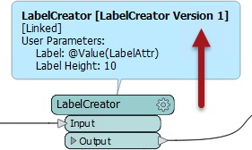
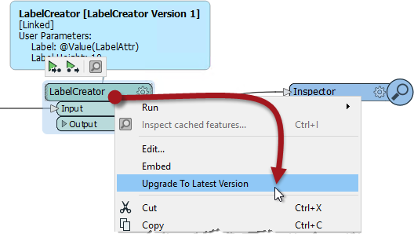

## Custom Transformer Versioning

FME includes functionality so that a linked custom transformer can exist as a number of versions. Each time a custom transformer definition is edited, a new version can be saved. 

In that way, a single fmx file can contain multiple versions of the same custom transformer. 

---

### Why use Versioning? ###

One advantage of versioning a custom transformer is that you have a record of previous versions and therefore can revert to a previous one should the need arise. For example, maybe some recent edits were incorrect, and you need to switch back to the definition that existed before those edits were made. 

However, a more important advantage relates to FME releases and new functionality.

For example, a custom transformer created in FME2017 and shared by many users could be updated to use new behavior in FME2018. If that custom transformer is versioned then the 2017 version remains available to users who have yet to update to that version of FME; while users who have updated their FME can also update their custom transformer to take advantage of the new updates.

---

### Creating a Versioned Custom Transformer ###

When you open an unversioned custom transformer definition file and later attempt to save edits, a dialog opens asking what you wish to do:

 

The two versioning options are to *Overwrite* the existing version or to create a *New Version*. 

Basically, you are being asked whether to implement versioning. Clicking New Version versions the transformer and saves the edits as version 2. Note that creating a new version does not create a separate fmx file; instead, it creates a separate version of the transformer within the same fmx file.

The title bar in Workbench illustrates the version number of a custom transformer file:

 <!-- ** Update Screenshot -->

If you choose Overwrite in the Save Transformer dialog, then the transformer remains unversioned.

---

### Editing a Specific Transformer Version ###

Whenever a versioned custom transformer is initially opened in Workbench, you are prompted as to which version you wish to edit, or whether you want to just start with a new version:

This way you can:

- Create a new version to make edits to
- Continue making edits to the existing version
- Make edits on an older version (particularly useful when that version is tied to a particular FME release)

It's important to be aware that you aren't creating a new version every time you click the Save button. A new version is only created when the dialog prompts you to "Create New Version". To forcibly create a new version you need to close and reopen the file, which causes the Select Transformer Version dialog to appear.

Each version of a custom transformer has a record of which FME version it was last edited with. You can choose to make edits to a transformer that was last edited in an older version of FME, but you will receive a warning message:

Here version 1 was created with FME2017, and the author is attempting to edit it in FME2018. Should they go ahead and do so, version 1 of the transformer will no longer be valid for use in FME2017.

---

<table style="border-spacing: 0px">
<tr>
<td style="vertical-align:middle;background-color:darkorange;border: 2px solid darkorange">
<i class="fa fa-quote-left fa-lg fa-pull-left fa-fw" style="color:white;padding-right: 12px;vertical-align:text-top"></i>
First Officer Transformer says…
</td>
</tr>

<tr>
<td style="border: 1px solid darkorange">

Sometimes you can get confused about these dialogs (well, I can) so let me set you straight:
  When a custom transformer is first exported, you don't get the Select Version dialog (because the transformer is still unversioned) and you don't get the Save Version dialog (because why create a new version when this transformer was just exported?) 
  When you open the definition (fmx file) the next time, you again don't get the Select Version dialog (because it is still unversioned), but you will get the Save Version dialog when you save the changes, allowing you to make the transformer versioned. 
  From that point one, you'll always get the Select Version dialog when you open the fmx file (because the transformer is now versioned) but for the same reason, you'll never get the Save Version dialog when you save edits.

</td>
</tr>
</table>

---

### Updating a Transformer Version ###

If the option to display transformer version is turned on (Tools &gt; FME Options &gt; Transformers &gt; Display transformer version) then each linked custom transformer displays its version number in summary annotation:

When FME detects that a new version is available - i.e., the author has made edits and saved them as a new version - then an option appears on the context menu to allow an update to the new version:

 <!-- ** Update Screenshot -->

Choosing to upgrade means the summary annotation would display the newest version number. 

---

<table style="border-spacing: 0px">
<tr>
<td style="vertical-align:middle;background-color:darkorange;border: 2px solid darkorange">
<i class="fa fa-quote-left fa-lg fa-pull-left fa-fw" style="color:white;padding-right: 12px;vertical-align:text-top"></i>
First Officer Transformer says…
</td>
</tr>

<tr>
<td style="border: 1px solid darkorange">

FME checks for new versions only when Workbench is first started. If Workbench is already open and you wish to check for a new custom transformer version, you can force FME to check by clicking the refresh button on the Transformer Gallery window: 
   <!-- ** Update screenshot -->

</td>
</tr>
</table>

---

<table style="border-spacing: 0px">
<tr>
<td style="vertical-align:middle;background-color:darkorange;border: 2px solid darkorange">
<i class="fa fa-quote-left fa-lg fa-pull-left fa-fw" style="color:white;padding-right: 12px;vertical-align:text-top"></i>
Miss Vector says…
</td>
</tr>

<tr>
<td style="border: 1px solid darkorange">

You have a workspace with a linked custom transformer (version 1). The author of that transformer makes a series of edits and updates it to version 4. What do you think the upgrade option do to the custom transformer in your workspace?
  <a href="http://52.73.3.37/fmedatastreaming/Manual/QAResponse2017.fmw?chapter=13&question=6&answer=1&DestDataset_TEXTLINE=C%3A%5CFMEOutput%5CQAResponse.html">1. Upgrade it to version 2</a>
 <a href="http://52.73.3.37/fmedatastreaming/Manual/QAResponse2017.fmw?chapter=13&question=6&answer=2&DestDataset_TEXTLINE=C%3A%5CFMEOutput%5CQAResponse.html">2. Upgrade it to version 3</a>
 <a href="http://52.73.3.37/fmedatastreaming/Manual/QAResponse2017.fmw?chapter=13&question=6&answer=3&DestDataset_TEXTLINE=C%3A%5CFMEOutput%5CQAResponse.html">3. Upgrade it to version 4</a>
 <a href="http://52.73.3.37/fmedatastreaming/Manual/QAResponse2017.fmw?chapter=13&question=6&answer=4&DestDataset_TEXTLINE=C%3A%5CFMEOutput%5CQAResponse.html">4. It depends on what version of FME you and the author are using</a>

</td>
</tr>
</table>

