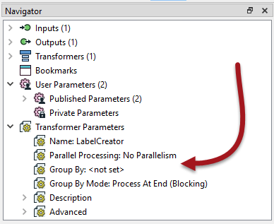
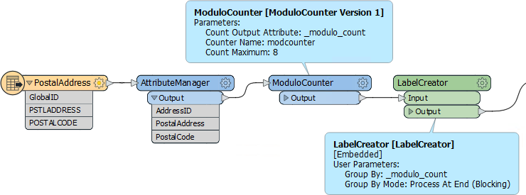

## Parallel Processing ##

Parallel Processing is a way to improve performance on high-end machines, by running multiple actions at once as a set of separate processes. A system architecture of multiple processors with multiple cores is useful because each process can be assigned to a different core. With multiple processes running on multiple cores, the whole translation can run several times quicker than it used to.

### Parallel Processing and FME ###

Parallel processing in FME covers not an entire workspace, but just a specific subsection of workspace. This is defined using a custom transformer, which is a natural method to subdivide a large translation.  

Parallel processing is achieved by forming groups of features on the basis of attribute values, in a similar way to a Group-Based transformer. Each group is assigned to a separate process. 

<table style="border-spacing: 0px">
<tr>
<td style="vertical-align:middle;background-color:darkorange;border: 2px solid darkorange">
<i class="fa fa-quote-left fa-lg fa-pull-left fa-fw" style="color:white;padding-right: 12px;vertical-align:text-top"></i>
FME Lizard says…
</td>
</tr>

<tr>
<td style="border: 1px solid darkorange">

To process multiple workspaces in parallel, you would use multiple engines on FME Server.
</td>
</tr>
</table>

### Activating Parallel Processing ###

Each custom transformer has a set of parameters - located in the Navigator window - that relates explicitly to parallel processing. Here you can determine the level of parallel processing, and an attribute that defines groups of data that will be transformed as a separate process:

#### Parallel Processing Levels ####

The parameter that controls parallel processing allows different levels of effort to be applied. Each level specifies the number of processes to run simultaneously, in relation to the number of cores available:

<table>
<tr><th rowspan="2">Parameter</th><th rowspan="2">Processes</th><th colspan="3">Examples</th></tr>
<tr><th>2 Cores</th><th>4 Cores</th><th>8 Cores</th></tr>
<tr><td align="center">No parallelism</td><td align="center">1 Process</td><td align="center">1 Process</td><td align="center">1 Process</td><td align="center">1 Process</td></tr>
<tr><td align="center">Minimal</td><td align="center">Cores / 2</td><td align="center">1 Process</td><td align="center">2 Processes</td><td align="center">4 Process</td></tr>
<tr><td align="center">Moderate</td><td align="center">Cores x 1</td><td align="center">2 Processes</td><td align="center">4 Processes</td><td align="center">8 Process</td></tr>
<tr><td align="center">Aggressive</td><td align="center">Cores x 1.5</td><td align="center">3 Processes</td><td align="center">6 Processes</td><td align="center">12 Process</td></tr>
<tr><td align="center">Extreme</td><td align="center">Cores x 2</td><td align="center">4 Processes</td><td align="center">8 Processes</td><td align="center">16 Process</td></tr>
</table>

As in the above example, on a quad-core machine, minimal parallelism results in two simultaneous FME processes. Extreme parallelism would result in eight (assuming there *are* eight tasks that can be processed simultaneously).

There is also a hard cap for each FME license level:

<table>
<tr><th rowspan="2">FME Edition</th><th rowspan="2">Process Cap</th><th colspan="3">Examples</th></tr>
<tr><th>2 Cores</th><th>4 Cores</th><th>8 Cores</th></tr>
<tr><td align="center">Base Edition</td><td align="center">4 processes</td><td align="center">Maximum 4 processes</td><td align="center">Max 4 processes</td><td align="center">Max 4 processes</td></tr>
<tr><td align="center">Professional Edition</td><td align="center">8 processes</td><td align="center">Maximum 4 processes</td><td align="center">Max 8 processes</td><td align="center">Max 8 processes</td></tr>
<tr><td align="center">All Other Editions</td><td align="center">16 processes</td><td align="center">Maximum 4 processes</td><td align="center">Max 8 processes</td><td align="center">Max 16 processes</td></tr>
</table>

So, if you have a Base Edition license, you are never going to get more than four processes at one time, regardless of machine type and the parallelism parameter. The quad-core machine in the above example can never have more than eight processes since that is the maximum that "extreme" parallel processing allows.

<table style="border-spacing: 0px">
<tr>
<td style="vertical-align:middle;background-color:darkorange;border: 2px solid darkorange">
<i class="fa fa-quote-left fa-lg fa-pull-left fa-fw" style="color:white;padding-right: 12px;vertical-align:text-top"></i>
FME Lizard says…
</td>
</tr>

<tr>
<td style="border: 1px solid darkorange">

These numbers - we should note - are the maximum number of processes <strong>at any one time</strong>. It's possible to divide data into many more groups and process them separately, but they won't all occur simultaneously. For example, given a quad-core machine, moderate processing, and 20 groups of features; there will be a total of 20 processes, but only four will run at any one time. When one of the four finishes, a new one is started.

</td>
</tr>
</table>

---

#### Parallel Processing Groups ####

The Parallel Process By parameter requires the author to select an attribute, and - as already covered - selecting attributes for a custom transformer parameter requires some consideration.

In particular, this parameter is designed so that you cannot simply pick an attribute to use:

Instead, this parameter (and one for Group By Mode) is published to make it available as one of the custom transformer parameters:

---

<table style="border-spacing: 0px">
<tr>
<td style="vertical-align:middle;background-color:darkorange;border: 2px solid darkorange">
<i class="fa fa-quote-left fa-lg fa-pull-left fa-fw" style="color:white;padding-right: 12px;vertical-align:text-top"></i>
FME Lizard says…
</td>
</tr>

<tr>
<td style="border: 1px solid darkorange">

Parallel Processing is most effective in two specific scenarios. The first scenario is a small number of groups, each with a large amount of processing to do. Parallel processing is less effective where there are a large number of small groups. Having said that, the second scenario is a large number of small tasks being offloaded elsewhere. For example, when features are being passed to a web service HTTPFetcher transformer, then it's most efficient to have FME fire off as many requests as it can, as quickly as possible.

</td>
</tr>
</table>

---

### Parallel Processing and Custom Transformer Design ###

The keys to parallel processing are designing a custom transformer to be a standalone subsection, and the definition of groups to be processed. 

In essence, features are split into groups on reaching the custom transformer, processed as a separate action, then combined back into a single group on exiting the custom transformer.

It's important to be aware that because each group is processed independently, there can be no relationship between features in different groups. If features are related, and their results depend on each other, then they must be in the same group.

The easiest way to think of this is that the Custom Transformer itself is a Group-Based transformer. Because it is a wrapper for all the individual FME transformers in the definition, it allows those transformers to operate in groups, even if they are Feature-Based.

#### Creating Artificial Groups ####

Sometimes none of the incoming data is related to each other, and can be split into arbitrary groups for processing. In these cases, where there is no identifier to define groups, one can be created manually by generating attributes with the ModuloCounter or RandomNumberGenerator transformers.

For example, here the workspace author has a large number of address features from which to create labels. To speed the process they activate parallel processing:

They could group by PostalCode, but choose not to because all addresses fall inside only one of two postal codes. Therefore they create an artificial group using the ModuloCounter. Note the Group By parameter in the custom transformer is set to the *&#95;modulo&#95;count* attribute:

In such a scenario, it's best to create only as many groups as there are going to be processes. For example, on a quad-core (four core) computer, with an FME Professional license and Extreme parallel processing, a maximum of eight processes at a time are permitted. Therefore - as shown here - the optimum number of groups to use is also eight.  

<table style="border-spacing: 0px">
<tr>
<td style="vertical-align:middle;background-color:darkorange;border: 2px solid darkorange">
<i class="fa fa-quote-left fa-lg fa-pull-left fa-fw" style="color:white;padding-right: 12px;vertical-align:text-top"></i>
FME Lizard says…
</td>
</tr>

<tr>
<td style="border: 1px solid darkorange">

See <strong><a href="https://blog.safe.com/2016/12/parallel-processing-tips-evangelist159/">this blog article</a></strong> for more information about - and some special techniques for - generating parallel processing groups. It's particularly useful for a custom transformer with multiple input ports.

</td>
</tr>
</table>