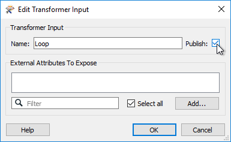
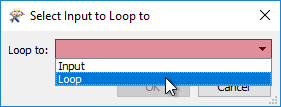

## Custom Transformers and Loops ##

Loops are a way to carry out a process that repeats a section of transformers.

### What is a Loop? ###

A loop is a programming structure that allows an action to be implemented repeatedly.

Often this is used to carry out iteration; where a process repeats to gradually narrow the process to the desired result. Usually, a loop is linked to a condition; i.e., the action continues until a certain condition is met.

In FME, loops are only permitted inside a custom transformer.

---

<table style="border-spacing: 0px">
<tr>
<td style="vertical-align:middle;background-color:darkorange;border: 2px solid darkorange">
<i class="fa fa-quote-left fa-lg fa-pull-left fa-fw" style="color:white;padding-right: 12px;vertical-align:text-top"></i>
FME Lizard says…
</td>
</tr>

<tr>
<td style="border: 1px solid darkorange">

I often get into a loop when flying. I have to circle the airport again and again (the action) until I have clearance to land (the condition). Users who have flown into London will understand what I mean!

</td>
</tr>
</table>

---

### Why Use a Loop? ###

As you know, FME processes one feature at a time. Therefore, when you create a loop, each feature is being sent around the loop **individually**. 

However, the essence of a loop is that each iteration is slightly different. Why else would you want to repeat the same action again and again, if the result was going to be no different?

So, to be worthwhile, each iteration of the loop must either fetch new data (for example, read another entry from a list) or repeat the same process using the results of the previous loop.

***NB:*** *In the following screenshots, the processing section is a single transformer labeled "ProcessData", in order to give a generic view of how a loop is created. In reality, this process must be doing something to the data  to be worthwhile carrying out at all.*

---

<table style="border-spacing: 0px">
<tr>
<td style="vertical-align:middle;background-color:darkorange;border: 2px solid darkorange">
<i class="fa fa-quote-left fa-lg fa-pull-left fa-fw" style="color:white;padding-right: 12px;vertical-align:text-top"></i>
FME Lizard says…
</td>
</tr>

<tr>
<td style="border: 1px solid darkorange">

It's stating the obvious I know, but you only use a loop to repeat an action inside the custom transformer. One-off actions should take place outside of a loop. For example, here is my landing sequence:
  
  The "wheels down" part comes outside the circling loop because I don't want to raise/lower the wheels every time I circled the airport. That would be very inefficient.

</td>
</tr>
</table>

---

### Setting up a Custom Transformer Loop ###

A loop in a custom transformer requires two components: the start and end point of the loop.

#### Loop Start Points ####
The start of the loop is identified by an Input port object. Although it can be the same input port as used for features to enter by, this does not have to be the case. For example, here there is an input port for features to arrive into, and another one for the start of the loop:

This allows the loop point to be other than the beginning of the custom transformer.

By default, this second input port also appears on the transformer itself, like this:

If you don't require this, then you simply have to 'unpublish' it in the input port's parameters:

---

#### Loop End Points ####

The end of a loop is identified by a Loop object. You can insert one by selecting it from the canvas context menu in a custom transformer:

When a loop object is placed you are asked which Input object it is to be looped to:

And then the loop is complete:

Of course, this example is an infinite loop. The action is repeated, but there is no condition being tested to stop it. FME won't let an infinite loop run forever - it will recognize the problem and stop it - but we should set up something to force an ending. 

---

#### Loop Conditions ####

There are two general types of condition for which we can test. Firstly we can loop a set number of times. Secondly, we can loop until a specific condition is met.

Here is a custom transformer that loops a set number of times:

Notice that we have an attribute that is a counter for the number of times we have looped (*LoopCounter*), and an attribute that tells us the maximum number of loops to carry out (*MaxLoops*). 

In each loop, the counter attribute is incremented by 1. When *LoopCounter < MaxLoops*, then we loop back and process the data again. When *LoopCounter = MaxLoops*, then we exit the transformer.

Instead of a simple count of iterations, another method is to test a specific measure of data quality. For example, here an ellipse representing a park is adjusted (resized smaller and smaller) until it's size is less than a certain quantity:

 

---

<table style="border-spacing: 0px">
<tr>
<td style="vertical-align:middle;background-color:darkorange;border: 2px solid darkorange">
<i class="fa fa-quote-left fa-lg fa-pull-left fa-fw" style="color:white;padding-right: 12px;vertical-align:text-top"></i>
FME Lizard says…
</td>
</tr>

<tr>
<td style="border: 1px solid darkorange">

For an excellent, real-world example of looping in an FME workspace, check out <a href="http://www.fme.ly/LoopExample"><strong>this customer story</strong></a>.
  In that example, the user uses a loop to place trees (the action) until a specific density is reached (the condition). Notice that the loop is not tied to a specific counter - it continues until the data quality required is met.

</td>
</tr>
</table>

---

### Loops and Transformer Types ###

As you should already know, transformers that operate on one feature at a time are called Feature-Based, and transformers that operate on multiple features at a time are called Group-Based.

We can also call a loop "Feature-Based" because it only processes one feature at a time. Unfortunately, that means that using a group-based transformer inside a (feature-based) custom transformer loop is not a simple task. 

If you attempt to create a loop inside an embedded custom transformer, when it includes a group-based FME transformer, then you receive an error message. Group-based transformers are only permitted inside a loop in a linked custom transformer. There are technical reasons for this that we won't go into right now.

This is the error message you get:

So, inside a linked custom transformer definition, you'll see a particular parameter (in the Navigator window) called Enable Blocked Looping:

When set to Yes then other parameters are exposed to set the number of iterations, and to set an attribute that will hold that value. Notice how parallel processing is turned off (the parameters are removed) for custom transformers that are being looped, and the Insert Mode is automatically changed to "Linked Only".

---

<table style="border-spacing: 0px">
<tr>
<td style="vertical-align:middle;background-color:darkorange;border: 2px solid darkorange">
<i class="fa fa-quote-left fa-lg fa-pull-left fa-fw" style="color:white;padding-right: 12px;vertical-align:text-top"></i>
FME Lizard says…
</td>
</tr>

<tr>
<td style="border: 1px solid darkorange">

Which of these statements about loops are true?
  <a href="http://52.73.3.37/fmedatastreaming/Manual/QAResponse2017.fmw?chapter=13&question=7&answer=1&DestDataset_TEXTLINE=C%3A%5CFMEOutput%5CQAResponse.html">1. Loops are only permitted inside a custom transformer</a>
 <a href="http://52.73.3.37/fmedatastreaming/Manual/QAResponse2017.fmw?chapter=13&question=7&answer=2&DestDataset_TEXTLINE=C%3A%5CFMEOutput%5CQAResponse.html">2. A loop without a condition will continue processing until manually stopped</a>
 <a href="http://52.73.3.37/fmedatastreaming/Manual/QAResponse2017.fmw?chapter=13&question=7&answer=3&DestDataset_TEXTLINE=C%3A%5CFMEOutput%5CQAResponse.html">3. Test conditions are built into the loop end point parameters</a>
 <a href="http://52.73.3.37/fmedatastreaming/Manual/QAResponse2017.fmw?chapter=13&question=7&answer=4&DestDataset_TEXTLINE=C%3A%5CFMEOutput%5CQAResponse.html">4. Nested loops (a loop within a loop) are permitted</a>

</td>
</tr>
</table>

