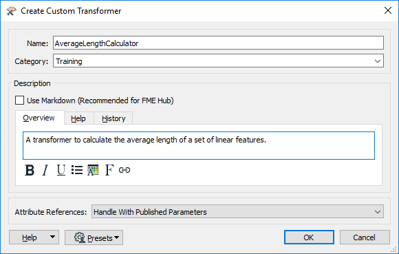
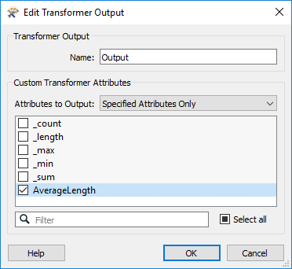
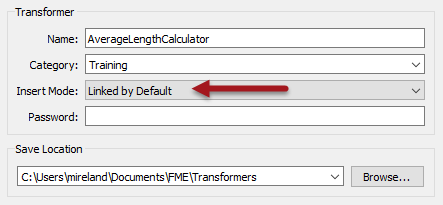
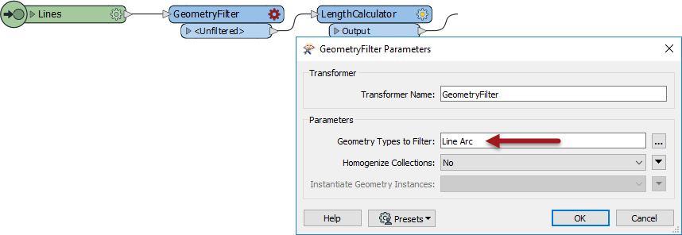
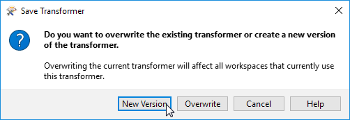
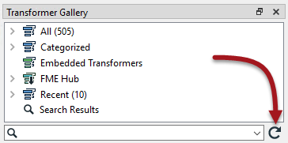
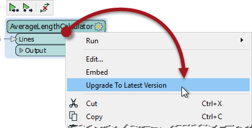

<!--Exercise Section-->

<table style="border-spacing: 0px;border-collapse: collapse;font-family:serif">
<tr>
<td style="vertical-align:middle;background-color:darkorange;border: 2px solid darkorange">
<i class="fa fa-cogs fa-lg fa-pull-left fa-fw" style="color:white;padding-right: 12px;vertical-align:text-top"></i>
Exercise 4
</td>
<td style="border: 2px solid darkorange;background-color:darkorange;color:white">
Custom Transformer Modes
</td>
</tr>

<tr>
<td style="border: 1px solid darkorange; font-weight: bold">Data</td>
<td style="border: 1px solid darkorange">Bicycle Routes (Esri Shapefile)</td>
</tr>

<tr>
<td style="border: 1px solid darkorange; font-weight: bold">Overall Goal</td>
<td style="border: 1px solid darkorange">Create a custom transformer to calculate the average length of a number of linear features</td>
</tr>

<tr>
<td style="border: 1px solid darkorange; font-weight: bold">Demonstrates</td>
<td style="border: 1px solid darkorange">Custom Transformer Modes</td>
</tr>

<tr>
<td style="border: 1px solid darkorange; font-weight: bold">Start Workspace</td>
<td style="border: 1px solid darkorange">C:\FMEData2018\Workspaces\DesktopAdvanced\CustomTransformers-Ex4-Begin.fmw</td>
</tr>

<tr>
<td style="border: 1px solid darkorange; font-weight: bold">End Workspace</td>
<td style="border: 1px solid darkorange">C:\FMEData2018\Workspaces\DesktopAdvanced\CustomTransformers-Ex4-Complete.fmw C:\FMEData2018\Workspaces\DesktopAdvanced\AverageLengthCalculator.fmx</td>
</tr>

</table>

You arrive early at the office for a meeting, but it is canceled at the last minute. Typical! Still, it gives you time to carry out an FME project that has been on your mind: a transformer to calculate the average length of linear features.

 **1) Open Workspace**
 Open the workspace C:\FMEData2018\Workspaces\DesktopAdvanced\CustomTransformers-Ex4-Begin.fmw

You’ll see that the workspace is reading a set of bicycle path data, and then doing some minor processing to get it into a reasonable state for use in the custom transformer.

You may want to run the workspace to examine the output and see what data we are dealing with, but remember the custom transformer we will create is to be designed to work on any linear data.

 **2) Add LengthCalculator**
 The contents of the transformer will be fairly straightforward and we’ll start out with just two transformers. So, simply add a LengthCalculator and a StatisticsCalculator transformer to the workspace.

 **3) Create Custom Transformer**
 Select the two newly placed transformers and turn them into a Custom Transformer called AverageLengthCalculator. Make sure the attribute references are handled automatically, although at the moment there aren’t any references to handle.

 **4) Edit Custom Transformer**
 Now we have a new custom transformer, let’s tidy it up and make it functional.

Firstly rename the input port object to Lines (thus identifying what geometry is expected), then add an output port object (if you don’t have one already) and rename it to Output. It should be connected to the StatisticsCalculator:Complete port:

Inspect the StatisticsCalculator parameters. Set Attributes to Analyze to *\_length*. Rename the Mean Attribute result to *AverageLength*

Finally, inspect the parameters for the Output port object. Change Attributes to Output to ‘Specified Attributes Only’ and ensure that AverageLength is output, but *\_length* and any other StatisticsCalculator attributes are not:

 **5) Run Workspace**
 Run the workspace (unless you need to reattach an Inspector transformer, you don’t even have to return to the Main tab to do this). Inspect the output to ensure everything is working as expected.

 **6) Export Custom Transformer**
 Now let's experiment with different transformer modes.

Select File > Export as Custom Transformer from the menubar. In the Export as Custom Transformer dialog make sure the Insert Mode option is set to Linked by Default. Make sure the Save Location is the default for storing custom transformers (&lt;user&gt;\FME\Transformers):

Click OK to close the dialog. The custom transformer is saved (as AverageLengthCalculator.fmx) and this file opened up in a new instance of FME Workbench.

 **7) Examine Workspace**
 Go back to the instance of FME Workbench where the original workspace is open. The custom transformer is now a cyan color to denote that it is now a linked transformer (it's linked because we chose "Linked By Default"):

Notice that you can right-click and choose to embed the transformer, and then switch back to the linked version. In a real-life scenario, which you choose would usually depend on whether you are planning to share the transformer.

In embed mode, right-click the transformer and choose Edit. You’ll find that you can no longer change back to Linked mode because the two definitions are now considered different!

Delete the embedded transformer. You’ll be prompted whether you wish to delete the definition too. Click Yes.

---

<table style="border-spacing: 0px">
<tr>
<td style="vertical-align:middle;background-color:darkorange;border: 2px solid darkorange">
<i class="fa fa-quote-left fa-lg fa-pull-left fa-fw" style="color:white;padding-right: 12px;vertical-align:text-top"></i>
First Officer Transformer says…
</td>
</tr>

<tr>
<td style="border: 1px solid darkorange">

It’s important to realize that the definition of an embedded custom transformer can remain in the workspace, even if it’s not used. If you clicked "No" above, that's what would have happened. You’ll be able to tell if such a definition remains by looking in the Embedded Transformers section of the transformer gallery.
  You'd usually click No (and keep the definition) if you wanted to make use of it later. You'd usually click Yes (and remove the definition) if you have made so many mistakes creating an embedded transformer that you decide to delete it and start again.

</td>
</tr>
</table>

---

 **8) Examine Custom Transformer**
 Using the Quick Add menu or the Transformer Gallery, place a new instance of the AverageLengthCalculator custom transformer in the workspace (it will be linked by default, which is fine). If you hover the mouse cursor over the transformer the pop-up text will show that it is version 1.

---

<!--Tip Section--> 

<table style="border-spacing: 0px">
<tr>
<td style="vertical-align:middle;background-color:darkorange;border: 2px solid darkorange">
<i class="fa fa-info-circle fa-lg fa-pull-left fa-fw" style="color:white;padding-right: 12px;vertical-align:text-top"></i>
TIP
</td>
</tr>

<tr>
<td style="border: 1px solid darkorange">

If you don't see the version number when hovering over the AverageLengthCalculator it means that feature is turned off. 
 To enable version numbers to go Tools > FME Options > Transformers then enable Display Transformer Version:
  
 

</td>
</tr>
</table>

---
Go back to the instance of Workbench where the fmx file is open. Move one of the objects about to activate the save button. Then save the file. Notice that you aren’t prompted to save a new version. That’s because versioning has not been applied yet. There is only one version of the transformer to make edits to.

So, leaving Workbench open, close the fmx file. Then go to the start tab and select it from the Recent Files list. Now it is reopened we are in a new editing session, and we will be prompted to apply versioning when we save the transformer.

 **9) Update Custom Transformer**
 Rather than just jiggling objects about to prove a point, let’s make a real update to this transformer. One thing we could do is filter data by geometry, so we aren’t trying to measure the length of a point feature, or similar.

So, add a GeometryFilter transformer, in front of the LengthCalculator:

Inspect the parameters and select Line and Arc as the geometries to filter by:

Adjust the feature mapping so that the Line and Arc ports are directed into the LengthCalculator. Add a second output port object by right-clicking on the canvas and selecting Insert Transformer Output. Call the newly placed port Rejected and connect the <Unfiltered> data to it, like so:

Now click the save button to save the custom transformer. You’ll be prompted whether you want to create a new version. Click the button labeled New Version to do so:

You can tell a new version is created by the information at the very top of the Workbench window.

---

<!--Tip Section--> 

<table style="border-spacing: 0px">
<tr>
<td style="vertical-align:middle;background-color:darkorange;border: 2px solid darkorange">
<i class="fa fa-info-circle fa-lg fa-pull-left fa-fw" style="color:white;padding-right: 12px;vertical-align:text-top"></i>
TIP
</td>
</tr>

<tr>
<td style="border: 1px solid darkorange">

If you when you saved you weren't prompted with the Save Transformer dialog box, this is because you forgot to close the first edit session. Undo your changes back to how the original custom transformer was (without the GeometryFilter and Rejected output port) and save again. This time close the .fmx file and re-open it. Now when you make your changes you will be prompted to create a new version. 

</td>
</tr>
</table>

---

 **10) Update Workspace**
 Go back to the instance of FME Workbench where the original workspace is open. Click the refresh button on the Transformer Gallery in order for FME to scan all custom transformers and discover the new version we’ve just created:

Now right-click on the AverageLengthCalculator custom transformer and there should be an option to upgrade to the latest version. Choose this option:

The transformer will be refreshed and updated, which you can tell by the presence of a Rejected port.

<table style="border-spacing: 0px">
<tr>
<td style="vertical-align:middle;background-color:darkorange;border: 2px solid darkorange">
<i class="fa fa-quote-left fa-lg fa-pull-left fa-fw" style="color:white;padding-right: 12px;vertical-align:text-top"></i>
First Officer Transformer says…
</td>
</tr>

<tr>
<td style="border: 1px solid darkorange">

Now you have this custom transformer you have various options to share it.
  - You can put the transformer into a shared folder and then have other users use Tools > FME Options > Default Paths to link their FME to that shared folder.
  - You can send (email) the fmx file to other users and have them install it in their FME. They can install it either by double-clicking the file or saving it to their default FME resource folder.
  - You can publish the transformer to FME Server for you (and others) to use there.

</td>
</tr>
</table>

---

<!--Exercise Congratulations Section--> 

<table style="border-spacing: 0px">
<tr>
<td style="vertical-align:middle;background-color:darkorange;border: 2px solid darkorange">
<i class="fa fa-thumbs-o-up fa-lg fa-pull-left fa-fw" style="color:white;padding-right: 12px;vertical-align:text-top"></i>
CONGRATULATIONS
</td>
</tr>

<tr>
<td style="border: 1px solid darkorange">

By completing this exercise you have learned how to:
<ul><li>Export a custom transformer</li>
<li>Switch the mode of a custom transformer instance</li>
<li>Delete an embedded custom transformer</li>
<li>Edit and create a new version of a linked custom transformer</li>
<li>Update a linked custom transformer instance to the latest version</li></ul>

</td>
</tr>
</table>