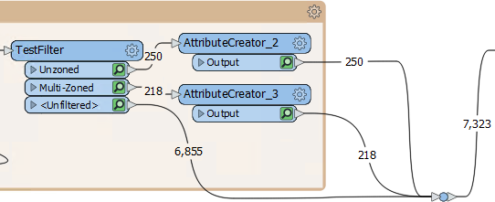
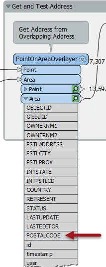
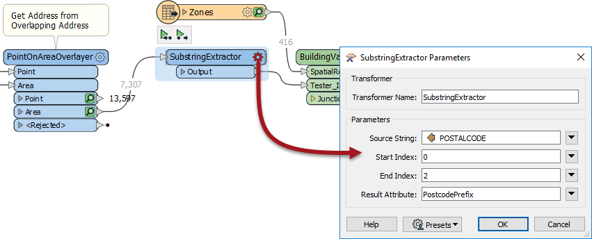
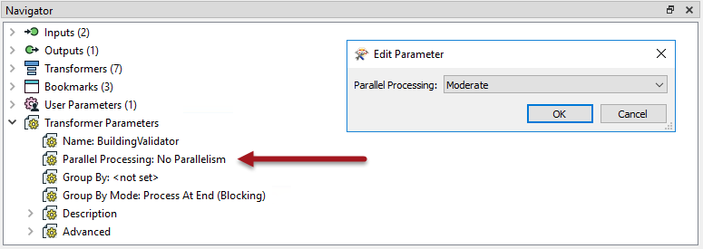
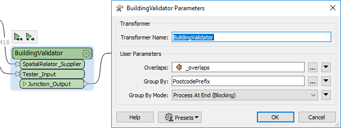
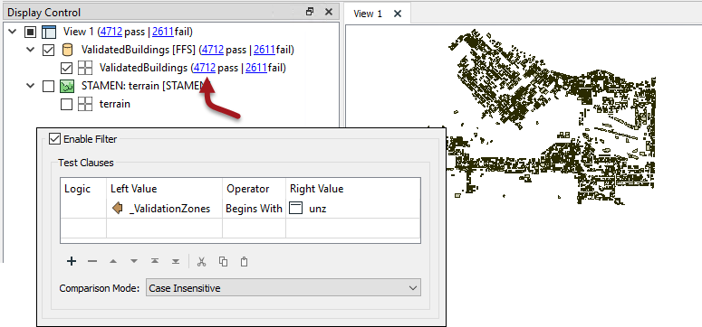
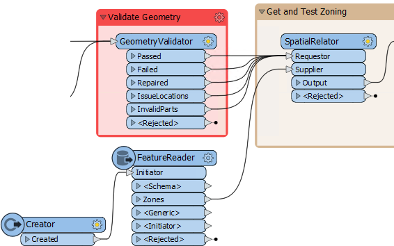

<!--Exercise Section-->

<table style="border-spacing: 0px;border-collapse: collapse;font-family:serif">
<tr>
<td style="vertical-align:middle;background-color:darkorange;border: 2px solid darkorange">
<i class="fa fa-cogs fa-lg fa-pull-left fa-fw" style="color:white;padding-right: 12px;vertical-align:text-top"></i>
Exercise 5
</td>
<td style="border: 2px solid darkorange;background-color:darkorange;color:white">
Custom Transformers and Parallel Processing
</td>
</tr>

<tr>
<td style="border: 1px solid darkorange; font-weight: bold">Data</td>
<td style="border: 1px solid darkorange">Building Polygons (OpenStreetMap) Address Points (Geodatabase) Zoning Polygons (MapInfo TAB)</td>
</tr>

<tr>
<td style="border: 1px solid darkorange; font-weight: bold">Overall Goal</td>
<td style="border: 1px solid darkorange">Create a custom transformer to parallel process data</td>
</tr>

<tr>
<td style="border: 1px solid darkorange; font-weight: bold">Demonstrates</td>
<td style="border: 1px solid darkorange">Custom Transformers and Parallel Processing</td>
</tr>

<tr>
<td style="border: 1px solid darkorange; font-weight: bold">Start Workspace</td>
<td style="border: 1px solid darkorange">C:\FMEData2019\Workspaces\DesktopAdvanced\CustomTransformers-Ex5-Begin.fmw</td>
</tr>

<tr>
<td style="border: 1px solid darkorange; font-weight: bold">End Workspace</td>
<td style="border: 1px solid darkorange">C:\FMEData2019\Workspaces\DesktopAdvanced\CustomTransformers-Ex5-Complete.fmw</td>
</tr>

</table>

The city is investigating the incorporation of OpenStreetMap data into their own spatial datasets and open data portals. The first dataset under consideration is buildings. A workspace has been generated to validate the OpenStreetMap data and compare it to other, existing city datasets.

You see this workspace and wonder if parallel processing might make it more efficient. Let's check that out...

 **1) Open Workspace**
 Open the workspace C:\FMEData2019\Workspaces\DesktopAdvanced\CustomTransformers-Ex5-Begin.fmw.

As you’ll see, this workspace reads OpenStreetMap building data and then carries out a number of validation tasks. Firstly it overlays it with the city address database, to confirm whether it has a matching address. Secondly it tests the building geometry with a GeometryValidator transformer. Finally it overlays the buildings against the city zoning data, to see if it properly falls inside a single zone:

Turn on Feature Caching and run the workspace. Inspect the data at each step to become familiar with what it is doing. Specifically take note of the feature counts, so that we can be sure that any changes we make do not affect the results:

Although the workspace does not take long to run, consider how it might be set up as a custom transformer with parallel processing.

 **2) Create Custom Transformer**
 The first thing to consider is how data might be managed as separate groups for parallel processing. Because OSM is crowdsourced data, there's no guarantee that any particular attribute will have values. In fact, if you check the source OSM data, you'll notice that it has very few values for any attribute. 

However, one of the early steps in the workspace copies address records onto each building. Because the address data is a city dataset, we can take that as the definitive data and trust its contents. One of the attributes that it copies is POSTALCODE:

Postcodes - or at least the first three characters of a postcode - are a good way to divide data into groups.

So, select all of the objects after the PointOnAreaOverlayer (where POSTALCODE is obtained) but before the final writer feature type. Notice this includes the feature type for the MapInfo TAB reader:

Press <kbd>Ctrl</kbd>+<kbd>T</kbd> to turn the selected objects into a custom transformer. Give the transformer a name like BuildingValidator and ensure that Attribute References are Handle(d) with Published Parameters.

Click OK to create the custom transformer.

 **2) Define Parallel Processing Group**
 Inspect the custom transformer to see if its contents are what you are expecting. Interestingly the reader feature type does not appear in the definition, but is piped in through a separate input port:

This shows that readers are not permitted inside a custom transformer. We'll leave it for now, but it might be important to re-consider this later, when we start parallel processing.  

Speaking of which, we need an attribute to group data by. Postcode (for example V3E1J4) is too precise. It would be a building by building level of precision. However, the first three characters (V3E) would be much more suitable.

So, back in the main workspace canvas, place a SubstringExtractor transformer between the PointOnAreaOverlayer and the newly created BuildingValidator. Use it to extract the first three characters of the POSTALCODE attribute into a new attribute:

Notice that characters are counted from zero, so we need characters from 0 (zero) to 2 (two). Also note that the author is writing the result to an attribute called PostcodePrefix.

 **3) Turn on Parallel Processing**
 Return to the custom transformer definition (the BuildingValidator tab). Look in the Navigator window for the Parallel Processing parameter. Double-click it and set the level of processing to Moderate:

Now return to the main canvas window. Open the parameters for the BuildingValidator custom transformer. For the Group By parameter select the attribute PostcodePrefix:

If you don't have a PostcodePrefix attribute, then it will be the attribute created by the SubstringExtractor (&#95;substring is the default).

 **4) Run Workspace**
 Now it's time to run the workspace. However, before you do, turn off Feature Caching. Also turn off Stop at Breakpoints if it is somehow set.

<!--Warning Section-->

<table style="border-spacing: 0px">
<tr>
<td style="vertical-align:middle;background-color:darkorange;border: 2px solid darkorange">
<i class="fa fa-exclamation-triangle fa-lg fa-pull-left fa-fw" style="color:white;padding-right: 12px;vertical-align:text-top"></i>
WARNING
</td>
</tr>

<tr>
<td style="border: 1px solid darkorange">

Absolutely do NOT run this with either Feature Caching or Stop at Breakpoints turned on. If you do, parallel processing won't work!

</td>
</tr>
</table>

---

The log window will now show several processes being started and stopped. You can open the task or process manager for your system to look for multiple FME processes running (note that some processes related to FME Server may exist, if you have it installed and active).

Once complete, check the results. You won't have feature counts in the custom transformer because it is running in parallel processing mode. You can instead inspect the output dataset. Check if the number of features with a _ValidationZones attribute set to "Unzoned Building" matches the number of features (it might be easier to look for this sort of thing in the full Data Inspector, rather than Visual Preview). 

Here the author is using the Filter tool to test for unzoned buildings:

It appears there are quite a lot of unzoned buildings (4,712). This is a lot more than when the workspace was originally run (250) so what is going on? Can you guess?

OK, the problem is related to the MapInfo TAB reader, which is reading the zoning data. We are parallel processing in groups of postal codes, but the zoning data does not have the same postcode prefix attribute. So one solution is to assign a postcode to each zone feature. 

However, another solution is to ensure that each parallel process gets its own set of zoning data. We can do that by replacing the MapInfo reader with a FeatureReader transformer, and moving it inside the custom transformer.

 **5) Fix Reader**
 Firstly, in the main tab, delete the Zones feature type. This will cause FME to prompt you to remove the MapInfo reader, which you should agree to.

Now switch to the BuildingValidator definition tab. Add a Creator transformer and a FeatureReader transformer,  and connect them together. Open the FeatureReader parameters and set it up to read the MapInfo TAB dataset Zones.tab:

Now connect the Zones output from the FeatureReader, into the SpatialRelator:Supplier port (in place of the SpatialRelator_Support Input object, which can now be deleted):

Now re-run the workspace and check the output. This time only 250 features should have a value of *Unzoned building* for the &#95;ValidationZones attribute; and 219 features should have a value of *Overlapping zones building*.

The workspace is now producing the correct results and in a set of parallel processes. But was it worth making these changes?

 **6) Assess Parallel Processing**
 Since the initial workspace ran in a fairly quick time anyway, the need for parallel processing was already low. The choice of the first three characters of the postcode gave us 17 groups. That's not unreasonable, but it does mean FME had to start 17 different processes, which takes time.

We also chose Moderate processing, giving only one process per core. Perhaps our machines can handle more?

Plus, because the FeatureReader appears inside the transformer definition, we are reading the zoning data in every separate process. Is that overhead too great? If not, could/should we do the same with the Geodatabase reader?

So, if you have time, re-run the workspace with a different processing level, say Aggressive. Does it run any quicker than the Moderate processing level? If not, why might that be? Does adjusting the number of tiles make it better or worse?

Also try using just the first two characters of a postal code for our group (simply change the SubstringExtractor to fetch only characters 0-1). That produces fewer groups (only 4), but is it faster?

In summary, we've seen that parallel processing can require some careful thought and consideration when setting up. However, the rewards can be very great.

---

<!--Exercise Congratulations Section--> 

<table style="border-spacing: 0px">
<tr>
<td style="vertical-align:middle;background-color:darkorange;border: 2px solid darkorange">
<i class="fa fa-thumbs-o-up fa-lg fa-pull-left fa-fw" style="color:white;padding-right: 12px;vertical-align:text-top"></i>
CONGRATULATIONS
</td>
</tr>

<tr>
<td style="border: 1px solid darkorange">

By completing this exercise you have learned how to:
<ul><li>Assess a workspace's potential for parallel processing</li>
<li>Select an attribute (or substring) suitable for grouping data by</li>
<li>Create and use parallel processing in a custom transformer</li>
<li>Read data inside a parallel process</li>
<li>Confirm with the task manager that FME is launching worker processes</li>
<li>Experiment with different settings to produce a more efficient result</li></ul>

</td>
</tr>
</table>
