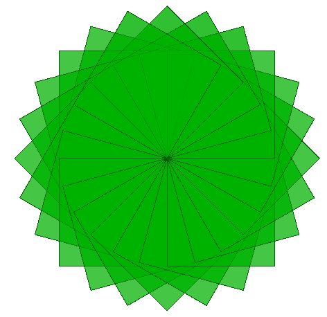

<!--Exercise Section-->

<table style="border-spacing: 0px;border-collapse: collapse;font-family:serif">
<tr>
<td style="vertical-align:middle;background-color:darkorange;border: 2px solid darkorange">
<i class="fa fa-cogs fa-lg fa-pull-left fa-fw" style="color:white;padding-right: 12px;vertical-align:text-top"></i>
Exercise 6
</td>
<td style="border: 2px solid darkorange;background-color:darkorange;color:white">
Looping in a Custom Transformer
</td>
</tr>

<tr>
<td style="border: 1px solid darkorange; font-weight: bold">Data</td>
<td style="border: 1px solid darkorange">None</td>
</tr>

<tr>
<td style="border: 1px solid darkorange; font-weight: bold">Overall Goal</td>
<td style="border: 1px solid darkorange">Create a custom transformer to create loop art</td>
</tr>

<tr>
<td style="border: 1px solid darkorange; font-weight: bold">Demonstrates</td>
<td style="border: 1px solid darkorange">Custom Transformers and Loops</td>
</tr>

<tr>
<td style="border: 1px solid darkorange; font-weight: bold">Start Workspace</td>
<td style="border: 1px solid darkorange">C:\FMEData2018\Workspaces\DesktopAdvanced\CustomTransformers-Ex6-Begin.fmw</td>
</tr>

<tr>
<td style="border: 1px solid darkorange; font-weight: bold">End Workspace</td>
<td style="border: 1px solid darkorange">C:\FMEData2018\Workspaces\DesktopAdvanced\CustomTransformers-Ex6-Complete.fmw 
C:\FMEData2018\Workspaces\DesktopAdvanced\CustomTransformers-Ex6-Complete-Advanced.fmw</td>
</tr>

</table>

Marketing has asked you for some fun images to post on twitter that you created in FME. Instead of creating maps you decided to create some abstract art utilizing your new found skills in looping. 

If you create something awesome share it with us on Twitter <a href="https://twitter.com/safesoftware?lang=en">@SafeSoftware</a>!

---

 **1) Start Workbench**
 Start FME Workbench and open the starting workspace CustomTransformers-Ex6-Begin.fmw

If you run this workspace nothing thrilling happens except you get a 100 squares each with their own count stacked on top of each other. 

 **2) Add a Rotator transformer**
 After the Counter transformer add a Rotator transformer. We will use this to rotate our squares. In the parameters create a New User Parameter for Rotation Angle (degrees) and enter 15 as the default value. 

 **3) Save and Run Translation**
 Run the translation with Feature Caching enabled and inspect the output of the Rotator:

It still looks like nothing is happening, besides a slight rotation. This is because we need to create a loop to get each square to do something different. 

 **4) Create Custom Transformer**
 First we will need to add an ExpressionEvaluator before we can make the custom transformer. Add an ExpressionEvaluator and connect it to the Rotator:Rotated output port. In the parameters change the Evaluation Mode to Overwrite Existing Attributes and set the Attributes to Overwrite to _count. Then enter the following expression:

<pre>
@Value(_count)+1
</pre>

This expression will count each of the squares as it passes though adding 1 to the count each time. We will use this count to stop our loop:

Now select the Rotator and ExpressionEvaluator transformers and create a new custom transformer, name it Looper.

 **5) Test the Loop**
 In the Looper tab, add a Tester transformer to the canvas and connect it to the ExpressionEvaulator. We will use the Tester to test for our final number of squares and will either continue looping or stop the loop. 

In the parameters set the test to:

<pre>
_count = 100 
</pre>

 **6) Add Output and Looping Ports**
 Finally we need to create the output port and the looping port. Create an output port by right-clicking on the canvas and selecting Insert Transformer Output. Connect this to the Tester:Passed output port. 

Next, create the loop by right-clicking on the canvas and selecting Insert Transformer Loop. Then Rotator_Input as the Loop To. Connect this to the Tester:Failed output port:

 **7) Expose Angle Parameter**
 In the Main tab, open the Looper custom transformer parameters. Set the Rotation Angle (degrees) to create a New User Parameter. The defaults will automatically be set to the ANGLE parameter we already created. 

 **8) Run the Translation**
 Run the translation with Run with Prompt enabled and enter different values for the parameters to change your art, then inspect the output. 

---

<!--Advanced Exercise Section-->

<table style="border-spacing: 0px">
<tr>
<td style="vertical-align:middle;background-color:darkorange;border: 2px solid darkorange">
<i class="fa fa-cogs fa-lg fa-pull-left fa-fw" style="color:white;padding-right: 12px;vertical-align:text-top"></i>
Advanced Exercise
</td>
</tr>

<tr>
<td style="border: 1px solid darkorange">

You can change the color of your art buy adding an FeatureColorSetter after the Looper Custom transformer. Create a New User Parameter for Color Scheme and one for Fill Color to customize your art at each run. 
 You could also try changing the shapes in the Creator. 

</td>
</tr>
</table>

---

<!--Exercise Congratulations Section--> 

<table style="border-spacing: 0px">
<tr>
<td style="vertical-align:middle;background-color:darkorange;border: 2px solid darkorange">
<i class="fa fa-thumbs-o-up fa-lg fa-pull-left fa-fw" style="color:white;padding-right: 12px;vertical-align:text-top"></i>
CONGRATULATIONS
</td>
</tr>

<tr>
<td style="border: 1px solid darkorange">

By completing this exercise you have learned how to:
<ul><li>Create a loop object in a custom transformer</li>
<li>Create and increment a loop counter in a custom transformer</li>
<li>Use a loop counter to loop through content in a custom transformer</li>
<li>Exposed published parameters from within a custom transformer</li>

</td>
</tr>
</table>