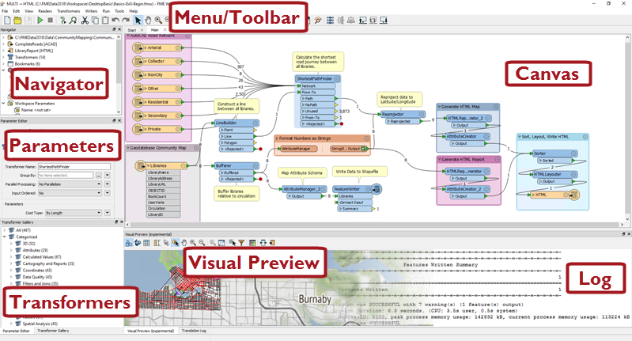
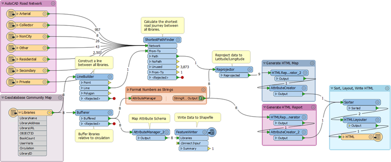
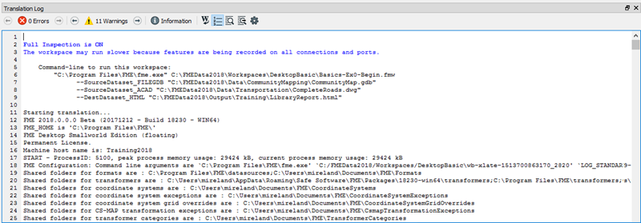

# Major Components of FME Workbench #

The FME Workbench user interface has a number of major components:

## Menu/Toolbar ##
The menubar and toolbar contain a number of tools: for example, tools for navigating around the Workbench canvas, controlling administrative tasks, and adding or removing reader (source) datasets.

## Canvas ##
The FME Workbench canvas is where users graphically define a translation. This definition is called a "workspace" and can be saved for re-use later.

By default the workspace reads from left to right; data source on the left, transformation tools in the center, and data destination on the right. Connections between each item represent the flow of data and may branch in different directions, merge together, or any combination of the two.

The canvas is the primary window within Workbench and the focus of all your work.

---

<!--Person X Says Section-->

<table style="border-spacing: 0px">
<tr>
<td style="vertical-align:middle;background-color:darkorange;border: 2px solid darkorange">
<i class="fa fa-quote-left fa-lg fa-pull-left fa-fw" style="color:white;padding-right: 12px;vertical-align:text-top"></i>
Police-Chief Webb-Mapp says...
</td>
</tr>

<tr>
<td style="border: 1px solid darkorange">

I'm the police chief, responsible for tracking down crimes against FME. 
  So, let's make sure you get the terminology right. The application itself is called FME “Workbench”, but the process defined in the canvas window is called a “Workspace”. The terms are so similar that they are easily confused, but please don't, otherwise I will have to send my grammar squad to arrest you! 
  Although mistreating FME terminology is a minor offence the ignominy of being caught is long lasting!

</td>
</tr>
</table>

---

## Navigator ##
The Navigator window is a structured list of parameters that represent and control all of the components on your workspace canvas.

## Transformer Gallery ##
The transformer gallery is a tool for the location and selection of FME transformation tools.

The number of transformers (above, 484) will vary depending on the version of FME and any optional custom transformers installed.

## Translation Log ##
The translation log reports on translations and other actions. Information includes any warning or error messages, translation status, length of translation, and number of features processed.

## Parameter Editor ##
The parameter editor window is a dialog in which transformation parameters can be entered and adjusted. 

<!--New Section--> 

<table style="border-spacing: 0px">
<tr>
<td style="vertical-align:middle;background-color:darkorange;border: 2px solid darkorange">
<i class="fa fa-bolt fa-lg fa-pull-left fa-fw" style="color:white;padding-right: 12px;vertical-align:text-top"></i>
NEW
</td>
</tr>

<tr>
<td style="border: 1px solid darkorange">

New for FME2017, the Parameter Editor is a single dialog is intended to replace having a dialog for each object on the canvas. It also replaces the Workspace Properties window.

</td>
</tr>
</table>

---

## Other Windows ##

### Help ###
The Help window displays information from the FME documentation. It automatically refreshes the content depending on what aspect of a workspace is being authored.

### History ###
The History window displays the workspace editing history. It is a form of tree-based undo/redo that allows a user to revisit previous revisions in a workspace.

### Overview ###
This window shows a small scale representation of the workspace canvas. It is useful as an aid to navigating through the canvas.

### Feature Type and Attribute Connections ###
These windows help to connect objects on the Canvas. It's part of a process called Schema Mapping that you'll find out about later...
