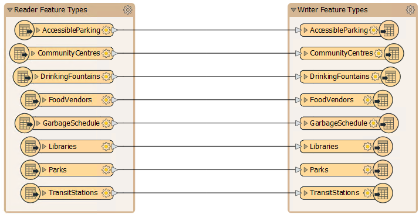

## The New Workspace ##
A new workspace reads from left to right, from the source (Reader) layers, through to the destination (Writer) layers. Arrows denote the direction of data flow:

In the above screenshot, eight layers are being read from one format and written to another.

---

<!--Tip Section-->

<table style="border-spacing: 0px">
  <tr>
    <td style="vertical-align:middle;background-color:darkorange;border: 2px solid darkorange">
      <i class="fa fa-info-circle fa-lg fa-pull-left fa-fw" style="color:white;padding-right: 12px;vertical-align:text-top"></i>
      FME Lizard says...
    </td>
  </tr>

  <tr>
    <td style="border: 1px solid darkorange">
      
        In most cases FME uses the terms 'Reader' and 'Writer' instead of 'Source’ and ‘Destination.' So a Reader reads datasets and a Writer writes datasets, in terms analogous to source/destination and input/output.
      
    </td>
  </tr>
</table>

---

## Saving the Workspace ##
Workspaces can be saved to a file so that they can be reused at a later date. The save button on the toolbar is one way to do this:

There are also menu options to do the same thing, in this case, File &gt; Save (shortcut = Ctrl+S) or File &gt; Save As. The default file extension is .fmw.

---

<!--Lizard Section-->

<table style="border-spacing: 0px">
  <tr>
    <td colspan="100%" style="vertical-align:middle;background-color:darkorange;border: 2px solid darkorange">
      <i class="fa fa-info-circle fa-lg fa-pull-left fa-fw" style="color:white;padding-right: 12px;vertical-align:text-top"></i>
      FME Lizard says...
    </td>
  </tr>

  <tr>
    <td style="border-left: 1px solid darkorange; border-bottom: 1px solid darkorange">
      
        There are several intuitive, but less obvious, features of the FME Workbench interface.
          For example, select File &gt; Open Recent on the menu bar to reveal a list of previously used workspaces. This list can show up to a huge 15 entries.
      
    </td>
  </tr>
</table>

---
