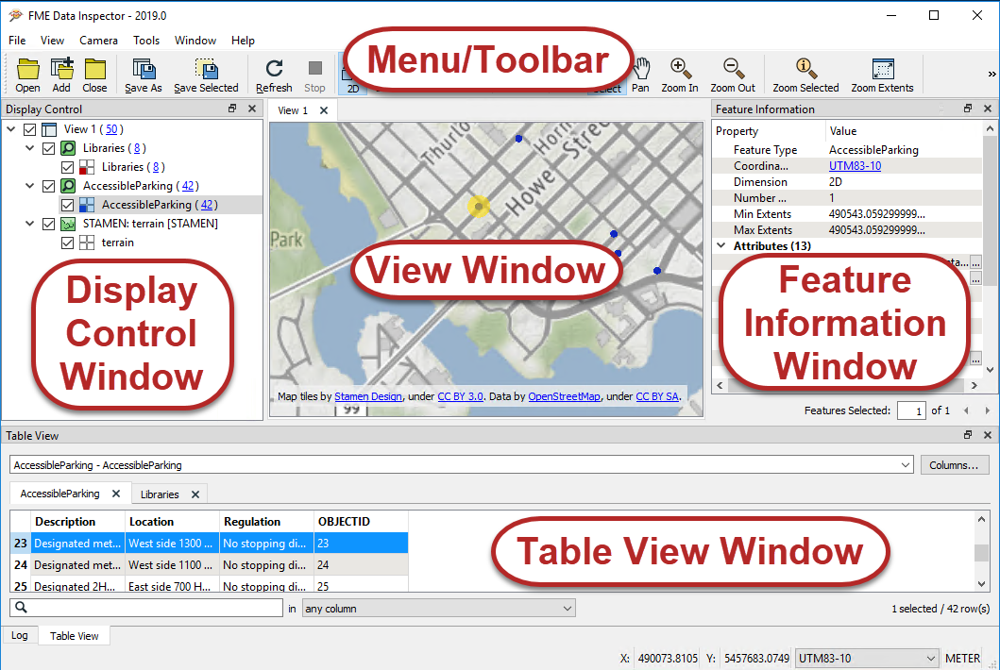
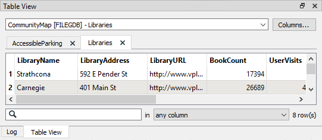

# Introduction to the FME Data Inspector #

The easiest place to start inspecting data in FME is in a complementary application called the FME Data Inspector.

## What is the FME Data Inspector? ##
The FME Data Inspector is a utility that allows viewing of data in any of the FME supported formats. It is used primarily to preview data before translation or to verify it after translation. 

The FME Data Inspector is closely tied to FME Workbench so that Workbench can send data directly to the Inspector. It's also embedded inside FME Workbench too, to help set up and debug workspaces by inspecting data *during* the translation.

## What the FME Data Inspector Is Not! ##
The FME Data Inspector isn’t designed to be a form of GIS or mapping application. It has no analysis functionality and the tools for symbology modification or printing are intended for data validation rather than producing map output.

## Starting the FME Data Inspector ##
To start the Data Inspector locate it in the Windows start menu:

## Major Components of the FME Data Inspector ##

When the FME Data Inspector is started, and a dataset is opened, it looks something like this:

 Map tiles by <a href="https://stamen.com">Stamen Design</a>, under <a href="https://creativecommons.org/licenses/by/3.0">CC-BY-3.0</a>. Data by <a href="http://openstreetmap.org">OpenStreetMap</a>, under <a href="http://creativecommons.org/licenses/by-sa/3.0">CC-BY-SA</a>.

### View Window ###
The View window is the spatial display area of the FME Data Inspector. Multiple views of different datasets may be opened at any one time.

 Map tiles by <a href="https://stamen.com">Stamen Design</a>, under <a href="https://creativecommons.org/licenses/by/3.0">CC-BY-3.0</a>. Data by <a href="http://openstreetmap.org">OpenStreetMap</a>, under <a href="http://creativecommons.org/licenses/by-sa/3.0">CC-BY-SA</a>.

## Menu bar and Toolbar ###
The menu bar and toolbar contain a number of tools. Some are for navigating around the View window, some control administrative tasks such as opening or saving a dataset, and others are for special functionality such as selective filtering of data or the creation of dynamic attributes.

### Display Control Window ###
The Display Control window shows a list of the open datasets and their feature types. Tools here let users turn these on or off in the display, alter their symbology, and adjust the display order.

### Feature Information Window ###
When users query a feature in the View window, information about that feature is shown in the Information window. This information includes the feature’s feature type, attributes (both user and format attributes), coordinate system and details about its geometry.

### Table View Window ###
The Table View window is a spreadsheet-like view of a dataset and includes all of the features and all of the attributes, with a separate tab for each feature type (layer).

---

<!--Person X Says Section-->

<table style="border-spacing: 0px">
<tr>
<td style="vertical-align:middle;background-color:darkorange;border: 2px solid darkorange">
<i class="fa fa-quote-left fa-lg fa-pull-left fa-fw" style="color:white;padding-right: 12px;vertical-align:text-top"></i>
Miss Vector says...
</td>
</tr>

<tr>
<td style="border: 1px solid darkorange">

FME is so easy to use, it's hard to think up some difficult questions! But I'll try.
  When you are inspecting <strong>schema</strong>, what are you trying to verify?
  <a href="http://52.73.3.37/fmedatastreaming/Manual/QAResponse2017.fmw?chapter=1&question=10&answer=1&DestDataset_TEXTLINE=C%3A%5CFMEOutput%5CQAResponse.html">1. The color and linestyle of features</a>
 <a href="http://52.73.3.37/fmedatastreaming/Manual/QAResponse2017.fmw?chapter=1&question=10&answer=2&DestDataset_TEXTLINE=C%3A%5CFMEOutput%5CQAResponse.html">2. The number of features</a>
 <a href="http://52.73.3.37/fmedatastreaming/Manual/QAResponse2017.fmw?chapter=1&question=10&answer=3&DestDataset_TEXTLINE=C%3A%5CFMEOutput%5CQAResponse.html">3. The feature types (layers, classes, tables) and their attributes</a>
 <a href="http://52.73.3.37/fmedatastreaming/Manual/QAResponse2017.fmw?chapter=1&question=10&answer=4&DestDataset_TEXTLINE=C%3A%5CFMEOutput%5CQAResponse.html">4. Where the nearest coffee shop is</a>

</td>
</tr>
</table>