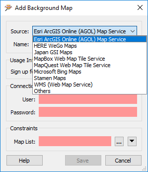

## Background Maps ##

The ability to view maps (or other imagery) as a backdrop to your spatial data is activated by a tool under Tools > FME Options on the menubar.

The background map dialog lets the user select an existing dataset (of any FME-supported format) to use as a backdrop, like so:

It's also possible to use web services that supply mapping on demand. Some of these - such as ArcGIS Online - require an existing account:

### Coordinate Systems ###

Source data must be referenced with a valid coordinate system to view it with a background map. If the coordinate system is not recorded in the dataset itself, you may enter it into a field when opening the dataset:

FME can display the source data against a background map, even when there are several source datasets of differing coordinate systems. FME does this by reprojecting the data to the coordinate system used by the background map. Therefore it's recommended that you turn off the background maps when you want to inspect the data in its original form.

---

<!--Person X Says Section-->

<table style="border-spacing: 0px">
<tr>
<td style="vertical-align:middle;background-color:darkorange;border: 2px solid darkorange">
<i class="fa fa-quote-left fa-lg fa-pull-left fa-fw" style="color:white;padding-right: 12px;vertical-align:text-top"></i>
FME Lizard says...
</td>
</tr>

<tr>
<td style="border: 1px solid darkorange">

You can adjust the symbology and display order of the background map in the Display Control window, just as you can for any normal dataset.

</td>
</tr>
</table>
