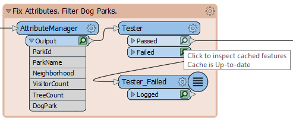
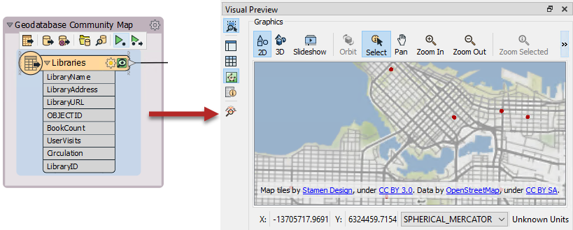

## Feature Caching ##

Sometimes it's important to be able to inspect data at any step of the translation. Adding an Inspector transformer at every step would be tiresome, so instead FME has an option to cache data automatically.

This behavior is activated using Run &gt; Run with Feature Caching on the menu bar:

With this option active, FME generates caches at every step of the translation when the workspace is run:

The caches are indicated by the small icons on each object. In the above screenshot, the caches are green, but they can change to yellow or red depending on how fresh the data is.

---

### Inspecting Cached Data ###

Cached data can be inspected by clicking on the feature cache icon:

With Toggle Automatic Inspect on Selection enabled, if you click a feature type or transformer with a cache, it will automatically be displayed in Visual Preview:

Inspecting data this way can allow you to quickly debug and develop workspaces, but keep in mind that if you are inspecting a large number of features or features with complex geometry, automatic inspection might introduce performance challenges.

---

<!--Tip Section-->

<table style="border-spacing: 0px">
<tr>
<td style="vertical-align:middle;background-color:darkorange;border: 2px solid darkorange">
<i class="fa fa-info-circle fa-lg fa-pull-left fa-fw" style="color:white;padding-right: 12px;vertical-align:text-top"></i>
TIP
</td>
</tr>

<tr>
<td style="border: 1px solid darkorange">

Be aware that caching data causes the translation to be slower, and to use system resources such as disk space.
  Data caching is very useful while developing a workspace, but should be turned off before putting a workspace into production.

</td>
</tr>
</table>

---

### Partial Runs ###

When caching is turned on, running a translation causes data to be cached at every part of the workspace. In subsequent runs, those caches can be used instead of having to re-run entire sections of the workspace.

Here, for example, a workspace has been run with caching turned on:

Now the author makes a change to the AreaCalculator parameters:

Notice that the caches change color (to yellow) on the AreaCalculator and subsequent transformers. This color denotes that caches are stale; their data contents no longer match what the workspace would produce.

To get the new results, the author must re-run the workspace. However, they do not have to re-run the entire workspace; they can start the workspace at the point of change - the AreaCalculator:

*Run From This* causes the workspace to run from that point only, using data cached up until that point. Notice how hovering over the option causes all "downstream" transformers to be highlighted. They are the only ones that will be run. That makes the translation quicker.

The other option is *Run To This*. The author could use that option on the writer feature type and get much the same effect:

...but notice how the second branch from the StatisticsCalculator does not get highlighted. It will not be run. That shows how you can avoid running a particular section of workspace, in much the same way as if that connection had been disabled.

---

<!--Tip Section-->

<table style="border-spacing: 0px">
<tr>
<td style="vertical-align:middle;background-color:darkorange;border: 2px solid darkorange">
<i class="fa fa-info-circle fa-lg fa-pull-left fa-fw" style="color:white;padding-right: 12px;vertical-align:text-top"></i>
TIP
</td>
</tr>

<tr>
<td style="border: 1px solid darkorange">

A partial run is particularly useful in avoiding re-reading data from its source; especially when the data comes from a slow, remote location such as a web service.
  Also, caches can be saved with the workspace, when it is saved as a template. That means the workspace can be re-run using the caches from a previous session or even from another author!

</td>
</tr>
</table>

---
