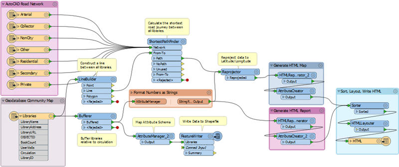
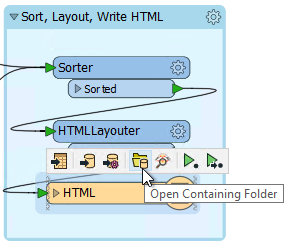
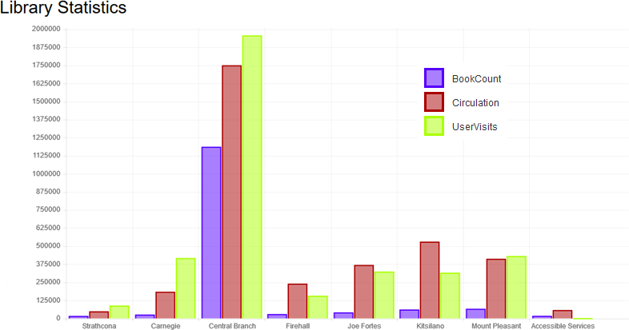

<!--Exercise Section-->

<!--This exercise assumes that Caching and Embedded Inspection are both turned OFF by default. If this is not the case then it may need adjusting to take account of those features.-->

<table style="border-spacing: 0px;border-collapse: collapse;font-family:serif">
<tr>
<td width=25% style="vertical-align:middle;background-color:darkorange;border: 2px solid darkorange">
<i class="fa fa-cogs fa-lg fa-pull-left fa-fw" style="color:white;padding-right: 12px;vertical-align:text-top"></i>
Exercise 1
</td>
<td style="border: 2px solid darkorange;background-color:darkorange;color:white">
Basic Workspace Creation
</td>
</tr>

<tr>
<td style="border: 1px solid darkorange; font-weight: bold">Data</td>
<td style="border: 1px solid darkorange">Libraries (Esri Geodatabase) Roads (AutoCAD DWG)</td>
</tr>

<tr>
<td style="border: 1px solid darkorange; font-weight: bold">Overall Goal</td>
<td style="border: 1px solid darkorange">To open and run an FME workspace to explore what it can do with data</td>
</tr>

<tr>
<td style="border: 1px solid darkorange; font-weight: bold">Demonstrates</td>
<td style="border: 1px solid darkorange">Opening and running a workspace</td>
</tr>

<tr>
<td style="border: 1px solid darkorange; font-weight: bold">Start Workspace</td>
<td style="border: 1px solid darkorange">C:\FMEData2018\Workspaces\DesktopBasic\Basics-Ex0-Begin.fmw</td>
</tr>

<tr>
<td style="border: 1px solid darkorange; font-weight: bold">End Workspace</td>
<td style="border: 1px solid darkorange">N/A</td>
</tr>

</table>

Rather than trying to explain what FME is and does, let's try it for ourselves!

**1) Locate Workspace File**
 When translations and transformations are defined in FME, they can be saved in a .fmw file.

Using a file explorer, browse to the file listed above

Double-click on the file. It will open an application called FME Workbench.

 **2) Explore FME Workspace**
 In FME Workbench, dismiss any Getting Started dialog that may open by clicking "Don't Show Me Again."

The main part of the application will look like this:

This part we call the canvas. It is where the translation and transformation of data is defined graphically. Although it might look complicated, it does not take much practice with FME to create workflows of this type.

Examine the left-hand side of the canvas:

This is where we read data, in this case a table of libraries from an Esri Geodatabase. This is the "E" (Extract) part of ETL.

Now look at the right-hand side:

This is where we write data, in this case a report of the libraries in HTML format. This is the "L" (Load) part of ETL.

In between the reader and writer are objects that transform data. They represent the "T" (Transform) part of ETL.

Labels and other annotations show us what the workspace does. It:

- Reads both roads and libraries
- Calculates the shortest path taking in all libraries
- Creates circles whose diameter is relative to a library's book circulation
- Creates a HTML report and a HTML map of the libraries
- Writes the data to HTML and also to Esri Shapefile

---

<!--Person X Says Section-->

<table style="border-spacing: 0px">
<tr>
<td style="vertical-align:middle;background-color:darkorange;border: 2px solid darkorange">
<i class="fa fa-quote-left fa-lg fa-pull-left fa-fw" style="color:white;padding-right: 12px;vertical-align:text-top"></i>
Police-Chief Webb-Mapp says...
</td>
</tr>

<tr>
<td style="border: 1px solid darkorange">

I'm the police chief, responsible for tracking down crimes against FME. 
  So, let's make sure you get the terminology right. The application itself is called FME "Workbench", but the process defined in the canvas window is called a "Workspace". The terms are so similar that they are easily confused, but please don't, otherwise I will have to send my grammar squad to arrest you! 
  Although mistreating FME terminology is a minor offence the ignominy of being caught is long lasting!

</td>
</tr>
</table>

---

 **3) Run FME Workspace**
 Let's run this workspace. To do this click on the Green run button on the Workbench toolbar:

The workspace will now run. As it does so you will see messages pass by in a log window. You may also see numbers appear on the canvas connections and green annotated icons on each object. We'll get to what these are for later!

 **4) Locate and Examine Output**
 Once the translation is complete, click on the HTML writer object on the canvas. Choose the option to Open Containing Folder:

In the Explorer dialog that opens you will find both the HTML output and the Shapefile dataset:

Double-click the HTML file to open it in a web browser. You will see a table of libraries, a graph of library statistics, and an interactive map showing where the libraries are located. All this has been generated by FME from the incoming Geodatabase points and attributes:

<!--Person X Says Section-->

---

<table style="border-spacing: 0px">
<tr>
<td style="vertical-align:middle;background-color:darkorange;border: 2px solid darkorange">
<i class="fa fa-quote-left fa-lg fa-pull-left fa-fw" style="color:white;padding-right: 12px;vertical-align:text-top"></i>
Miss Vector says...
</td>
</tr>

<tr>
<td style="border: 1px solid darkorange">

This small demonstration illustrates the power of FME. This workspace read data from multiple spatial datasets and wrote it out to datasets in both spatial and "tabular" formats. In between it carried out a series of transformations and spatial analyses, buffering and reprojecting the data, and creating added value and information.

</td>
</tr>
</table> 

---

<!--Exercise Congratulations Section--> 

<table style="border-spacing: 0px">
<tr>
<td style="vertical-align:middle;background-color:darkorange;border: 2px solid darkorange">
<i class="fa fa-thumbs-o-up fa-lg fa-pull-left fa-fw" style="color:white;padding-right: 12px;vertical-align:text-top"></i>
CONGRATULATIONS
</td>
</tr>

<tr>
<td style="border: 1px solid darkorange">

By completing this exercise you have learned how to:
 
<ul><li>Open an FME workspace</li>
<li>Run an FME workspace</li>
<li>Locate the output from an FME workspace</li></ul>

</td>
</tr>
</table>
