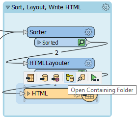

<!--Exercise Section-->

<table style="border-spacing: 0px;border-collapse: collapse;font-family:serif">
<tr>
<td width=25% style="vertical-align:middle;background-color:darkorange;border: 2px solid darkorange">
<i class="fa fa-cogs fa-lg fa-pull-left fa-fw" style="color:white;padding-right: 12px;vertical-align:text-top"></i>
Exercise 1
</td>
<td style="border: 2px solid darkorange;background-color:darkorange;color:white">
Opening and Running a Workspace
</td>
</tr>

<tr>
<td style="border: 1px solid darkorange; font-weight: bold">Data</td>
<td style="border: 1px solid darkorange">Libraries (Esri Geodatabase) Roads (AutoCAD DWG)</td>
</tr>

<tr>
<td style="border: 1px solid darkorange; font-weight: bold">Overall Goal</td>
<td style="border: 1px solid darkorange">To open and run an FME workspace to explore what it can do with data</td>
</tr>

<tr>
<td style="border: 1px solid darkorange; font-weight: bold">Demonstrates</td>
<td style="border: 1px solid darkorange">Opening and running a workspace</td>
</tr>

<tr>
<td style="border: 1px solid darkorange; font-weight: bold">Start Workspace</td>
<td style="border: 1px solid darkorange">C:\FMEData2019\Workspaces\DesktopBasic\Basics-Ex1-Begin.fmw</td>
</tr>

<tr>
<td style="border: 1px solid darkorange; font-weight: bold">End Workspace</td>
<td style="border: 1px solid darkorange">N/A</td>
</tr>

</table>

Rather than trying to explain what FME is and does, let's try it for ourselves! In this exercise you will  explore a workflow to integrate and transform data to create an HTML report summarizing information about libraries in Vancouver, BC, Canada. This workflow transforms spatial and attribute data.

**1) Locate Workspace File**
 When translations and transformations are defined in FME, they can be saved in a .fmw file.

Using a file explorer, browse to C:\FMEData2019\Workspaces\DesktopBasic\Basics-Ex1-Begin.fmw:

Double-click on the file. It will open an application called FME Workbench.

 **2) Explore FME Workspace**
 When FME Workbench opens you will see the option of viewing the Workbench Essentials tutorial. You can complete this now if you wish, or view it later under Help > Workbench Essentials. For now, click the `X` to close the window.

The main part of the application will look like this (click to expand):

This part we call the canvas. It is where the translation and transformation of data is defined graphically. Although it might look complicated, it does not take much practice with FME to create workflows of this type.

Examine the left-hand side of the canvas:

This area is where we read data, in this case, a table of libraries from an Esri Geodatabase.

Now look at the right-hand side:

This area is where we write data, in this case, a report of the libraries in HTML format.

In between the reader and writer are objects that transform data.

Labels and other annotations show us what the workspace does. It:

- Reads both roads (AutoCAD DWG) and libraries (Esri Geodatabase)
- Calculates the shortest road route taking in all libraries
- Creates circles with diameters relative to each library's book circulation
- Creates an HTML report and an HTML map of the libraries
- Writes the data to HTML and also to Esri Shapefile

---

<!--Tip Section-->

<table style="border-spacing: 0px">
  <tr>
    <td style="vertical-align:middle;background-color:darkorange;border: 2px solid darkorange">
      <i class="fa fa-info-circle fa-lg fa-pull-left fa-fw" style="color:white;padding-right: 12px;vertical-align:text-top"></i>
      FME Lizard says...
    </td>
  </tr>

  <tr>
    <td style="border: 1px solid darkorange">
      
        Let's make sure we are clear on terminology. The application itself is called FME "Workbench," but the process defined in the canvas window is called a "Workspace." The terms are easily confused.
      
    </td>
  </tr>
</table>

---

 **3) Run FME Workspace**
 Let's run this workspace.

Before doing so, we want to control _how_ to run the workspace. By default, a feature called **Prompt for User Parameters** is turned on. We don't need this on for this course, so let's turn it off by clicking the dropdown arrow next to the Run button the toolbar, and clicking Prompt for User Parameters:

Now we are ready to run the workspace. Click on the green Run button on the Workbench toolbar:

The workspace will now run. As it does, you will see messages pass by in a log window. You may also see numbers appear on the canvas connections and green annotated icons on each object. We'll get to what these are for later!

 **4) Locate and Examine Output**
 Once the translation is complete, click on the HTML writer object on the canvas. It is located on the right side of the workspace and is labelled "HTML." Choose the option to Open Containing Folder:

In the Explorer dialog that opens you will find both the HTML output and the Shapefile dataset:

Open the output file created by FME with a web browser such as Firefox or Chrome (double-clicking it should open it in your default browser). You will see a table of libraries, a graph of library statistics, and an interactive map showing where the libraries are located. All this has been generated by FME from the incoming Geodatabase points and attributes:

---

<!--Tip Section-->

<table style="border-spacing: 0px">
  <tr>
    <td style="vertical-align:middle;background-color:darkorange;border: 2px solid darkorange">
      <i class="fa fa-info-circle fa-lg fa-pull-left fa-fw" style="color:white;padding-right: 12px;vertical-align:text-top"></i>
      FME Lizard says...
    </td>
  </tr>

  <tr>
    <td style="border: 1px solid darkorange">
      
        This small demonstration illustrates the power of FME. This workspace read data from multiple spatial datasets and wrote it out to datasets in both spatial and "tabular" formats. In between it carried out a series of transformations and spatial analyses, buffering and reprojecting the data, and creating added value and information.
      
    </td>
  </tr>
</table>

---

<!--Exercise Congratulations Section-->

<table style="border-spacing: 0px">
<tr>
<td style="vertical-align:middle;background-color:darkorange;border: 2px solid darkorange">
<i class="fa fa-thumbs-o-up fa-lg fa-pull-left fa-fw" style="color:white;padding-right: 12px;vertical-align:text-top"></i>
CONGRATULATIONS
</td>
</tr>

<tr>
<td style="border: 1px solid darkorange">

By completing this exercise you have learned how to:
 
<ul><li>Open an FME workspace</li>
<li>Run an FME workspace</li>
<li>Locate the output from an FME workspace</li></ul>

</td>
</tr>
</table>
