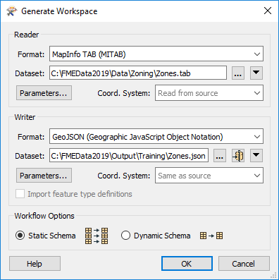

<!--Exercise Section-->

<table style="border-spacing: 0px;border-collapse: collapse;font-family:serif">
<tr>
<td width=25% style="vertical-align:middle;background-color:darkorange;border: 2px solid darkorange">
<i class="fa fa-cogs fa-lg fa-pull-left fa-fw" style="color:white;padding-right: 12px;vertical-align:text-top"></i>
Exercise 2
</td>
<td style="border: 2px solid darkorange;background-color:darkorange;color:white">
Basic Workspace Creation
</td>
</tr>

<tr>
<td style="border: 1px solid darkorange; font-weight: bold">Data</td>
<td style="border: 1px solid darkorange">Zoning Data (MapInfo TAB)</td>
</tr>

<tr>
<td style="border: 1px solid darkorange; font-weight: bold">Overall Goal</td>
<td style="border: 1px solid darkorange">Create a workspace to translate zoning data in MapInfo TAB format to GeoJSON (Geographic JavaScript Object Notation)</td>
</tr>

<tr>
<td style="border: 1px solid darkorange; font-weight: bold">Demonstrates</td>
<td style="border: 1px solid darkorange">Basic workspace creation with FME Workbench</td>
</tr>

<tr>
<td style="border: 1px solid darkorange; font-weight: bold">Start Workspace</td>
<td style="border: 1px solid darkorange">None</td>
</tr>

<tr>
<td style="border: 1px solid darkorange; font-weight: bold">End Workspace</td>
<td style="border: 1px solid darkorange">C:\FMEData2018\Workspaces\DesktopBasic\Basics-Ex2-Complete.fmw</td>
</tr>

</table>

Congratulations! You have just landed a job as a technical analyst in the GIS department of your local city. Your old schoolteacher, Miss Vector, gave you a reference, so don't let her down!

On your first day, you've been asked to do a simple file format translation.

We’ve outlined all of the actions you need to tak;, though FME's interface is so intuitive you should be able to carry out the exercise without the need for these step-by-step instructions.

**1) Start FME Workbench**
 If it isn't open already, start FME Workbench by selecting it from the Windows start menu. You’ll find it under Start > FME Desktop 2018.0 > FME Workbench 2018.0.

If Workbench is already open, click on the Start tab above the main canvas.

 **2) Select Generate Workspace**
 In the Create Workspace part of the Start page select the option to Generate (Workspace). Alternatively, you can use the shortcut Ctrl+G.

<!--Repeat of Image 15-->

 **3) Define Translation**
 The Generate Workspace tool opens up a dialog in which to define the translation to be carried out. Fill in the fields in this dialog as follows:

<table style="border: 0px">

<tr>
<td style="font-weight: bold">Reader Format</td>
<td style="">MapInfo TAB (MITAB)</td>
</tr>

<tr>
<td style="font-weight: bold">Reader Dataset</td>
<td style="">C:\FMEData2018\Data\Zoning\Zones.tab</td>
</tr>

<tr>
<td style="font-weight: bold">Writer Format</td>
<td style="">GeoJSON (Geographic JavaScript Object Notation)</td>
</tr>

<tr>
<td style="font-weight: bold">Writer Dataset</td>
<td style="">C:\FMEData2018\Output\Training\Zones.json</td>
</tr>

</table>

The dialog will look like this:

Remember, you can set a format by typing its name, by selecting it from the drop-down list, or by choosing “More Formats” and selecting the format from the full table of formats. For now, ignore the Workflow Options and leave the default of 'Static Schema.'

 **4) Generate and Examine Workspace**
 Click OK to close the Generate Workspace dialog. A new workspace will be generated into the FME Workbench canvas:

The list of attributes is exposed by clicking the arrow icon on each object.

 **5) Run Workspace**
 Run the workspace by clicking the run button on the toolbar, or by using Run > Run Translation on the menubar. The workspace runs and the log file reports a successful translation:

 **6) Locate Output**
 Locate the destination data in Windows Explorer to prove that it's been written as expected (don't forget the Open Containing Folder button from Exercise 1). In the next section, we’ll cover how to inspect the dataset visually to ensure that it is correct.

 **7) Save Workspace**
 Save the workspace. We'll be using it in a later exercise. Remember there is a toolbar save button, and on the menu, there is File &gt; Save As.

---

<!--Tip Section-->

<table style="border-spacing: 0px">
<tr>
<td style="vertical-align:middle;background-color:darkorange;border: 2px solid darkorange">
<i class="fa fa-info-circle fa-lg fa-pull-left fa-fw" style="color:white;padding-right: 12px;vertical-align:text-top"></i>
TIP
</td>
</tr>

<tr>
<td style="border: 1px solid darkorange">

When a translation is run immediately without adjustment it's known as a "Quick Translation". Because FME is a 'semantic' translator, with an enhanced data model, the output from a quick translation is as close to the source data in structure and meaning as possible, given the capabilities of the destination format.

</td>
</tr>
</table>

---

<!--Exercise Congratulations Section-->

<table style="border-spacing: 0px">
<tr>
<td style="vertical-align:middle;background-color:darkorange;border: 2px solid darkorange">
<i class="fa fa-thumbs-o-up fa-lg fa-pull-left fa-fw" style="color:white;padding-right: 12px;vertical-align:text-top"></i>
CONGRATULATIONS
</td>
</tr>

<tr>
<td style="border: 1px solid darkorange">

By completing this exercise you have learned how to:
 
<ul><li>Create an FME workspace</li>
<li>Run an FME workspace</li></ul>

</td>
</tr>
</table>
