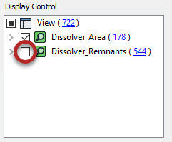
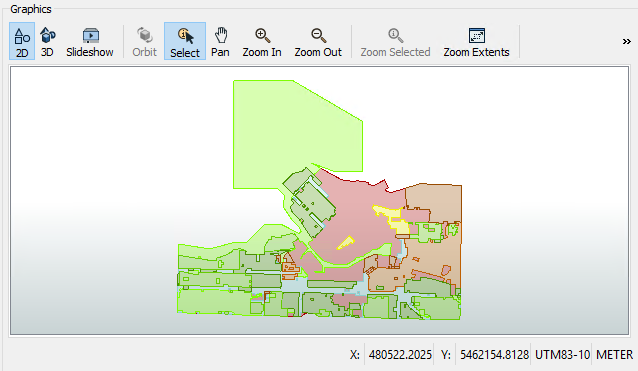
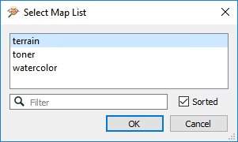
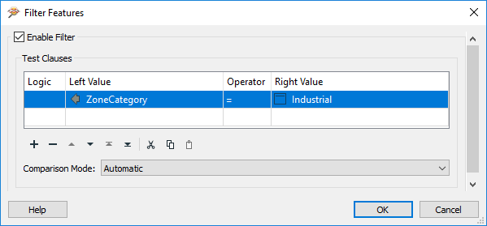
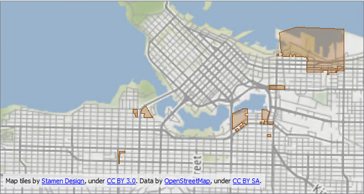

<!--Exercise Section-->

<table style="border-spacing: 0px;border-collapse: collapse;font-family:serif">
<tr>
<td width=25% style="vertical-align:middle;background-color:darkorange;border: 2px solid darkorange">
<i class="fa fa-cogs fa-lg fa-pull-left fa-fw" style="color:white;padding-right: 12px;vertical-align:text-top"></i>
Exercise 4
</td>
<td style="border: 2px solid darkorange;background-color:darkorange;color:white">
The FME Data Inspector
</td>
</tr>

<tr>
<td style="border: 1px solid darkorange; font-weight: bold">Data</td>
<td style="border: 1px solid darkorange">Zoning Data (GeoJSON) Neighborhoods (Google KML)</td>
</tr>

<tr>
<td style="border: 1px solid darkorange; font-weight: bold">Overall Goal</td>
<td style="border: 1px solid darkorange">Set up layer and dataset display</td>
</tr>

<tr>
<td style="border: 1px solid darkorange; font-weight: bold">Demonstrates</td>
<td style="border: 1px solid darkorange">Use of Display Control and Background Maps in the Data Inspector</td>
</tr>

<tr>
<td style="border: 1px solid darkorange; font-weight: bold">Start Workspace</td>
<td style="border: 1px solid darkorange">C:\FMEData2019\Workspaces\DesktopBasic\Basics-Ex4-Begin.fmw</td>
</tr>

<tr>
<td style="border: 1px solid darkorange; font-weight: bold">End Workspace</td>
<td style="border: 1px solid darkorange">C:\FMEData2019\Workspaces\DesktopBasic\Basics-Ex4-Complete.fmw </td>
</tr>

</table>

In the previous exercise, we inspected some data from a translation and added a second dataset. Now we can rearrange the data to make the display clearer.

 **1) Start FME Data Inspector**
 Continue in the FME Data Inspector from the previous exercise. You should have both the converted zones data (as GeoJSON) and a dataset of neighborhood boundaries in KML. The Display Control window looks like this:

 **2) Set Neighborhoods Symbology**
 The Display Control window shows a number of different layers in the VancouverNeighborhoods dataset. In reality, most of these are tabular (non-spatial) items. The layer we are interested in is called Neighborhoods.

Click the symbology icon for the Neighborhoods data in the Display Control window:

Set the color to be a neutral shade (like orange) and increase the opacity value to 0.8:

 **3) Set Draw Order**
 The previous change makes it clear that the zone features are below the neighborhoods in the drawing order. To solve this problem drag the Zones dataset above the VancouverNeighborhoods dataset in the Display Control Window.

At the same time set a color for the zones data fill color and reduce the opacity value to 0.1. The main view will now look like this:

If you query a zone feature, you'll see that it has both a ZoneCategory and ZoneName attribute. You might not realize, but there is a relationship between those attributes. Each ZoneName belongs to a specific ZoneCategory, where Category:Name is a 1:Many relationship.

Let's clarify the display by merging all the features into one feature per ZoneCategory. We can do that in FME Workbench.

 **4) Return to Workspace**
 Return to FME Workbench. Open the workspace saved in Exercise 2, or the workspace listed above.

What we'll do here is use what we call a transformer. This object is something we'll cover in more detail in the chapter on Data Transformation. It is an object to transform data in some way.

Click on the dark line connecting the Reader Feature Type and Writer Feature Type. Start typing the word "Dissolver":

When you see the Dissolver transformer appear in the list, double-click on it to place it into the workspace. The result will look like this:

The Dissolver parameter will merge all features with a common attribute value.

 **5) Set Dissolver Parameters**
 Click on the cogwheel icon on the Dissolver transformer:

Doing so will open a parameters dialog for the transformer. Click the ellipsis (...) button next to the Group By parameter. In the dialog that opens, select the ZoneCategory attribute and click OK.

Click OK again to close the parameters dialog.

 **6) Inspect with Feature Caching in Visual Preview**
 Save the workspace. Let's try using feature caching and Visual Preview now. Click the Dissolver to select it, then click Run to This:

Workbench will cache the Zones feature type and then create two caches on the Dissolver: Area and Remnants. As long as the Dissolver remains selected, Remnants will display automatically in Visual Preview because it is the last output port on the transformer, but Area is the one we are interested in. You can change which port is displayed in Visual Preview by unchecking Dissolver_Remnants in the Visual Preview Display Control window:

The Graphics window should now show that the Dissolver has simplified the original data by combining adjacent polygons with the same zoning category:

You can compare the before and after results by selecting the Zones feature type as well as the Dissolver (<kbd>Ctrl</kbd> click or click and drag to select both). Then the original Zones data will be added to your Display Control window and you can toggle it on and off to compare.

Now that we are using Visual Preview, you should notice that nearly all of the same tools are available here as in Data Inspector. We will be using Visual Preview for the remainder of the course except where noted.

 **7) Add Background Map**
 When inspecting data it will help to have a background map to provide a sense of location. You can choose from many mapping services.

Click **Add a background map** in the Visual Preview Graphics window toolbar:

In the Add Background Map dialog, click the Source dropdown:

You will notice that FME supports a variety of background map services. Most require an existing account or server, but for this example let's select Stamen Maps, which we can use without an account.

After selecting Stamen Maps, click the ellipsis button to retrieve the list of background map styles available. Select terrain and click OK:

Click OK and then Save to close these dialogs. A background map is added to the display. Notice that the data is reprojected to match the coordinate system of the chosen background. For example, the Stamen Maps background causes the data to reproject to Spherical Mercator, with a clear change of shape:

 Map tiles by <a href="https://stamen.com">Stamen Design</a>, under <a href="https://creativecommons.org/licenses/by/3.0">CC-BY-3.0</a>. Data by <a href="http://openstreetmap.org">OpenStreetMap</a>, under <a href="http://creativecommons.org/licenses/by-sa/3.0">CC-BY-SA</a>.

 **8) Filter Data**
 Let's filter our data to control what is displayed. We'd like to keep all of the neighborhood layer, but only show industrially-zoned zoning districts.

Click the Visual Preview Graphics window toolbar Filter button:

In the Filter Features dialog, check Enable Filter. Then click in the Left Value field and start to type in ZoneCategory. This will search the available attributes:

Once you see ZoneCategory appear in the list, double-click it to select it. Then click in the Operator field and select the = (equals) symbol, if it is not already selected.

For the Right Value field, click in the field and type the word **Industrial** (don't worry, it's not case-sensitive).

Click OK to close the dialog. The display will be filtered to show only industrial zones:

 Map tiles by <a href="https://stamen.com">Stamen Design</a>, under <a href="https://creativecommons.org/licenses/by/3.0">CC-BY-3.0</a>. Data by <a href="http://openstreetmap.org">OpenStreetMap</a>, under <a href="http://creativecommons.org/licenses/by-sa/3.0">CC-BY-SA</a>.

The Display Control Window will also show the effects of the filter:

---

<!--Exercise Congratulations Section-->

<table style="border-spacing: 0px">
<tr>
<td style="vertical-align:middle;background-color:darkorange;border: 2px solid darkorange">
<i class="fa fa-thumbs-o-up fa-lg fa-pull-left fa-fw" style="color:white;padding-right: 12px;vertical-align:text-top"></i>
CONGRATULATIONS
</td>
</tr>

<tr>
<td style="border: 1px solid darkorange">

By completing this exercise you have learned how to:
 
<ul>
<li>Set symbology for features in the FME Data Inspector</li>
<li>Set a background map for the FME Data Inspector</li>
<li>Add a transformer in FME Workbench and set its parameters</li>
<li>Refresh the Data Inspector when source data is updated</li>
<li>Filter data using test clauses in the FME Data Inspector</li>

</td>
</tr>
</table>
