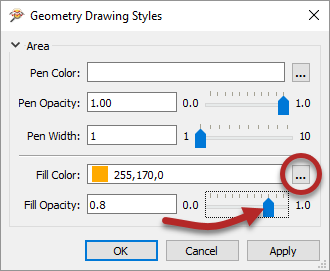
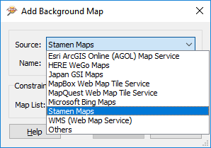
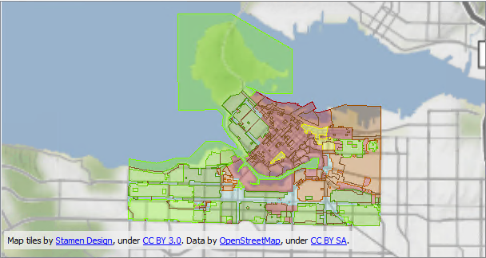

<!--Exercise Section-->

<table style="border-spacing: 0px;border-collapse: collapse;font-family:serif">
<tr>
<td width=25% style="vertical-align:middle;background-color:darkorange;border: 2px solid darkorange">
<i class="fa fa-cogs fa-lg fa-pull-left fa-fw" style="color:white;padding-right: 12px;vertical-align:text-top"></i>
Exercise 4
</td>
<td style="border: 2px solid darkorange;background-color:darkorange;color:white">
The FME Data Inspector
</td>
</tr>

<tr>
<td style="border: 1px solid darkorange; font-weight: bold">Data</td>
<td style="border: 1px solid darkorange">Zoning Data (GeoJSON) Neighborhoods (Google KML)</td>
</tr>

<tr>
<td style="border: 1px solid darkorange; font-weight: bold">Overall Goal</td>
<td style="border: 1px solid darkorange">Set up layer and dataset display</td>
</tr>

<tr>
<td style="border: 1px solid darkorange; font-weight: bold">Demonstrates</td>
<td style="border: 1px solid darkorange">Use of Display Control and Background Maps in the Data Inspector</td>
</tr>

<tr>
<td style="border: 1px solid darkorange; font-weight: bold">Start Workspace</td>
<td style="border: 1px solid darkorange">C:\FMEData2018\Workspaces\DesktopBasic\Basics-Ex4-Begin.fmw</td>
</tr>

<tr>
<td style="border: 1px solid darkorange; font-weight: bold">End Workspace</td>
<td style="border: 1px solid darkorange">C:\FMEData2018\Workspaces\DesktopBasic\Basics-Ex4-Complete.fmw </td>
</tr>

</table>

In the previous exercise we inspected some data from a translation and added a second dataset. Now we can rearrange the data to make the display clearer.

 **1) Start FME Data Inspector**
 Continue in the FME Data Inspector from the previous exercise. You should have both the converted zones data (as GeoJSON) and a dataset of neighborhood boundaries in KML. The Display Control window looks like this:

 **2) Set Neighborhoods Symbology**
 The Display Control window shows a number of different layers in the VancouverNeighborhoods dataset. In reality most of these are tabular (non-spatial) items. The layer we are really interested in is called Neighborhoods.

Click the symbology icon for the Neighborhoods data in the Display Control window:

Set the color to be a neutral shade (like orange) and increase the opacity value to 0.8:

 **3) Set Draw Order**
 The previous change makes it clear that the zone features are below the neighborhoods in the drawing order. To solve this problem drag the Zones dataset above the VancouverNeighborhoods dataset in the Display Control Window.

At the same time set a color for the zones data fill color and reduce the opacity value to 0.1. The main view will now look like this:

If you query a zone feature you'll see that it has both a ZoneCategory and ZoneName attribute. You might not realize, but there is a relationship between those attributes. Each ZoneName belongs to a specific ZoneCategory, where Category:Name is a 1:Many relationship.

Let's clarify the display by merging all the features into one feature per ZoneCategory. We can do that in FME Workbench.
 

 **4) Return to Workspace**
 Return to FME Workbench. Open the workspace saved in Exercise 2, or the workspace listed above. 

What we'll do here is use what we call a transformer. This is something we'll cover in more detail in the chapter on Data Transformation. Basically it is an object to transform data in some way.

Click on the dark line connecting the Reader Feature Type and Writer Feature Type. Start typing the word "Dissolver":

When you see the Dissolver transformer appear in the list, double-click on it to place it into the workspace. The result will look like this:

The Dissolver parameter will merge together all features with a common attribute value.

 **5) Set Dissolver Parameters**
 Click on the little cogwheel icon on the Dissolver transformer (it will probably be yellow in color):

This will open a parameters dialog for the transformer. Click the elipsis (...) button next to the Group By parameter. In the dialog that opens select the ZoneCategory attribute and click OK.

Click OK again to close the parameters dialog. 

Save the workspace and run it once more. The translation will run and the data be overwritten.

 **6) Refresh Data Inspector View**
 Back in the Data Inspector, rather than reopening the data, let's refresh the view of it. To do so click the Refresh button on the toolbar:

You'll now find there are fewer features, as many have been merged together.

 **7) Set Background**
 When inspecting data it will help to have a background map to provide a sense of location. The FME Data Inspector is capable of displaying a backdrop from several different mapping services.

Select Tools > FME Options from the menubar. In the Background Map section, select a background map format. If you have an account with a specific provider, please feel free to use that. Otherwise select Stamen Maps:

Click the Parameters button. A map constraint (type) dialog will open. Click the browse button and select "terrain":

Click OK and OK again to close these dialogs. A background map is added to the display. Notice that the data is reprojected to match the coordinate system of the chosen background. For example, the Stamen Maps background causes the data to reproject to Spherical Mercator, with a clear change of shape:

 Map tiles by <a href="http://stamen.com">Stamen Design</a>, under <a href="http://creativecommons.org/licenses/by/3.0">CC-BY-3.0</a>. Data by <a href="http://openstreetmap.org">OpenStreetMap</a>, under <a href="http://creativecommons.org/licenses/by-sa/3.0">CC-BY-SA</a>.

 **8) Filter Data**
 Let's try something to filter our data a little in the Data Inspector.

Choose Tools &gt; Filter Features from the menubar, or click the toolbar button for filters:

In the Filter Features dialog, double click in the Left Value field, click the drop down arrow, and select Attribute Value. Choose ZoneCategory as the attribute to filter by and click OK.

For the Operator field select the = (equals) symbol, if it is not already selected.

For the Right Value field, click in the field and type the word **Industrial** (don't worry, it's not case-sensitive).

Filtering in the Data Inspector is applied to all visible data (if you clicked OK now the Neighborhood data would also be filtered out) therefore we must also add a clause to enable the neighborhood data to remain on screen.

Create a second test clause using the same techniques as before. This time select the attribute NeighborhoodId and select the operator **Attribute has a value**:

The Pass Criteria parameter should be set (or left as) "One Test (OR)".

Now click OK to close the dialog. The display will be filtered to show only the neighborhood features plus zones of type industrial:

 Map tiles by <a href="http://stamen.com">Stamen Design</a>, under <a href="http://creativecommons.org/licenses/by/3.0">CC-BY-3.0</a>. Data by <a href="http://openstreetmap.org">OpenStreetMap</a>, under <a href="http://creativecommons.org/licenses/by-sa/3.0">CC-BY-SA</a>.

The Display Control Window will also show the effects of the filter:

 **9) Set Writer Parameters**
 One final task: the output GeoJSON file is intended for distribution via the internet, and you've been asked to make the file size as small as possible. Check the current file size. It will be approximately 362kb.

There are a couple of writer parameters that can be used to reduce GeoJSON file size.

Explore the Navigator window in FME Workbench, and look for the GeoJSON writer parameters. Double-click on one of the parameters, such as Formatting Type:

In the dialog that opens, set the Formatting Type to Linear and the Coordinate Precision to 6:

Re-run the workspace. You should find that the results are the same, but the file size is now closer to 232kb.

---

<!--Exercise Congratulations Section--> 

<table style="border-spacing: 0px">
<tr>
<td style="vertical-align:middle;background-color:darkorange;border: 2px solid darkorange">
<i class="fa fa-thumbs-o-up fa-lg fa-pull-left fa-fw" style="color:white;padding-right: 12px;vertical-align:text-top"></i>
CONGRATULATIONS
</td>
</tr>

<tr>
<td style="border: 1px solid darkorange">

By completing this exercise you have learned how to:
 
<ul>
<li>Set symbology for features in the FME Data Inspector</li>
<li>Set a background map for the FME Data Inspector</li>
<li>Add a transformer in FME Workbench and set its parameters</li>
<li>Refresh the Data Inspector when source data is updated</li>
<li>Filter data using test clauses in the FME Data Inspector</li>
<li>Set writer parameters in the Navigator window</li></ul>

</td>
</tr>
</table>
