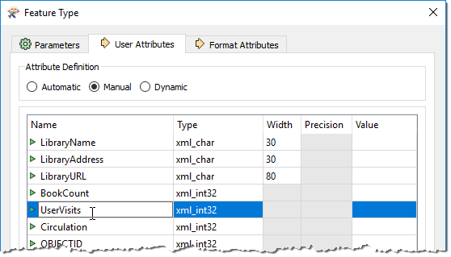
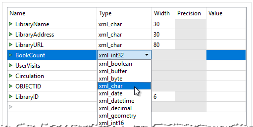
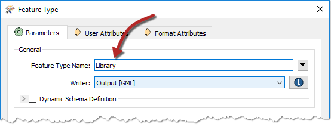
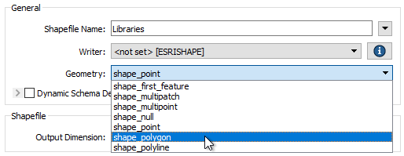

# Schema Editing

***Schema Editing*** is the process of altering the writer schema to customize the structure of the output data. One good example is renaming an attribute field.

After editing, the source schema still represents *"what we have"*, but the destination schema now truly does represent *"what we want"*.

## Editable Components
There are a number of edits that can be performed, including, but not limited to the following:

### Attribute Renaming
Attributes on the destination schema can be renamed, such as renaming POSTALCODE to PSTLCODE.

To rename an attribute open the Feature Type dialog and click the User Attributes tab. Click on the attribute to be renamed and enter the new name.

---

### Attribute Type Changes
Any attribute on the writer schema can have a change of type; for example, changing from an integer field to a character field.

To change an attribute type open the User Attributes tab and set the Type field to the new type:

---

<!--Tip Section-->

<table style="border-spacing: 0px">
<tr>
<td style="vertical-align:middle;background-color:darkorange;border: 2px solid darkorange">
<i class="fa fa-info-circle fa-lg fa-pull-left fa-fw" style="color:white;padding-right: 12px;vertical-align:text-top"></i>
TIP
</td>
</tr>

<tr>
<td style="border: 1px solid darkorange">

The Type column for an attribute shows only values that match the permitted types for that data format. For example, an Oracle schema permits attribute types of varchar or clob. MapInfo does not support these data types so they would never appear in a MapInfo schema. The above screenshot shows data types for the GML format.

</td>
</tr>
</table>

---

### Feature Type Renaming
To rename a writer feature type open the Parameters tab, click in the Feature Type Name field (the label may vary according to the format type) and edit the name as required:

You can also rename a feature type by clicking on it in the Workbench canvas and pressing the F2 key.

---

### Geometry Type Changes
To change the permitted geometry for a feature type, (for example, change the permitted geometries from lines to points) open the Parameters tab and change the permitted geometry type:

This field is only available where the format requires a strict decision on geometry type. Where formats allow any mix of geometry in a single feature type, this setting is not shown.

---

Once the user has made all the required changes to the writer schema, the workspace reflects *"what we want"* - but it doesn't yet specify how the reader and writer schemas should be connected together. This is the next task and it is called ***Schema Mapping***.

---

<!--Tip Section-->

<table style="border-spacing: 0px">
<tr>
<td style="vertical-align:middle;background-color:darkorange;border: 2px solid darkorange">
<i class="fa fa-info-circle fa-lg fa-pull-left fa-fw" style="color:white;padding-right: 12px;vertical-align:text-top"></i>
TIP
</td>
</tr>

<tr>
<td style="border: 1px solid darkorange">

You might be wondering "what would happen if I edited the <strong>reader</strong> schema, instead of the writer"?
  Well, by default you can't! The schema fields for a reader are greyed out to prevent this, since changes would put the schema definition out of sync with the source dataset:
  
  There are a few, rare, use cases - but they're outside the scope of this training course!

</td>
</tr>
</table>
